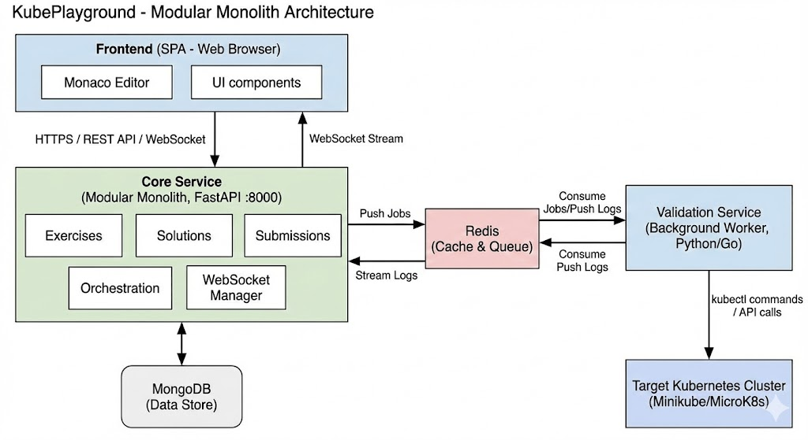

# KubePlayground - Development Plan (v2.1)

## Project Vision

An interactive, locally-deployable web platform similar to HackerRank/LeetCode for learning Kubernetes hands-on.

**What you can do:**

* Browse exercises from curated curriculum
* Write YAML solutions in browser with Monaco Editor (VS Code-like experience)
* Validate against your local Kubernetes cluster (Minikube/MicroK8s)
* Save and track progress locally with auto-save
* Get instant feedback via automated verification steps

**Current Focus (v1.0)**: Exercise display, solution editing/saving, decoupled deployment/validation workflow.
**Future (v2.0)**: User authentication, progress tracking, leaderboards, and social features.

---

## Architecture Overview

We utilize a **Modular Monolith** pattern for the core application logic, paired with an **Asynchronous Worker** for Kubernetes operations. Crucially, all database connectivity and access patterns are standardized via a shared SDK (`dbdaolib`), separating infrastructure concerns from business logic.



---

## Service Breakdown

### 0. SDK Layer (`dbdaolib`)

**Role**: The Foundation (Library)

* **Responsibilities**:
* **Unified Connectivity**: Manages connection pooling for SQL (SQLAlchemy) and NoSQL (Motor/Beanie).
* **Singleton Management**: Ensures single instances of database drivers across the application.
* **Data Access Abstraction**: Provides generic Repositories for CRUD operations, decoupling services from raw database queries.


* **Tech**: Python, Motor, Beanie, SQLAlchemy.

### 1. Core Service (Port 8000)

**Role**: The "Brain" (Monolith)

* **Responsibilities**:
* **API Gateway**: Single entry point for Frontend.
* **Exercise Domain**: Manages static content & templates via `dbdaolib` Repositories.
* **Solution Domain**: Handles user code versioning & auto-save via `dbdaolib`.
* **Orchestration**: Dispatches jobs to Redis.
* **WebSocket Manager**: Streams real-time logs.


* **Tech**: FastAPI, `dbdaolib` (NoSQL Driver).
* **Database**: MongoDB (via SDK).

### 2. Validation Service (Background Worker)

**Role**: The "Muscle" (Worker)

* **Responsibilities**:
* **Job Consumer**: Listens to Redis `validation_queue`.
* **K8s Interaction**: Applies manifests using official K8s Client.
* **Namespace Isolation**: Manages ephemeral test environments.


* **Tech**: Python (K8s Library).
* **Database**: Stateless (Uses K8s API).

### 3. Infrastructure

* **MongoDB**: Centralized storage (Exercises, Solutions).
* **Redis**: Message Broker (Jobs) & Event Bus (Logs).

---

## Directory Structure

```text
kubeplayground/
├── SDKs/
│   └── dbdaolib-1.0.0/          # SHARED LIBRARY
│       ├── daolib/
│       │   ├── drivers/         # Connectivity (SQL, NoSQL, SQLite)
│       │   ├── dao/             # Generic Repositories
│       │   └── ...
│       └── setup.py
│
├── core-service/                # THE MONOLITH
│   ├── main.py                  # App entry point
│   ├── models.py                # Beanie Documents (Exercise, Solution)
│   ├── schema.py                # Pydantic Schemas
│   ├── dao/                     # Service-specific Repositories (Inherits SDK)
│   ├── routes/
│   └── utils/
│       └── mongo_helper.py      # Implements SDK Helper for Config
│
├── validation-service/          # THE WORKER
│   └── ...
│
├── frontend/                    # REACT UI
│   └── ...
│
├── docker-compose.yml
└── README.md

```

---

## Development Phases (Revised)

### Phase 0: SDK Implementation (✅ Completed)

**Goal**: Build the shared Data Access Library.

* **Status**: **Done**.
* Implemented `AbstractDBDriver` and `Connector` patterns.
* Implemented `MongoConnector` (Async/Motor) and `RdbmsConnector` (Sync/SQLAlchemy).
* Implemented `BaseMongoRepository` for generic CRUD.
* Packaged as installable Wheel.


### Phase 1: Core Service Implementation (Current)

**Goal**: Build the Unified API using the SDK.
**Tasks**:

1. **Scaffold Core**: Setup FastAPI and install `dbdaolib`.
2. **Helper Implementation**: Create `MongoHelper` to inject YAML configs into the SDK.
3. **Unified Models**: Define `Exercise` and `Solution` documents in `models.py`.
4. **Repositories**: Implement `ExerciseRepository` inheriting from `BaseMongoRepository`.
5. **API Routes**: Build endpoints for listing exercises and saving solutions.

### Phase 2: Validation Worker (Upcoming)

**Goal**: Build the background K8s processor.
**Tasks**:

1. Redis Producer/Consumer logic.
2. Kubernetes Client implementation.
3. Log streaming pipeline (Worker -> Redis -> WebSocket).

---

## Resource Requirements

| Service | CPU Limit | Memory Limit | Notes |
| --- | --- | --- | --- |
| **Core Service** | 0.5 cores | 512MB | Uses shared SDK |
| **Validation Worker** | 0.5 cores | 512MB | Background tasks |
| **MongoDB** | 1.0 cores | 1GB | Primary Data |
| **Redis** | 0.2 cores | 256MB | Message Broker |
| **Frontend** | 0.2 cores | 128MB | Nginx Static |

**Total Estimate**: ~2-3 Cores, 3GB RAM.