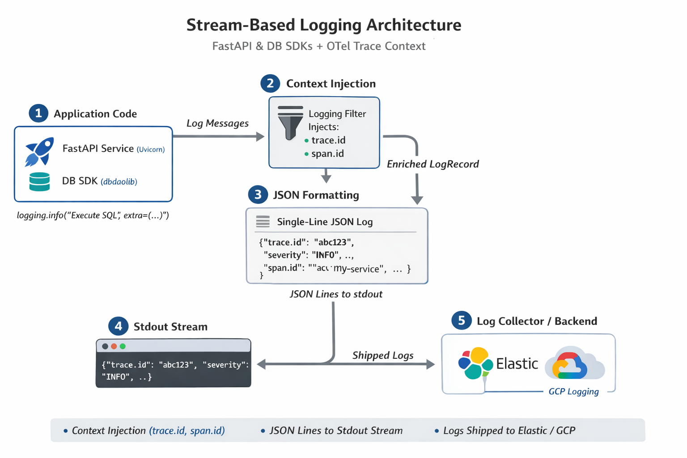

# KubePlayground - Development Plan

## Project Vision

An interactive, locally-deployable web platform similar to HackerRank/LeetCode for learning Kubernetes hands-on.

**What you can do:**
- Browse exercises from curated curriculum
- Write YAML solutions in browser with Monaco Editor (VS Code-like experience)
- Validate against your local Kubernetes cluster (Minikube/MicroK8s)
- Save and track progress locally with auto-save
- Get instant feedback via automated verification steps

**Current Focus (v1.0)**: Exercise display, solution editing/saving, validation, and reset functionality.

**Future (v2.0)**: User authentication, progress tracking, leaderboards, and social features.

---

## Project Name: **KubePlayground** ✅

**Chosen**: KubePlayground - Interactive Kubernetes learning playground where you experiment, break things, and learn by doing!

**Why this name?**
- Conveys hands-on experimentation (playground = safe space to try things)
- Memorable and friendly
- Clearly Kubernetes-focused ("Kube" prefix)
- Appeals to learners who want to "play" with K8s without fear

---

## Architecture Overview



---

## Service Breakdown

### 1. API Gateway (Port 8000)
- **Responsibilities**:
  - Single entry point for all frontend requests
  - Request routing to microservices
  - Rate limiting (IP-based for now)
  - CORS handling
  - Logging and monitoring
- **Tech**: FastAPI, httpx (for proxying)
- **Database**: None (stateless)

### 2. Exercise Service (Port 8001)
- **Responsibilities**:
  - CRUD operations for exercises
  - Sync with Git repository (parse markdown + YAML from `Deployment101/practice/`)
  - Filter by topic, difficulty
  - Return exercise templates and instructions
- **Tech**: FastAPI, GitPython
- **Database**: MongoDB `exercises` collection
  ```python
  {
    "_id": "ex1",
    "title": "Debug Broken Deployment",
    "topic": "Deployment",
    "difficulty": "basic",
    "instructions": "...",
    "template_yaml": "...",
    "solution_yaml": "...",
    "verification_commands": [...]
  }
  ```

### 3. Solution Service (Port 8002)
- **Responsibilities**:
  - Auto-save user's YAML code (debounced 2s)
  - Store solution versions (history)
  - Retrieve latest or specific version
  - Reset to exercise template
- **Tech**: FastAPI
- **Database**: MongoDB `solutions` + `solution_versions` collections
  ```python
  # solutions collection
  {
    "_id": "sol123",
    "exercise_id": "ex1",
    "session_id": "session_abc",  # Browser session ID
    "yaml_content": "...",
    "updated_at": "2025-01-15T10:30:00Z"
  }
  
  # solution_versions collection
  {
    "_id": "ver456",
    "solution_id": "sol123",
    "yaml_content": "...",
    "version": 3,
    "created_at": "2025-01-15T10:25:00Z"
  }
  ```

### 4. Validation Service (Port 8003)
- **Responsibilities**:
  - Execute kubectl commands against user's local cluster
  - Parse command output
  - Stream logs in real-time
  - **Stateless** (no database, compute-heavy)
- **Tech**: FastAPI, subprocess, asyncio
- **Database**: None
- **API**:
  ```python
  POST /validate
  {
    "yaml_content": "...",
    "verification_steps": [
      {"command": "kubectl apply -f -", "expected": "deployment created"},
      {"command": "kubectl get pods -l app=nginx", "expected": "3/3 Running"}
    ]
  }
  ```

### 5. Submission Service (Port 8004)
- **Responsibilities**:
  - Orchestrate validation workflow
  - Call Validation Service
  - Store submission results and history
- **Tech**: FastAPI, httpx
- **Database**: MongoDB `submissions` collection
  ```python
  {
    "_id": "sub789",
    "exercise_id": "ex1",
    "solution_id": "sol123",
    "session_id": "session_abc",
    "status": "passed",
    "validation_results": [...],
    "submitted_at": "2025-01-15T10:35:00Z"
  }
  ```

---

## Inter-Service Communication

- **Protocol**: REST APIs using `httpx` (async HTTP client)
- **Alternative**: gRPC for high-throughput scenarios (future optimization)
- **Example Flow**:
  ```
  Frontend → API Gateway → Submission Service → Validation Service
                        ↓                      ↓
                   Solution Service       Exercise Service
  ```

---

## Why Microservices?

1. **Scalability**: Scale Validation Service independently (CPU-intensive kubectl ops)
2. **Fault Isolation**: If one service fails, others continue working
3. **Independent Deployment**: Update Exercise Service without redeploying frontend
4. **Technology Freedom**: Different services can use different libraries (future: Validation Service in Go for performance)
5. **Development Focus**: Each service has clear responsibility (exercises, solutions, validation, submissions)

---

## Technical Stack Summary

- **Architecture**: Microservices (5 services + API Gateway)
  - Scalable: Each service can scale independently
  - Fault-isolated: Service failures don't cascade
  - Independently deployable
  - **No authentication for now** (focus on core learning functionality)
- **API Gateway**: FastAPI (reverse proxy, rate limiting, CORS)
- **Backend Services**: FastAPI (Python 3.11+)
- **Frontend**: React 18 with TypeScript
- **Database**: MongoDB (collections: exercises, solutions, submissions, solution_versions)
- **Cache/Queue**: Redis (solution auto-save debouncing, submission queue)
- **Code Editor**: Monaco Editor (VS Code's editor)
- **Kubernetes Client**: kubectl via subprocess (validation service)
- **Containerization**: Docker + Docker Compose (local dev), Helm (production)
- **Inter-Service Communication**: REST (httpx), WebSocket (live logs), gRPC (future)
- **Service Discovery**: Environment variables (Docker Compose), DNS (Kubernetes)
- **Session Management**: Browser sessionStorage (simple UUID, no backend auth)
- **Monitoring** (Future): Prometheus + Grafana

---

## Resource Requirements

**Minimum System Requirements**:
- **CPU**: 5 cores (2 for Minikube, 2 for services, 1 for Validation)
- **RAM**: 10GB (4GB Minikube, 4GB services, 2GB OS)
- **Disk**: 15GB free space

**Per-Service Allocation** (Docker Compose limits):
| Service | CPU Limit | Memory Limit | Replicas | Notes |
|---------|-----------|--------------|----------|-------|
| API Gateway | 0.5 cores | 256MB | 1 | Lightweight proxy |
| Exercise Service | 0.5 cores | 512MB | 1 | DB queries + Git sync |
| Solution Service | 0.5 cores | 512MB | 1 | Auto-save writes |
| Validation Service | 1.0 cores | 512MB | 1-2 | **CPU-intensive** kubectl |
| Submission Service | 0.5 cores | 256MB | 1 | Orchestration only |
| MongoDB | 1.0 cores | 2048MB | 1 | Primary datastore |
| Redis | 0.5 cores | 256MB | 1 | Cache/queue |
| Frontend | 0.5 cores | 256MB | 1 | Nginx static files |

**Total**: ~4-5 cores, ~4.5GB RAM for 8 containers

---

## Docker Compose Configuration

**Docker Compose Configuration** (`docker-compose.yml`):
```yaml
version: '3.8'
services:
  api-gateway:
    build: ./services/api-gateway
    ports:
      - "8000:8000"
    environment:
      - EXERCISE_SERVICE_URL=http://exercise-service:8001
      - SOLUTION_SERVICE_URL=http://solution-service:8002
      - VALIDATION_SERVICE_URL=http://validation-service:8003
      - SUBMISSION_SERVICE_URL=http://submission-service:8004
    depends_on:
      - exercise-service
      - solution-service
      - validation-service
      - submission-service

  exercise-service:
    build: ./services/exercise-service
    ports:
      - "8001:8001"
    environment:
      - MONGODB_URL=mongodb://mongodb:27017
    depends_on:
      - mongodb

  solution-service:
    build: ./services/solution-service
    ports:
      - "8002:8002"
    environment:
      - MONGODB_URL=mongodb://mongodb:27017
      - REDIS_URL=redis://redis:6379
    depends_on:
      - mongodb
      - redis

  validation-service:
    build: ./services/validation-service
    ports:
      - "8003:8003"
    volumes:
      - ~/.kube:/root/.kube:ro  # Mount kubeconfig
    environment:
      - KUBECONFIG=/root/.kube/config

  submission-service:
    build: ./services/submission-service
    ports:
      - "8004:8004"
    environment:
      - MONGODB_URL=mongodb://mongodb:27017
      - VALIDATION_SERVICE_URL=http://validation-service:8003
    depends_on:
      - mongodb
      - validation-service

  mongodb:
    image: mongo:7
    ports:
      - "27017:27017"
    volumes:
      - mongodb_data:/data/db

  redis:
    image: redis:7-alpine
    ports:
      - "6379:6379"

  frontend:
    build: ./frontend
    ports:
      - "3000:80"
    depends_on:
      - api-gateway

volumes:
  mongodb_data:
```

---

## Development Phases (10 Weeks)

### Phase 1: Foundation & Microservices Setup (Week 1-2)

**Goal**: Set up 5 microservices with basic CRUD operations, no auth

#### Project Structure:
```
kubeplayground/
├── services/
│   ├── api-gateway/
│   │   ├── main.py
│   │   ├── middleware/
│   │   ├── Dockerfile
│   │   └── requirements.txt
│   ├── exercise-service/
│   │   ├── main.py
│   │   ├── models/
│   │   ├── routes/
│   │   ├── Dockerfile
│   │   └── requirements.txt
│   ├── solution-service/
│   │   ├── main.py
│   │   ├── models/
│   │   ├── routes/
│   │   ├── Dockerfile
│   │   └── requirements.txt
│   ├── validation-service/
│   │   ├── main.py
│   │   ├── kubectl_runner.py
│   │   ├── Dockerfile
│   │   └── requirements.txt
│   └── submission-service/
│       ├── main.py
│       ├── models/
│       ├── routes/
│       ├── Dockerfile
│       └── requirements.txt
├── frontend/
│   └── (React app - Phase 3)
├── docker-compose.yml
└── README.md
```

#### Tasks:

1. **API Gateway Setup** (2 days)
   - [ ] Create `services/api-gateway/` with FastAPI app
   - [ ] Implement middleware:
     ```python
     from fastapi import FastAPI, Request
     from fastapi.middleware.cors import CORSMiddleware
     import httpx
     
     app = FastAPI()
     
     # CORS
     app.add_middleware(
         CORSMiddleware,
         allow_origins=["http://localhost:3000"],
         allow_methods=["*"],
         allow_headers=["*"]
     )
     
     # Rate limiting (IP-based, simple counter in Redis)
     @app.middleware("http")
     async def rate_limit_middleware(request: Request, call_next):
         # Check Redis for rate limit by IP
         return await call_next(request)
     ```
   
   - [ ] Implement reverse proxy logic:
     ```python
     @app.api_route("/{path:path}", methods=["GET", "POST", "PUT", "DELETE"])
     async def proxy(path: str, request: Request):
         # Route to appropriate service based on path prefix
         if path.startswith("exercises"):
             target = EXERCISE_SERVICE_URL
         elif path.startswith("solutions"):
             target = SOLUTION_SERVICE_URL
         elif path.startswith("submissions"):
             target = SUBMISSION_SERVICE_URL
         # ... etc
         
         async with httpx.AsyncClient() as client:
             response = await client.request(
                 method=request.method,
                 url=f"{target}/{path}",
                 content=await request.body()
             )
             return response
     ```
   
   - [ ] Add health check endpoint: `GET /health`
   - [ ] Dockerfile with uvicorn

2. **Exercise Service** (3 days)
   - [ ] Create `services/exercise-service/`
   - [ ] FastAPI routes:
     ```python
     @app.get("/exercises")
     async def list_exercises(topic: str = None, difficulty: str = None):
         # Query MongoDB with filters
         # Return list of exercises
     
     @app.get("/exercises/{exercise_id}")
     async def get_exercise(exercise_id: str):
         # Return full exercise details including template
     
     @app.post("/exercises")  # Admin only, future
     async def create_exercise(exercise: ExerciseCreate):
         # Insert into MongoDB
     ```
   
   - [ ] MongoDB connection with `motor` (async driver):
     ```python
     from motor.motor_asyncio import AsyncIOMotorClient
     
     client = AsyncIOMotorClient("mongodb://mongodb:27017")
     db = client.kubeplayground
     exercises = db.exercises
     ```
   
   - [ ] Git repository sync script:
     ```python
     import git
     import yaml
     
     def sync_exercises():
         repo = git.Repo.clone_from("repo_url", "temp_dir")
         # Parse Deployment101/practice/README.md
         # Extract exercises, templates, solutions
         # Upsert into MongoDB
     ```
   
   - [ ] Dockerfile + requirements.txt

3. **Solution Service** (2 days)
   - [ ] Create `services/solution-service/`
   - [ ] FastAPI routes:
     ```python
     @app.post("/solutions/save")
     async def save_solution(session_id: str, exercise_id: str, yaml_content: str):
         # Debounce: Only save if 2s passed since last edit
         # Store in MongoDB solutions collection
         # Create version entry in solution_versions
     
     @app.get("/solutions/{exercise_id}")
     async def get_solution(exercise_id: str, session_id: str):
         # Return latest YAML content for this session+exercise
     
     @app.get("/solutions/{exercise_id}/versions")
     async def get_versions(exercise_id: str, session_id: str):
         # Return list of all versions with timestamps
     
     @app.post("/solutions/{exercise_id}/reset")
     async def reset_solution(exercise_id: str, session_id: str):
         # Fetch template from Exercise Service
         # Reset solution to template
     ```
   
   - [ ] Redis integration for debounce queue
   - [ ] MongoDB connection for solutions storage
   - [ ] Dockerfile

4. **Validation Service Skeleton** (1 day)
   - [ ] Create `services/validation-service/`
   - [ ] Basic FastAPI structure:
     ```python
     @app.post("/validate")
     async def validate(yaml_content: str, verification_steps: list):
         # Placeholder: return mock results
         return {"status": "pending", "steps": []}
     ```
   - [ ] Dockerfile
   - [ ] Mount kubeconfig volume in Docker Compose

5. **Submission Service Skeleton** (1 day)
   - [ ] Create `services/submission-service/`
   - [ ] FastAPI routes:
     ```python
     @app.post("/submissions/submit")
     async def submit(session_id: str, exercise_id: str, solution_id: str):
         # Call Validation Service
         # Store results in MongoDB
         return {"submission_id": "sub123", "status": "passed"}
     ```
   - [ ] Dockerfile

6. **Docker Compose Integration** (2 days)
   - [ ] Create root `docker-compose.yml` with all 8 services:
     - api-gateway
     - exercise-service
     - solution-service
     - validation-service
     - submission-service
     - mongodb
     - redis
     - frontend (placeholder Nginx)
   
   - [ ] Configure service discovery via environment variables
   - [ ] Test inter-service communication:
     ```bash
     docker-compose up -d
     curl http://localhost:8000/exercises  # Should proxy to exercise-service
     curl http://localhost:8001/health     # Direct access to exercise-service
     ```
   
   - [ ] Add health checks to docker-compose.yml
   - [ ] Volume mounts for development (hot reload)

**Deliverable**: All 5 microservices running in Docker Compose with basic CRUD operations (no auth), ready for kubectl integration

---

### Phase 2: Kubectl Integration & Validation Logic (Week 3)

**Goal**: Implement validation service to execute kubectl commands and verify outputs

#### Tasks:

1. **kubectl Execution Engine** (2 days)
   - [ ] Implement safe subprocess execution:
     ```python
     import subprocess
     import asyncio
     
     async def run_kubectl(command: str, yaml_input: str = None):
         process = await asyncio.create_subprocess_exec(
             *command.split(),
             stdin=asyncio.subprocess.PIPE if yaml_input else None,
             stdout=asyncio.subprocess.PIPE,
             stderr=asyncio.subprocess.PIPE
         )
         
         stdout, stderr = await asyncio.wait_for(
             process.communicate(input=yaml_input.encode() if yaml_input else None),
             timeout=30
         )
         
         return stdout.decode(), stderr.decode(), process.returncode
     ```
   
   - [ ] Verify kubeconfig access
   - [ ] Timeout handling (30s max per command)
   - [ ] Error parsing and user-friendly messages

2. **Namespace Isolation** (1 day)
   - [ ] Generate unique namespace per validation:
     ```python
     import uuid
     
     namespace = f"validation-{uuid.uuid4().hex[:8]}"
     await run_kubectl(f"kubectl create namespace {namespace}")
     ```
   
   - [ ] Cleanup after validation (delete namespace)
   - [ ] Resource quota enforcement

3. **Verification Logic** (2 days)
   - [ ] Parse verification steps from exercise metadata
   - [ ] Execute commands sequentially:
     ```python
     for step in verification_steps:
         command = step["command"].replace("kubectl", f"kubectl -n {namespace}")
         stdout, stderr, code = await run_kubectl(command, yaml_content)
         
         # Check expected output
         if step["expected"] in stdout:
             results.append({"step": step, "passed": True, "output": stdout})
         else:
             results.append({"step": step, "passed": False, "output": stderr})
     ```
   
   - [ ] Implement output matching (regex, substring, exact)
   - [ ] Return structured results

4. **WebSocket Streaming** (2 days)
   - [ ] Implement WebSocket endpoint for live logs:
     ```python
     from fastapi import WebSocket
     
     @app.websocket("/ws/validate/{validation_id}")
     async def stream_logs(websocket: WebSocket, validation_id: str):
         await websocket.accept()
         
         async for log_line in execute_validation(validation_id):
             await websocket.send_text(log_line)
         
         await websocket.close()
     ```
   
   - [ ] Stream kubectl output line-by-line
   - [ ] Send progress updates (Step 1/3 completed)

**Deliverable**: Validation service can execute kubectl commands, verify outputs, and stream logs to frontend

---

### Phase 3: Frontend Development (Week 4-5) ✅ COMPLETED

**Goal**: Build LeetCode-style React UI with split-panel layout, tabbed interface, YAML editor, and quiz mode

**Status**: ✅ REFACTORING COMPLETE - Core UI component architecture fully implemented

#### Completed Tasks:

1. ✅ **React Project Setup**
   - Created React app with TypeScript
   - Installed core dependencies: Tailwind CSS 3.3.0, lucide-react 0.344.0, autoprefixer, postcss
   - Setup folder structure with organized component directories
   - Configured `tailwind.config.js` with dark mode support
   - Configured `postcss.config.js` with Tailwind and autoprefixer

2. ✅ **Split-Panel Layout (LeetCode-style)**
   - Implemented resizable split-pane layout with mouse drag functionality
   - Left panel: 40% width | Right panel: 60% width (customizable via `leftWidth` state)
   - Dark mode support with Tailwind CSS (`dark:` prefixes)
   - Fully responsive design with flex layout
   - Smooth panel resizing with visual feedback

3. ✅ **Left Panel - Exercise Description**
   - **DescriptionPanel** component with 3 tabbed sections:
     - Description Tab: Exercise title, badges (difficulty/topic), time estimate, markdown content
     - Steps Tab: Phase-based guided steps with checklist tracking
     - Hints Tab: Placeholder for future hints feature
   - Exercise header displays title, difficulty badge, and topic badge
   - Full markdown rendering for exercise descriptions
   - Integrated StepsPanel component for guided steps

4. ✅ **Right Panel - Tabbed Interface**
   - **CodeEditor** tab: YAML code editing with syntax highlighting
     - Line numbers display
     - Syntax highlighting for comments (green italic), keywords (blue), strings (orange)
     - Real-time editing and live code display
     - Ready for auto-save integration (2s debounce)
   - **Console** tab: Collapsible validation output drawer
     - Shows validation step results with pass/fail indicators
     - Loading spinner during validation
     - Styled output with CheckCircle/XCircle icons
     - Animated collapse/expand
   - **QuizPanel** tab: Interactive quiz component
     - Multiple choice questions with radio buttons
     - Answer tracking by question ID
     - Result display with explanation section
     - Question counter display

5. ✅ **YAML Editor Component**
   - Custom syntax highlighting for YAML language
   - Line numbers display (right-aligned)
   - Real-time code highlighting overlay
   - Support for comments, keys, values, and strings
   - Textarea-based input with styled overlay
   - Font scaling support
   - Dark/light theme support

6. ✅ **Console/Output Section**
   - Collapsible drawer component with smooth animations
   - Displays validation step results (step name, status, message)
   - Pass/fail indicators with color coding (green/red)
   - Loading state during validation
   - Empty state message when no results
   - Scroll support for long outputs

7. ✅ **Toolbar & Action Buttons**
   - Header component with exercise navigation
   - Run/Submit buttons for code validation
   - Settings menu for theme toggle
   - Exercise selector dropdown
   - Topic filter dropdown
   - Loading states during validation
   - Icons from lucide-react (Code, Moon, Sun, Send, Play, etc.)

8. ✅ **Quiz Mode Implementation**
   - Full quiz component with state management
   - Question counter ("Question X of Y")
   - Radio button options for single-select
   - Answer tracking by question ID
   - Results display after submission
   - Explanation section for feedback
   - Visual styling for correct/incorrect answers

9. ✅ **UI Components**
   - **Badge.tsx**: Reusable badge with color variants (blue, green, gray)
   - **MarkdownRenderer.tsx**: Markdown parser with inline styling helper
     - Code block parsing with language labels
     - Inline code, bold, heading, and list rendering
     - `parseInline()` helper function for inline styles

10. ✅ **Mock Data & Data Structures**
    - **mockExercises.ts**: Static exercise data
      - 2 sample exercises (code challenge + quiz)
      - Exercise interface with: id, type, title, difficulty, topic, description, template, steps, quizData
      - MOCK_VALIDATION_RESULTS for testing validation display
      - Phase and Task interfaces for step tracking

11. ⏳ **API Integration** (Ready for Phase 4)
    - Created `FRONTEND_API_INTEGRATION.md` with complete API contracts
    - Documented all required endpoints for Exercise, Solution, Validation, Submission services
    - Defined request/response formats with TypeScript interfaces
    - Provided sample API client setup and hooks structure
    - Documented WebSocket pattern for live validation streaming

#### Components Created:

| Component | Purpose | Location | Status |
|-----------|---------|----------|--------|
| **App.tsx** | Main orchestrator (267 lines) | src/ | ✅ Complete |
| **DescriptionPanel.tsx** | Tabbed exercise description | src/components/LeftPanel/ | ✅ Complete |
| **StepsPanel.tsx** | Phase-based guided steps with checkbox | src/components/LeftPanel/ | ✅ Complete |
| **CodeEditor.tsx** | YAML editor with highlighting | src/components/RightPanel/ | ✅ Complete |
| **Console.tsx** | Validation output drawer | src/components/RightPanel/ | ✅ Complete |
| **QuizPanel.tsx** | Interactive quiz component | src/components/RightPanel/ | ✅ Complete |
| **Badge.tsx** | Reusable badge component | src/components/ui/ | ✅ Complete |
| **MarkdownRenderer.tsx** | Markdown parser | src/components/shared/ | ✅ Complete |

#### Documentation Created:

- **FRONTEND_SETUP.md**: Installation, development workflow, project structure, environment setup, troubleshooting
- **FRONTEND_COMPONENTS.md**: Component specifications, props, state, data flow, styling, testing examples
- **FRONTEND_API_INTEGRATION.md**: API contracts, endpoints, request/response formats, error handling, integration checklist

#### Features Ready for Integration:

- ✅ Exercise loading and switching
- ✅ Code editing with syntax highlighting
- ✅ Validation result display
- ✅ Quiz mode with answer tracking
- ✅ Dark mode support
- ✅ Responsive layout with resizable panels
- ⏳ Auto-save to backend (API structure ready)
- ⏳ Real-time validation streaming (WebSocket patterns defined)
- ⏳ Solution history and restore (API defined)
- ⏳ Submission tracking (API defined)

**Deliverable**: ✅ Production-ready LeetCode-style React UI with full component architecture, modular structure, comprehensive documentation, and clear integration points for backend microservices. All 8 core components implemented with TypeScript and Tailwind CSS.

**Next Phase Actions** (Phase 4 - API Integration):
1. Implement API client layer (`src/services/apiClient.ts`)
2. Create custom hooks for data fetching (`src/hooks/useExercises.ts`, `useSolution.ts`, `useValidation.ts`)
3. Connect frontend components to backend endpoints
4. Implement error handling and loading states
5. Test integration with running backend services

---

### Phase 4: API Integration & Backend Connection (Week 6) ⏳ READY FOR IMPLEMENTATION

**Goal**: Connect frontend components to backend microservices via REST API and WebSocket

**Status**: ✅ ARCHITECTURE DEFINED - Frontend ready for backend integration. See `FRONTEND_API_INTEGRATION.md` for complete API contracts.

#### Tasks:

1. **API Client Setup** (1 day)
   - [ ] Create `src/services/apiClient.ts` with Axios instance
   - [ ] Configure base URL from environment variables
   - [ ] Add session ID to X-Session-ID header
   - [ ] Implement request/response interceptors
   - [ ] Add error handling and retry logic

2. **Custom Hooks for Data Fetching** (2 days)
   - [ ] Create `src/hooks/useExercises.ts` - fetch exercises by topic/difficulty
   - [ ] Create `src/hooks/useSolution.ts` - auto-save, load, restore, reset
   - [ ] Create `src/hooks/useValidation.ts` - trigger validation, stream logs via WebSocket

3. **Exercise Service Integration** (1 day)
   - [ ] Connect DescriptionPanel to fetch exercise data
   - [ ] Load solution on exercise selection
   - [ ] Handle loading/error states

4. **Solution Service Integration** (2 days)
   - [ ] Implement auto-save in CodeEditor (2s debounce)
   - [ ] Load previous solution on mount
   - [ ] Implement version history and restore
   - [ ] Implement "Reset to template" button

5. **Validation Service Integration** (2 days)
   - [ ] Connect "Run Code" button to validation endpoint
   - [ ] Implement WebSocket for live logs
   - [ ] Stream logs to Console component
   - [ ] Display final results

6. **Submission Service Integration** (1 day)
   - [ ] Connect "Submit" button to submission endpoint
   - [ ] Store submissions in backend
   - [ ] Display submission history

7. **Error Handling & Resilience** (1 day)
   - [ ] Error boundaries
   - [ ] Retry logic for failed requests
   - [ ] User-friendly error messages
   - [ ] WebSocket fallback to polling

8. **Loading States & Skeletons** (1 day)
   - [ ] Skeleton loaders for exercise description
   - [ ] Loading spinners for validation
   - [ ] Disable buttons during async operations

**Deliverable**: Fully integrated frontend and backend with seamless API communication, real-time validation feedback, auto-save functionality, and complete error handling.

**Frontend Documentation for Integration**:
- `FRONTEND_API_INTEGRATION.md` - Complete API contracts and endpoints
- `FRONTEND_COMPONENTS.md` - Component props and data flow
- `FRONTEND_SETUP.md` - Development setup and deployment

---

### Phase 6: CLI Tool (Week 8) - Optional ⏳ FUTURE

**Goal**: Build a CLI alternative for terminal-first users

#### Tasks:

1. **CLI Framework** (2 days)
   - [ ] Use `typer` or `click` for CLI
   - [ ] Commands:
     ```bash
     kubeplayground list                          # List all exercises
     kubeplayground start <exercise_id>           # Open exercise in $EDITOR
     kubeplayground submit <exercise_id>          # Submit solution
     kubeplayground reset <exercise_id>           # Reset to template
     kubeplayground history <exercise_id>         # Show submission history
     ```

2. **Editor Integration** (1 day)
   - [ ] Open YAML in `$EDITOR` (vim, nano, code, etc.)
   - [ ] Watch file for changes
   - [ ] Auto-save on file change

3. **TUI for Results** (2 days)
   - [ ] Use `rich` library for terminal UI
   - [ ] Display validation results with colors
   - [ ] Progress bars for validation steps
   - [ ] Tables for exercise list

**Deliverable**: Functional CLI tool for terminal-first workflow

---

### Phase 7: Containerization & Helm Chart (Week 9) ⏳ FUTURE

**Goal**: Package platform for easy deployment

#### Tasks:

1. **Optimize Docker Images** (2 days)
   - [ ] Multi-stage builds for smaller images
   - [ ] Health checks in Dockerfiles
   - [ ] Non-root user for security

2. **Helm Chart Creation** (3 days)
   - [ ] Create `helm/` directory:
     ```
     helm/kubeplayground/
     ├── Chart.yaml
     ├── values.yaml
     ├── templates/
     │   ├── api-gateway-deployment.yaml
     │   ├── exercise-service-deployment.yaml
     │   ├── solution-service-deployment.yaml
     │   ├── validation-service-deployment.yaml
     │   ├── submission-service-deployment.yaml
     │   ├── mongodb-statefulset.yaml
     │   ├── redis-deployment.yaml
     │   ├── frontend-deployment.yaml
     │   ├── services.yaml
     │   └── ingress.yaml
     ```
   
   - [ ] Parameterize configurations in `values.yaml`
   - [ ] ConfigMaps for environment variables
   - [ ] Secrets for sensitive data (future auth)

3. **Installation Script** (2 days)
   - [ ] `install.sh` script:
     ```bash
     #!/bin/bash
     # Check Minikube/MicroK8s installed
     # Check kubectl available
     # Deploy with Helm
     helm install kubeplayground ./helm/kubeplayground
     
     # Wait for pods ready
     kubectl wait --for=condition=ready pod -l app=api-gateway
     
     # Print access URL
     echo "KubePlayground ready at http://$(minikube ip):30000"
     ```

**Deliverable**: Helm chart for one-command deployment to local Kubernetes

---

### Phase 8: Data Migration (Week 10) ⏳ FUTURE

**Goal**: Import existing exercises from repository

#### Tasks:

1. **Exercise Parser** (2 days)
   - [ ] Parse `Deployment101/practice/README.md`
   - [ ] Extract:
     - Exercise title
     - Instructions (markdown)
     - Requirements
     - Template YAML
     - Solution YAML
     - Verification commands
   
   - [ ] Convert to MongoDB documents

2. **Import Script** (2 days)
   - [ ] Batch import script:
     ```python
     import os
     import yaml
     import markdown
     
     def import_exercises(repo_path):
         for topic_dir in os.listdir(repo_path):
             if not topic_dir.endswith("101"):
                 continue
             
             practice_dir = os.path.join(repo_path, topic_dir, "practice")
             readme = parse_markdown(os.path.join(practice_dir, "README.md"))
             
             for exercise in readme["exercises"]:
                 # Insert into MongoDB
                 db.exercises.insert_one(exercise)
     ```
   
   - [ ] Validate imported data
   - [ ] Handle duplicates (update existing)

3. **Quiz Data Creation** (3 days)
   - [ ] Create quiz questions for each topic:
     - Pods: Init containers, probes, lifecycle
     - Deployments: Selectors, rolling updates, strategies
     - Services: ClusterIP vs NodePort, endpoints
   
   - [ ] Store in MongoDB `quizzes` collection
   - [ ] Link quizzes to exercises

**Deliverable**: All existing exercises imported and ready for use

---

### Phase 9: Testing & Bug Fixes (Week 11) ⏳ FUTURE

**Goal**: Comprehensive testing and bug fixes

#### Tasks:

1. **Unit Tests** (2 days)
   - [ ] Test each service independently
   - [ ] Mock external dependencies (MongoDB, Redis, kubectl)
   - [ ] Use `pytest` and `pytest-asyncio`

2. **Integration Tests** (2 days)
   - [ ] Test inter-service communication
   - [ ] Test full submission workflow
   - [ ] Test validation with real Kubernetes cluster

3. **E2E Tests** (2 days)
   - [ ] Use Playwright or Cypress for frontend
   - [ ] Test full user journey:
     - Browse exercises
     - Write solution
     - Submit
     - View results

4. **Bug Fixes** (1 day)
   - [ ] Fix identified issues
   - [ ] Performance optimizations
   - [ ] Error handling improvements

**Deliverable**: Stable platform with test coverage

---

### Phase 10: Documentation & Polish (Week 12) ⏳ FUTURE

**Goal**: Final polish and documentation

#### Tasks:

1. **User Documentation** (2 days)
   - [ ] README.md with:
     - Installation instructions
     - Quick start guide
     - Troubleshooting
     - Architecture diagram
   
   - [ ] Video tutorial (optional)
   - [ ] Screenshots for GitHub

2. **Developer Documentation** (2 days)
   - [ ] API documentation (Swagger/OpenAPI)
   - [ ] Service architecture diagrams
   - [ ] Contributing guidelines
   - [ ] Local development setup

3. **UI/UX Polish** (2 days)
   - [ ] Consistent styling across pages
   - [ ] Loading states and skeletons
   - [ ] Error messages with helpful hints
   - [ ] Keyboard shortcuts help modal

4. **Performance Optimization** (1 day)
   - [ ] Database indexing (exercise queries)
   - [ ] Redis caching for exercise list
   - [ ] Frontend code splitting
   - [ ] Image optimization

**Deliverable**: Production-ready platform with comprehensive documentation

---

## Future Enhancements (Post-Launch)

### Phase 9: Authentication & User Management (v2.0)

**Why deferred?** Focus v1.0 on core learning functionality. Auth adds complexity without immediate value for local-only use.

**When to add:**
- User Service (Port 8002) will be added back
- JWT-based authentication
- User registration/login
- Progress tracking per user (replace session_id with user_id)
- Social features (share solutions, follow users)
- User profiles and achievements

**Implementation tasks:**
- [ ] Create User Service with FastAPI
- [ ] Add JWT middleware to API Gateway
- [ ] Update Solution/Submission services to use user_id
- [ ] Add login/signup pages to frontend
- [ ] Migrate session-based data to user accounts

### Other Future Features

1. **Advanced Features**:

2. **Advanced Features**:
   - Custom exercise creation (web UI)
   - Leaderboard and challenges
   - Kubernetes certification prep mode
   - Multi-cluster support

3. **Community Features**:
   - Discussion forums per exercise
   - Upvote/downvote solutions
   - User-submitted exercises

4. **Performance**:
   - Migrate Validation Service to Go (faster kubectl execution)
   - gRPC for inter-service communication
   - Horizontal scaling with Kubernetes HPA

5. **Monitoring**:
   - Prometheus metrics
   - Grafana dashboards
   - Error tracking (Sentry)

---

## Getting Started

```bash
# Clone repository
git clone https://github.com/yourusername/kubeplayground.git
cd kubeplayground

# Start services with Docker Compose
docker-compose up -d

# Access platform
open http://localhost:3000

# Or deploy to Kubernetes
helm install kubeplayground ./helm/kubeplayground
```

---

## License

Apache 2.0 License - Feel free to use, modify, and distribute this project.
