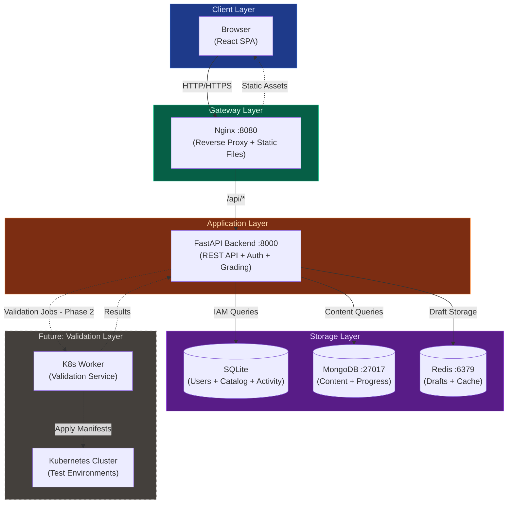

# KubePlayground

> A privacy-first, AI-powered Kubernetes learning platform — run locally with custom courses generated by ChatGPT/Claude.

[](https://opensource.org/licenses/MIT)
[](https://www.python.org/downloads/)
[](https://nodejs.org/)
[](https://docs.docker.com/compose/)

## What Makes KubePlayground Different?

### 🏠 Local-First Architecture

- **Your data, your machine** - No cloud dependencies, complete offline capability
- **Privacy guaranteed** - Zero telemetry, no analytics tracking
- **Blazing fast** - 5-50ms query times with hybrid SQLite + MongoDB architecture

### 🤖 AI-Powered Content Creation

- **Generate custom courses** with ChatGPT, Claude, or any AI assistant
- **Simple YAML format** - AI outputs structured learning units you control
- **Incremental seeding** - Add topics gradually as you create them
- **Portable content** - Export/share courses in standard YAML format

### 🎓 Comprehensive Learning Experience

- 📚 **Dual-Mode Learning**: Conceptual modules (quizzes) + Coding exercises (YAML editor)
- 🎨 **Modern UI**: Dracula theme with VS Code-style Monaco editor
- 🎉 **Gamification**: Streak tracking, activity heatmaps, animated feedback
- 🔒 **Split-Brain Security**: Answer keys never exposed to client
- 💾 **Progress Tracking**: JWT authentication with refresh tokens, auto-save drafts
- 🐳 **Zero Config**: Docker Compose deployment in 60 seconds

## Quick Start (60 Seconds)

```bash
# Clone and start
git clone https://github.com/Lelouch-Britannia/KubePlayground.git
cd KubePlayground
docker compose up -d

# Access at http://localhost:8080
# Sample content auto-seeded on first run

# Create your own AI-generated course
# 1. Ask ChatGPT: "Generate a Kubernetes course with Pods topic"
# 2. Save YAML files to ./user-courses/my-k8s-course/pods/
# 3. Seed: curl -X POST http://localhost:8000/api/seed/populate?topic_dir=/user-courses/my-k8s-course/pods
```

## Architecture


```mermaid
graph TB
    subgraph Client["Client Layer"]
        Browser["Browser\n(React SPA)"]
    end

    subgraph Gateway["Gateway Layer"]
        Nginx["Nginx :8080\n(Reverse Proxy + Static Files)"]
    end

    subgraph Backend["Application Layer"]
        API["FastAPI Backend :8000\n(REST API + Auth + Grading)"]
    end

    subgraph Storage["Storage Layer"]
        SQLite[("SQLite\n(Users + Catalog + Activity)")]
        MongoDB[("MongoDB :27017\n(Content + Progress)")]
        Redis[("Redis :6379\n(Drafts + Cache)")]
    end

    subgraph Future["Future: Validation Layer"]
        Worker["K8s Worker\n(Validation Service)"]
        K8s["Kubernetes Cluster\n(Test Environments)"]
    end

    Browser -->|HTTP/HTTPS| Nginx
    Nginx -->|/api/*| API
    Nginx -.->|Static Assets| Browser

    API -->|IAM Queries| SQLite
    API -->|Content Queries| MongoDB
    API -->|Draft Storage| Redis
    API -.->|Validation Jobs - Phase 2| Worker

    Worker -.->|Apply Manifests| K8s
    Worker -.->|Results| API

    style Client fill:#1e3a8a,stroke:#3b82f6,color:#e0e7ff
    style Gateway fill:#065f46,stroke:#10b981,color:#d1fae5
    style Backend fill:#7c2d12,stroke:#f97316,color:#fed7aa
    style Storage fill:#581c87,stroke:#a855f7,color:#e9d5ff
    style Future fill:#44403c,stroke:#78716c,color:#d6d3d1,stroke-dasharray: 5 5
```

**Current Status**: Phase 1 completed - Full-stack application with authentication
**Architecture**: Local-first hybrid database (SQLite + MongoDB + Redis)
**Next Phase**: K8s validation worker for real cluster testing


---

## Core Philosophy

### 🔐 Privacy & Ownership

- **No cloud accounts** - Run entirely on your machine
- **Your content** - Generate courses with AI, keep all data locally
- **No vendor lock-in** - Standard YAML format, open-source stack
- **Offline-capable** - Full functionality without internet after setup

### ⚡ Performance-First Design

- **Hybrid database** - SQLite (5ms catalog queries) + MongoDB (flexible content)
- **Smart caching** - Redis for draft autosave (every 3-5s)
- **Optimized for local** - No network latency, no distributed systems complexity
- **Minimal footprint** - <500MB RAM, runs on any modern processor

### 🎯 What You Can Do

- **Browse AI-generated courses** - Custom curriculum tailored to your learning path
- **Dual-mode learning** - Conceptual quizzes + hands-on YAML coding exercises
- **Track progress** - Activity heatmaps, streak tracking, completion stats
- **Secure grading** - Split-brain architecture (answer keys server-side only)
- **Validate against K8s** - Real cluster testing (Phase 6)

---

## Service Breakdown

| Service | Port | Technology | Description |
|---------|------|------------|-------------|
| **Frontend** | 8080 | React + Nginx | SPA with Dracula theme, Monaco editor, JWT auth |
| **Backend** | 8000 | FastAPI + Beanie | REST API with split-brain security, JWT + refresh tokens |
| **MongoDB** | 27017 | MongoDB 6.0 | Learning content, user progress, quiz submissions |
| **SQLite** | - | File-based | User accounts, course catalog, activity tracking |
| **Redis** | 6379 | Redis | Draft autosave (every 3-5s), session state |
| **Seed** | - | Python script | Auto-populate sample content on first run |

### SDK Layer (`dbdaolib` v2.0.0)

**Role**: The Foundation (Library)

- **Responsibilities**:
  - **Unified Connectivity**: Manages connection pooling for SQL (SQLAlchemy) and NoSQL (Motor/Beanie).
  - **Singleton Management**: Ensures single instances of database drivers across the application.
  - **SQL Data Access**: BaseSqlDao with @InjectConnection decorator for transaction management.
  - **NoSQL Data Access**: Direct Beanie Document models (Active Record pattern, no DAO layer).
  - **Structured Logging**: LogBuilder with LogEvent taxonomy for operational monitoring.
  - **Error Handling**: Two-tier for SQL (InfraErrorCode + DaoErrorCode), single-tier for NoSQL
    (InfraErrorCode).

- **Tech**: Python, Motor, Beanie, SQLAlchemy 2.0+.
- **Documentation**: [SDK Architecture Docs](./docs/SDK/)

### 1. Core Service (Port 8000)

**Role**: The "Brain" (Monolith)

- **Responsibilities**:
  - **API Gateway**: Single entry point for Frontend.
  - **Content Delivery**: Serves public learning content (exercises, lessons).
  - **Secure Grading**: Server-side quiz/code validation using split-brain architecture.
  - **Exercise Domain**: Manages public content (questions, instructions) and private solutions (answer
    keys, validation scripts).
  - **User Solution Domain**: Handles user code/quiz submissions, versioning, and auto-save.
  - **Progress Tracking**: Records user completion status and scores.
  - **Orchestration**: Dispatches validation jobs to background worker (future).
  - **WebSocket Manager**: Streams real-time validation logs (future).

- **Tech**: FastAPI, `dbdaolib` (NoSQL Driver).
- **Database**: MongoDB (via SDK).
  - **Collections**:
    - `learning_units` (Public): Questions, instructions, initial code templates
    - `unit_solutions` (Private): Answer keys, validation scripts (**never exposed to frontend**)
    - `user_solutions` (User Data): Code submissions, quiz answers, versioning, auto-save
    - `user_progress` (Permanent State): Completion tracking, scores, timestamps

### 2. Validation Service (Background Worker)

**Role**: The "Muscle" (Worker)

- **Responsibilities**:
- **Job Consumer**: Listens to Redis `validation_queue`.
- **K8s Interaction**: Applies manifests using official K8s Client.
- **Namespace Isolation**: Manages ephemeral test environments.

- **Tech**: Python (K8s Library).
- **Database**: Stateless (Uses K8s API).

### 3. Infrastructure

- **MongoDB**: Centralized storage with split-brain architecture:
  - Public collections: Safe for frontend (learning_units)
  - Private collections: Answer keys and validation scripts (unit_solutions)
  - User data: Submissions and progress tracking (user_solutions, user_progress)
- **Redis**: Message Broker (Jobs) & Event Bus (Logs) - **Deferred to Phase 6**
  - **Note**: Auto-save currently uses MongoDB (Redis optimization in v2.0)

---

## Development Phases

### Phase 1: Full-Stack Application ✅

**Complete local-first learning platform with authentication and content management.**

| Component | Implementation |
|-----------|----------------|
| **SDK Layer** | Database Access Object Library (`dbdaolib` v2.0.0) - Unified SQL/NoSQL drivers |
| **Frontend** | React 18 + TypeScript + Vite, Monaco Editor, Dracula theme, JWT auth |
| **Backend** | FastAPI + Beanie ODM + SQLAlchemy, split-brain security architecture |
| **Authentication** | JWT access tokens (60min) + refresh tokens (7 days), bcrypt password hashing |
| **Databases** | SQLite (users, catalog, activity) + MongoDB (content, progress) + Redis (drafts) |
| **Activity Tracking** | Daily aggregation, points system, GitHub-style heatmaps, streak calculation |
| **Course Catalog** | SQLite-based hierarchy with 5ms query times, cross-database foreign keys |
| **Content Management** | AI-generated YAML seeding, incremental topic loading |
| **Containerization** | Docker Compose with health checks, auto-seed service |
| **Security** | Rate limiting, token revocation, answer keys server-side only |
| **Performance** | 5-50ms query times, smooth UX, draft autosave every 3-5s |
| **Documentation** | [Technical Design](./docs/backend/TECHNICAL_DESIGN.md), [IAM Design](./docs/backend/IAM.md) |

**Deliverables:**

- ✅ Full-stack containerized application
- ✅ User authentication with JWT
- ✅ Course browsing with progress tracking
- ✅ Quiz/code submission with grading
- ✅ Activity analytics and gamification
- ✅ AI-powered content seeding

---

### Phase 2: K8s Validation Worker (Planned)

**Real Kubernetes cluster validation for coding exercises.**

| Component | Implementation |
|-----------|----------------|
| **Worker Service** | Python with Kubernetes client library |
| **Job Queue** | MongoDB-based (no Redis) |
| **Validation Flow** | Apply manifest → Run checks → Return results |
| **Namespace Isolation** | Ephemeral test environments per validation |
| **Resource Cleanup** | Auto-delete resources after validation |
| **Error Handling** | Detailed failure messages with K8s events |
| **Security** | RBAC-restricted service account, namespace quotas |

**Deliverables:**

- Real K8s cluster testing
- Automated manifest validation
- Live feedback on coding exercises

See [Issue 2](https://github.com/Lelouch-Britannia/KubePlayground/issues/2) for implementation details.

---

### Phase 3: Cloud Deployment (Deferred)

**⚠️ Architecture Decision:** This project is **intentionally designed for local hosting only**.

**Why no Kubernetes/Helm charts?**

- SQLite is single-writer (no multi-tenancy support)
- Hybrid database design optimized for local performance
- No cloud scalability requirements (personal learning tool)
- Docker Compose provides sufficient orchestration

**Migration Path (if needed):**

- Replace SQLite with PostgreSQL (multi-writer support)
- Replace MongoDB with Atlas cluster (horizontal scaling)
- Add Redis Cluster (distributed caching)
- Implement distributed transactions (saga pattern)
- **Estimated effort:** 6-12 months complete rearchitecture

**Recommendation:** If you need cloud deployment, build a cloud-native version
from scratch instead of adapting this local-first architecture.

**See:** [TECHNICAL_DESIGN.md Section 8.6](./docs/backend/TECHNICAL_DESIGN.md) for detailed migration analysis

---

## Resource Requirements

| Service | CPU Limit | Memory Limit | Status | Notes |
|---------|-----------|--------------|--------|-------|
| **Frontend** | 0.2 cores | 128MB | ✅ Running | Nginx + React + JWT auth |
| **Backend** | 0.5 cores | 512MB | ✅ Running | FastAPI + Beanie + SQLAlchemy (~5-50ms) |
| **MongoDB** | 0.5 cores | 512MB | ✅ Running | Content + progress storage |
| **SQLite** | - | 50MB | ✅ Running | Embedded (IAM + catalog) |
| **Redis** | 0.1 cores | 128MB | ✅ Running | Draft autosave + session cache |
| **Validation Worker** | 0.5 cores | 512MB | ⏳ Phase 6 | Real K8s cluster testing |

**Current Deployment (Phase 1)**: Full stack with authentication (~1.5 cores, 1.3GB RAM)
**Resource Footprint**: Optimized for single-user local hosting (laptop/desktop)

---

## Getting Started

### Option 1: Docker Compose (Recommended)

```bash
# Prerequisites: Docker and Docker Compose

# Clone repository
git clone https://github.com/Lelouch-Britannia/KubePlayground.git
cd KubePlayground

# Start all services
docker compose up -d

# Seed database with sample content (runs once)
# The seed service automatically populates pods101 content

# Access application
open http://localhost:8080

# View logs
docker compose logs -f backend

# Stop services
docker compose down

# Stop and remove volumes (clean slate)
docker compose down -v
```

### Option 2: Local Development

#### Prerequisites

- Python 3.10+
- Node.js 20+
- MongoDB 6.0+ (running on localhost:27017)
- uv (Python package manager)

#### Backend Setup

```bash
# Install uv
curl -LsSf https://astral.sh/uv/install.sh | sh

# Install SDK
cd SDKs/DAO
uv pip install -e .
cd ../..

# Install backend dependencies
uv pip install -r pyproject.toml

# Configure MongoDB connection
# Edit core/utils/config/development.yaml

# Start backend
cd core
uvicorn main:app --reload --host 0.0.0.0 --port 8000
```

#### Frontend Setup

```bash
cd frontend
npm install
npm run dev
# Frontend runs on http://localhost:5173
```

### Verify Installation

1. Open <http://localhost:8080> (Docker) or <http://localhost:5173> (local)
2. Dashboard should load with "Kubernetes Pods" topic
3. Click topic card → navigate to learning unit
4. Test quiz submission → see animated toast + confetti (on pass)
5. Test code submission → see toast notification

### Troubleshooting

| Issue | Solution |
|-------|----------|
| Port 8080 in use | Change port in `docker-compose.yml` or stop conflicting service |
| MongoDB connection refused | Check `docker compose ps` - ensure mongodb is healthy |
| Frontend shows 502 | Backend may still be starting - wait for health check |
| CORS errors (local dev) | Ensure backend runs on port 8000, frontend on 5173 |
| Seed not running | Run `docker compose up seed` manually |

---

## Documentation

### Architecture & Design

- [Backend Technical Design](./docs/backend/TECHNICAL_DESIGN.md) - System
  architecture, hybrid database design, AI content workflow
- [IAM Technical Design](./docs/backend/IAM.md) - Authentication flow, JWT security, activity tracking
- [IAM Schema Reference](./docs/backend/IAM_SCHEMA.md) - Database quick reference
- [Logging Standards](./docs/backend/Logging.md) - ECS-compliant structured logging

### Frontend

- [Component Architecture](./docs/frontend/COMPONENTS.md) - React component design patterns
- [API Integration](./docs/frontend/API_INTEGRATION.md) - Frontend-backend contracts

### SDK Layer

- [Database Access Library](./docs/SDK/DAOLIB.md) - Unified SQL + NoSQL driver
- [SQL Architecture](./docs/SDK/SQL_ARCHITECTURE.md) - SQLAlchemy implementation
- [NoSQL Architecture](./docs/SDK/NOSQL_ARCHITECTURE.md) - MongoDB/Beanie driver

---

## Future Roadmap

### v2.0 Features (Future)

- **Leaderboards** - Daily/weekly rankings with user activity data
- **More content** - Services, ConfigMaps, Deployments, StatefulSets
- **AI hints** - Context-aware suggestions powered by LLMs
- **Community courses** - Share/import AI-generated content
- **Advanced analytics** - Learning path recommendations
- **Mobile-responsive** - PWA for tablet/phone learning

### What We Won't Build

- ❌ **Cloud hosting/SaaS** - Violates local-first philosophy
- ❌ **Multi-tenancy** - Architecture optimized for single-user
- ❌ **Kubernetes deployment** - Docker Compose sufficient for local use
- ❌ **User data collection** - Privacy-first means zero telemetry

---

## Contributing

Contributions are welcome! Please see [CONTRIBUTING.md](./CONTRIBUTING.md) for guidelines.

## License

This project is licensed under the MIT License - see [LICENSE](./LICENSE) file for details.
