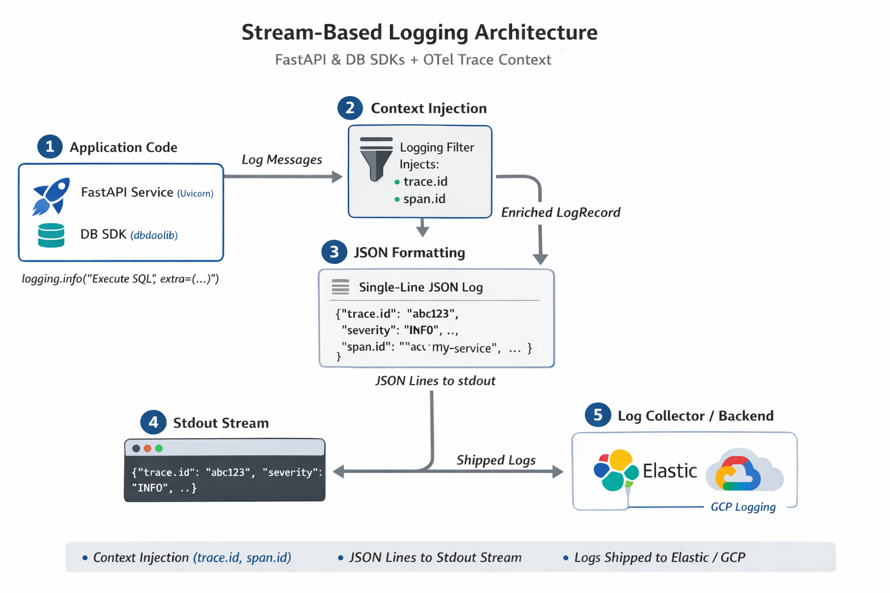

# KubePlayground - Development Plan (v2.1)

## Project Vision

An interactive, locally-deployable web platform similar to HackerRank/LeetCode for learning Kubernetes hands-on.

**What you can do:**

* Browse exercises from curated curriculum
* **Dual-Mode Learning**:
  * **Conceptual Modules**: Markdown lessons with interactive quizzes (multiple-choice)
  * **Coding Exercises**: Write YAML solutions in browser with Monaco Editor (VS Code-like experience)
* Validate against your local Kubernetes cluster (Minikube/MicroK8s)
* Save and track progress with auto-save (MongoDB-based)
* Get instant feedback via automated verification steps
* Secure grading via split-brain architecture (answer keys never exposed to frontend)

**Current Status (v1.0)**: Phase 2A completed - Full-stack implementation with Dracula theme, animated feedback, and optimized navigation.
**Current Focus**: Testing and validation before Phase 6 (K8s validation worker).
**Future (v2.0)**: User authentication, Redis optimization, leaderboards, and social features.

---

## Architecture Overview

We utilize a **Modular Monolith** pattern for the core application logic, paired with an **Asynchronous Worker** for Kubernetes operations (Phase 6). Crucially, all database connectivity and access patterns are standardized via a shared SDK (`dbdaolib`), separating infrastructure concerns from business logic.

**Current State (Phase 2A)**: Frontend + Core Service + MongoDB
**Planned State (Phase 6)**: + Validation Worker + Redis



---

## Service Breakdown

### 0. SDK Layer (`dbdaolib`)

**Role**: The Foundation (Library)

* **Responsibilities**:
  * **Unified Connectivity**: Manages connection pooling for SQL (SQLAlchemy) and NoSQL (Motor/Beanie).
  * **Singleton Management**: Ensures single instances of database drivers across the application.
  * **SQL Data Access**: BaseSqlDao with @InjectConnection decorator for transaction management.
  * **NoSQL Data Access**: Direct Beanie Document models (Active Record pattern, no DAO layer).
  * **Structured Logging**: LogBuilder with LogEvent taxonomy for operational monitoring.
  * **Error Handling**: Two-tier for SQL (InfraErrorCode + DaoErrorCode), single-tier for NoSQL (InfraErrorCode).

* **Tech**: Python, Motor, Beanie, SQLAlchemy 2.0+.
* **Documentation**: [SDK Architecture Docs](./docs/SDK/)

### 1. Core Service (Port 8000)

**Role**: The "Brain" (Monolith)

* **Responsibilities**:
  * **API Gateway**: Single entry point for Frontend.
  * **Content Delivery**: Serves public learning content (exercises, lessons).
  * **Secure Grading**: Server-side quiz/code validation using split-brain architecture.
  * **Exercise Domain**: Manages public content (questions, instructions) and private solutions (answer keys, validation scripts).
  * **User Solution Domain**: Handles user code/quiz submissions, versioning, and auto-save.
  * **Progress Tracking**: Records user completion status and scores.
  * **Orchestration**: Dispatches validation jobs to background worker (future).
  * **WebSocket Manager**: Streams real-time validation logs (future).


* **Tech**: FastAPI, `dbdaolib` (NoSQL Driver).
* **Database**: MongoDB (via SDK).
  * **Collections**:
    * `learning_units` (Public): Questions, instructions, initial code templates
    * `unit_solutions` (Private): Answer keys, validation scripts (**never exposed to frontend**)
    * `user_solutions` (User Data): Code submissions, quiz answers, versioning, auto-save
    * `user_progress` (Permanent State): Completion tracking, scores, timestamps

### 2. Validation Service (Background Worker)

**Role**: The "Muscle" (Worker)

* **Responsibilities**:
* **Job Consumer**: Listens to Redis `validation_queue`.
* **K8s Interaction**: Applies manifests using official K8s Client.
* **Namespace Isolation**: Manages ephemeral test environments.


* **Tech**: Python (K8s Library).
* **Database**: Stateless (Uses K8s API).

### 3. Infrastructure

* **MongoDB**: Centralized storage with split-brain architecture:
  * Public collections: Safe for frontend (learning_units)
  * Private collections: Answer keys and validation scripts (unit_solutions)
  * User data: Submissions and progress tracking (user_solutions, user_progress)
* **Redis**: Message Broker (Jobs) & Event Bus (Logs) - **Deferred to Phase 6**
  * **Note**: Auto-save currently uses MongoDB (Redis optimization in v2.0)

---

## Directory Structure

```text
kubeplayground/
├── SDKs/
│   ├── dbdaolib-1.0.0/          # SHARED LIBRARY
│   │   ├── daolib/
│   │   │   ├── drivers/         # SQL & NoSQL Drivers
│   │   │   │   ├── sql/         # SQLDriver, RdbmsConnector
│   │   │   │   └── nosql/       # MongoDriver, MongoConnector
│   │   │   ├── dao/sql/         # BaseSqlDao, @InjectConnection
│   │   │   ├── constants.py     # LogEvent, InfraErrorCode, DaoErrorCode
│   │   │   ├── exceptions.py    # SqlDaoException, MongoConnectionException
│   │   │   └── log_builder.py   # Structured logging
│   │   └── setup.py
│   └── docs/SDK/                # Architecture & API docs
│
├── core-service/                # THE MONOLITH
│   ├── main.py                  # App entry point
│   ├── models.py                # Beanie Documents (LearningUnit, UnitSolution, UserSolution, UserProgress)
│   ├── schema.py                # Pydantic Schemas
│   ├── routes/                  # API endpoints
│   └── utils/
│       ├── mongo_helper.py      # Implements MongoConnector for config loading
│       ├── logger.py            # ECS-compliant structured logging
│       └── constants.py         # Service identity and DB constants
│
├── validation-service/          # THE WORKER
│   └── ...
│
├── frontend/                    # REACT UI
│   └── ...
│
├── docker-compose.yml
└── README.md

```

---

## Development Phases (Revised)

### Phase 0: SDK Implementation (✅ Completed)

**Goal**: Build the shared Data Access Library.

**Status**: **Completed** (v2.0.0)

**SQL Layer** (Synchronous):
- ✅ `SQLDriver` with automatic query logging via event system
- ✅ `RdbmsConnector` with singleton pattern and read/write engine support
- ✅ `BaseSqlDao` for raw SQL execution with exception wrapping
- ✅ `@InjectConnection` decorator for transaction management
- ✅ Two-tier error codes (InfraErrorCode + DaoErrorCode)
- ✅ Supports: PostgreSQL, MySQL, SQL Server, SQLite

**NoSQL Layer** (Asynchronous):
- ✅ `MongoDriver` with AsyncIOMotorClient
- ✅ `MongoConnector` with singleton pattern and Beanie ODM initialization
- ✅ Direct Beanie Document models (no DAO layer - Active Record pattern)
- ✅ Single-tier error codes (InfraErrorCode only)
- ✅ Supports: MongoDB with replica sets and sharded clusters

**Infrastructure**:
- ✅ LogBuilder with LogEvent taxonomy for structured logging
- ✅ Exception hierarchy (SqlDaoException, MongoConnectionException, MongoODMException)
- ✅ Complete architecture documentation (SQL_ARCHITECTURE.md, NOSQL_ARCHITECTURE.md)
- ✅ Complete API reference documentation (SQL_API_REFERENCE.md)
- ✅ Packaged as installable Wheel


### Phase 1: Frontend Foundation (✅ Completed)

**Goal**: Build the interactive React UI foundation.

**Status**: **Completed**

**Completed Components**:
- ✅ Component architecture (modular design)
- ✅ React 18 + TypeScript setup with Vite
- ✅ React Router DOM for navigation
- ✅ Monaco Editor integration for code editing
- ✅ Markdown rendering with syntax highlighting
- ✅ Responsive layout foundations
- ✅ Mock data structure definition

**Documentation**:
- ✅ [Component Architecture](./docs/frontend/COMPONENTS.md)
- ✅ [API Integration Contracts](./docs/frontend/API_INTEGRATION.md)

**Note**: Initial design was refactored in Phase 2A with Dracula theme and optimized navigation.

---

### Phase 2: Backend Core Service (✅ Completed)

**Goal**: Build the FastAPI backend using `dbdaolib` SDK with split-brain security.

**Status**: **Completed**

**Completed**:
- ✅ FastAPI application structure with modular routes
- ✅ Installed `dbdaolib` SDK (v2.0.0)
- ✅ Implemented `MongoHelper` (extends `MongoConnector`) for YAML config loading
- ✅ ECS-compliant structured logging system
- ✅ **Beanie Document Models** (split-brain architecture):
  - ✅ `LearningUnit` (Public Collection) - safe for frontend exposure
  - ✅ `UnitSolution` (Private Collection) - **NEVER exposed to API**
  - ✅ `UserSolution` (User Submissions) - code/quiz answers with versioning
  - ✅ `UserProgress` (Permanent State) - completion tracking with scores
- ✅ **MongoDB Initialization**: Startup event with Beanie ODM binding (4 collections)
- ✅ **10 API Routes** (split-brain security enforced):
  - ✅ `GET /api/dashboard` - Topic-grouped progress overview
  - ✅ `GET /api/units/syllabus` - List all units (public fields only)
  - ✅ `GET /api/units/{slug}` - Get single unit (no answer keys)
  - ✅ `POST /api/progress/update` - Update user completion status
  - ✅ `GET /api/progress/{user_id}` - Get user progress
  - ✅ `POST /api/solutions/autosave` - Auto-save user code with versioning
  - ✅ `GET /api/solutions/{slug}/history` - Get version history (preview only)
  - ✅ `POST /api/solutions/{slug}/restore` - Restore previous version
  - ✅ `POST /api/grading/quiz/submit` - Server-side quiz grading (70% pass threshold)
  - ✅ `POST /api/grading/code/verify` - Code verification stub (Phase 6: real K8s validation)
- ✅ **Security Implementation**:
  - ✅ `UnitSolution` collection NEVER queried by frontend-facing endpoints
  - ✅ Server-side quiz grading (answer keys stay server-side)
  - ✅ Validation scripts bundled for worker (deferred to Phase 6)
- ✅ **Error Handling**: MongoDB connection failures, Beanie exceptions, HTTP status codes
- ✅ **CORS**: Configured for frontend (http://localhost:3000)
- ✅ **Content**: 11 sample units (Kubernetes Pods topic, mix of conceptual + coding)

**Performance**: Backend response time ~13ms (measured with curl)

---

### Phase 2A: Frontend-Backend Integration (✅ Completed)

**Goal**: Connect React frontend to FastAPI backend with production-quality UX.

**Status**: **Completed**

**Completed**:
1. ✅ **API Client Setup**:
   - ✅ TypeScript API client (`src/services/api.ts`)
   - ✅ Type definitions (`src/types/api.ts`)
   - ✅ Environment variables (`.env` with `VITE_API_BASE_URL`)
   - ✅ CORS integration with backend

2. ✅ **Dashboard Page** (`pages/Dashboard.tsx`):
   - ✅ Topic-grouped progress cards
   - ✅ Overall completion stats (total units, completed, in progress, streak)
   - ✅ User banner with greeting
   - ✅ Topic filtering and navigation
   - ✅ Loading and error states

3. ✅ **Learning Unit Page** (`pages/LearningUnit.tsx`):
   - ✅ Split-screen layout (description + quiz/code editor)
   - ✅ Markdown renderer with syntax highlighting
   - ✅ Quiz submission with server-side grading
   - ✅ Code editor with Monaco (YAML syntax)
   - ✅ Code submission to verification API
   - ✅ Prev/Next navigation between units
   - ✅ Progress tracking integration

4. ✅ **Dracula Theme Implementation**:
   - ✅ Full color palette (#282a36 bg, #f8f8f2 fg, #bd93f9 purple, #ff79c6 pink, #50fa7b green, etc.)
   - ✅ Increased font sizes (18px base, 3xl/2xl headers, 16px code)
   - ✅ LeetCode-style readability (large fonts, high contrast, comfortable spacing)
   - ✅ Custom scrollbars with theme colors
   - ✅ Markdown rendering with colored syntax (orange inline code, purple bold, pink h2, green h3)

5. ✅ **Animated Feedback System**:
   - ✅ Toast component with slide-in animation
   - ✅ Success toast: Trophy icon, green theme, bounce animation, confetti trigger
   - ✅ Error toast: X icon, red theme, shake animation
   - ✅ Auto-dismiss after 5 seconds with animated progress bar
   - ✅ Confetti animation: 50 physics-based particles, 3s duration, Dracula colors
   - ✅ Score breakdown display (X/Y correct, percentage)

6. ✅ **Performance Optimizations**:
   - ✅ No full-page loading on navigation (smooth transitions)
   - ✅ Purple progress bar in header during navigation
   - ✅ 50% opacity transition on panels during load (200ms)
   - ✅ Disabled prev/next buttons during navigation
   - ✅ Backend responds in 13ms (very fast)

7. ✅ **Testing**:
   - ✅ End-to-end flow tested (dashboard → topic → unit → quiz/code)
   - ✅ CORS configuration verified
   - ✅ Security validated: Answer keys never appear in network tab
   - ✅ TypeScript compilation errors fixed

8. ✅ **Documentation**:
   - ✅ [Component Architecture](./docs/frontend/COMPONENTS.md) - Updated with current implementation
   - ✅ [API Integration Guide](./docs/frontend/API_INTEGRATION.md) - Updated with actual endpoints
   - ✅ [README.md](./README.md) - Updated with Phase 2A completion (this document)

**Pending for Future Phases**:
- [ ] Code autosave with debouncing (currently manual submit, backend ready)
- [ ] Solution history UI (backend ready, frontend pending)
- [ ] Restore previous version UI (backend ready, frontend pending)
- [ ] User authentication (currently guest-user-001)
- [ ] Phase 6: WebSocket validation streaming
- [ ] Phase 6: Real Kubernetes cluster validation


### Phase 4: Containerization (Upcoming)

**Goal**: Dockerize frontend and backend services.

**Prerequisites**:
- ✅ Phase 3 (Integration) must be completed

**Tasks**:
1. **Frontend Dockerfile**:
   - [ ] Multi-stage build (Node.js build + Nginx serve)
   - [ ] Optimize image size (Alpine Linux)
   - [ ] Configure Nginx for SPA routing
   - [ ] Add health check endpoint

2. **Backend Dockerfile**:
   - [ ] Python 3.11+ base image
   - [ ] Install `dbdaolib` SDK
   - [ ] Copy application code
   - [ ] Configure Gunicorn/Uvicorn for production
   - [ ] Add health check endpoint

3. **Docker Compose**:
   - [ ] Define services (frontend, backend, mongodb)
   - [ ] Configure networking (bridge network)
   - [ ] Set up volumes for MongoDB persistence
   - [ ] Configure environment variables
   - [ ] Add depends_on for service orchestration
   - [ ] **Note**: Redis deferred to Phase 6
   - [ ] Document startup commands

4. **Testing**:
   - [ ] Test docker-compose up/down
   - [ ] Verify service connectivity
   - [ ] Test data persistence across restarts
   - [ ] Performance benchmarking

---

### Phase 5: Kubernetes Deployment (Helm) - Feasibility Evaluation (Future)

**Goal**: Evaluate and implement Helm charts for Kubernetes deployment.

**Prerequisites**:
- ✅ Phase 4 (Containerization) must be completed

**Feasibility Checks**:
1. **Complexity vs Benefit**:
   - [ ] Evaluate if Helm adds value for local deployment
   - [ ] Consider simpler k8s manifests vs Helm complexity
   - [ ] Assess team's Helm expertise

2. **If Helm is Justified**:
   - [ ] Create Helm chart structure (`helm/kubeplayground/`)
   - [ ] Define values.yaml with configurable parameters
   - [ ] Create templates for:
     - [ ] Frontend deployment & service
     - [ ] Backend deployment & service
     - [ ] MongoDB StatefulSet & PVC
     - [ ] Redis deployment
     - [ ] Ingress (optional)
   - [ ] Document installation steps
   - [ ] Test on Minikube/MicroK8s

3. **Alternative**: Plain Kubernetes Manifests
   - [ ] If Helm is overkill, use simple k8s YAML files
   - [ ] kubectl apply -f k8s/ approach
   - [ ] Document deployment process

---

### Phase 6: Validation Worker & Redis Integration (Future)

**Goal**: Build the background K8s processor and optimize with Redis caching.

**Tasks**:
1. **Redis Infrastructure**:
   - [ ] Set up Redis Docker container
   - [ ] Migrate auto-save from MongoDB to Redis (draft storage)
   - [ ] Implement TTL-based draft expiration (30 days)
   - [ ] Message queue for validation jobs

2. **Validation Worker**:
   - [ ] Redis Producer/Consumer logic
   - [ ] Kubernetes Client implementation
   - [ ] Log streaming pipeline (Worker -> Redis -> WebSocket)
   - [ ] Integration with Core Service

3. **Performance Optimization**:
   - [ ] Benchmark MongoDB vs Redis autosave performance
   - [ ] Implement Redis-based session caching
   - [ ] Monitor memory usage and eviction policies

---

## Resource Requirements

| Service | CPU Limit | Memory Limit | Status | Notes |
| --- | --- | --- | --- | --- |
| **Frontend** | 0.2 cores | 128MB | ✅ Deployed | Vite Dev Server (React 18 + TypeScript) |
| **Core Service** | 0.5 cores | 512MB | ✅ Deployed | FastAPI + Beanie ODM + Split-Brain Security (~13ms response time) |
| **MongoDB** | 1.0 cores | 1GB | ✅ Running | 4 Collections (learning_units, unit_solutions, user_solutions, user_progress) |
| **Redis** | 0.2 cores | 256MB | ⏳ Phase 6 | Message Broker + Draft Cache (optimization deferred) |
| **Validation Worker** | 0.5 cores | 512MB | ⏳ Phase 6 | Background K8s Validation |

**Current Deployment (Phase 2A)**: Frontend + Backend + MongoDB (~2 cores, 1.5GB RAM)  
**Phase 6 Estimate (Full System)**: ~2.5-3 Cores, 3GB RAM

---

## Getting Started

### Prerequisites
- Python 3.11+
- Node.js 18+
- MongoDB 6.0+ (running on localhost:27017)
- Git

### Backend Setup
```bash
# Clone repository
git clone <repo-url>
cd KubePlayground

# Create and activate virtual environment
python3 -m venv .venv
source .venv/bin/activate

# Install dbdaolib SDK
cd SDKs/dbdaolib-1.0.0
pip install -e .
cd ../..

# Install backend dependencies
cd core-service
pip install -r requirements.txt

# Start backend
uvicorn main:app --reload
# Backend runs on http://localhost:8000
```

### Frontend Setup
```bash
# In a new terminal
cd frontend

# Install dependencies
npm install

# Create .env file
echo "VITE_API_BASE_URL=http://localhost:8000" > .env

# Start frontend
npm run dev
# Frontend runs on http://localhost:3000 (or 5173)
```

### Verify Installation
1. Open http://localhost:3000 in browser
2. Dashboard should load with "Kubernetes Pods" topic
3. Click topic card → navigate to learning unit
4. Test quiz submission → see animated toast + confetti (on pass)
5. Test code submission → see toast notification
6. Use prev/next buttons → verify smooth navigation (no full-page reload)

### Troubleshooting
- **CORS errors**: Ensure backend is running on port 8000
- **MongoDB connection errors**: Verify MongoDB is running on localhost:27017
- **Frontend not loading**: Check `.env` file has correct `VITE_API_BASE_URL`
- **TypeScript errors**: Run `npm run build` to check for compilation errors
- **Backend errors**: Check logs in terminal running `uvicorn`

---

## Current Features (v1.0)

### Learning Experience
- 📚 **Dual-Mode Learning**: Conceptual modules (quizzes) + Coding exercises (YAML editor)
- 🎨 **Dracula Theme**: LeetCode-style readability with large fonts, high contrast, comfortable spacing
- 🎉 **Animated Feedback**: Toast notifications with bounce/shake animations, confetti on quiz pass
- 🚀 **Optimized Navigation**: Smooth transitions between units (no full-page reloads, 13ms backend response)
- 📝 **Markdown Rendering**: Colored syntax (orange inline code, purple bold, pink/green headings)
- ✅ **Progress Tracking**: Completion status, scores, in-progress units, overall completion percentage

### Technical Features
- 🔒 **Split-Brain Security**: Answer keys never exposed to frontend (server-side grading)
- 💾 **Auto-Save with Versioning**: MongoDB-based solution storage with version history
- 📊 **Topic-Grouped Dashboard**: Overview of all topics with progress cards
- 🎯 **Quiz Grading**: Server-side validation with 70% pass threshold
- 🐳 **Containerization Ready**: Docker Compose setup (Phase 4)
- ☸️ **K8s Native**: Built for Kubernetes learning (Phase 6: real cluster validation)

### Current Content
- 11 learning units on Kubernetes Pods (beginner level)
- Mix of conceptual and hands-on coding exercises
- Quiz questions with multiple-choice answers
- YAML manifests for pod creation and troubleshooting

---

## Future Roadmap (v2.0)

### Phase 4: Containerization (Next Priority)
- [ ] Frontend Dockerfile (Nginx + React build)
- [ ] Backend Dockerfile (Uvicorn + FastAPI)
- [ ] Docker Compose with MongoDB + Redis
- [ ] Health check endpoints
- [ ] Multi-stage builds for optimization

### Phase 5: Kubernetes Deployment (Optional)
- [ ] Evaluate Helm vs plain manifests
- [ ] StatefulSet for MongoDB
- [ ] Ingress configuration
- [ ] Testing on Minikube/MicroK8s

### Phase 6: Real K8s Validation (Critical)
- [ ] Validation worker service
- [ ] Redis message queue integration
- [ ] Kubernetes Client implementation
- [ ] WebSocket streaming for real-time logs
- [ ] Namespace isolation for user sessions
- [ ] Resource cleanup after validation

### v2.0 Features (Long-Term)
- [ ] User authentication (OAuth2 + JWT)
- [ ] Redis optimization for auto-save (replace MongoDB drafts)
- [ ] Leaderboards and social features
- [ ] More learning tracks (Deployments, Services, ConfigMaps, PVs)
- [ ] Code hints and AI-powered suggestions
- [ ] Multi-language support (Go, Python alongside YAML)
- [ ] Admin panel for content management
- [ ] Analytics dashboard (completion rates, time spent, etc.)

---

## Contributing

Contributions are welcome! Please see [CONTRIBUTING.md](./CONTRIBUTING.md) for guidelines.

## License

This project is licensed under the MIT License - see [LICENSE](./LICENSE) file for details.