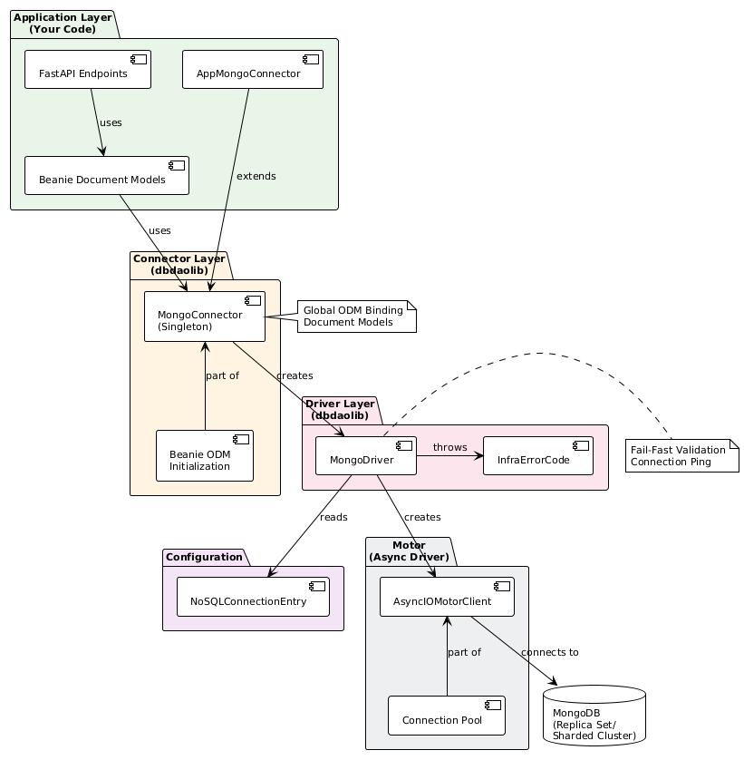
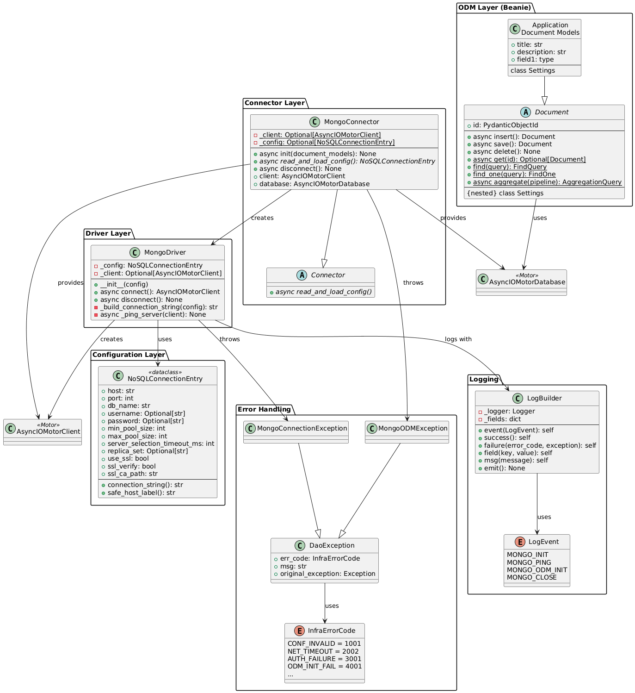
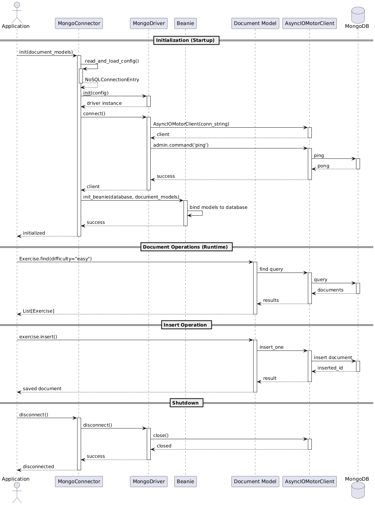

# MongoDB/NoSQL Architecture - dbdaolib

**Version:** 2.0.0  
**Status:** Production-Ready  
**Last Updated:** January 2026

---

## Table of Contents

1. [Architecture Overview](#1-architecture-overview)
2. [Layer Design](#2-layer-design)
3. [Logging Architecture](#3-logging-architecture)
4. [Error Handling Architecture](#4-error-handling-architecture)
5. [Design Decisions](#5-design-decisions)

---

## 1. Architecture Overview

### 1.1 High-Level Architecture



### 1.2 UML Class Diagram



### 1.3 Sequence Diagram - Document Operation Flow



---

## 2. Layer Design

### 2.1 Configuration Layer

**Purpose**: Encapsulate MongoDB connection parameters and pool configuration.

**Component**: `NoSQLConnectionEntry` (dataclass)

**Responsibilities**:

- Store MongoDB credentials, host, port, database name
- Connection pool configuration (min/max pool sizes)
- Replica set and SSL/TLS settings
- Connection timeout configuration
- Generate MongoDB connection string

**Interface**:

```python
@dataclass
class NoSQLConnectionEntry:
    host: str
    port: int
    db_name: str
    username: Optional[str] = None
    password: Optional[str] = None
    min_pool_size: int = 10
    max_pool_size: int = 100
    server_selection_timeout_ms: int = 5000
    replica_set: Optional[str] = None
    use_ssl: bool = False
    ssl_verify: bool = True
    ssl_ca_path: str = ""

    def connection_string() -> str
    def safe_host_label() -> str
```

**Validation Rules**:

- Host and port must be provided
- Pool sizes must be positive (min_pool_size <= max_pool_size)
- SSL: CA path must exist if ssl_verify is True
- Timeouts must be positive integers

---

### 2.2 Driver Layer

**Purpose**: Create and manage AsyncIOMotorClient with connection validation.

**Component**: `MongoDriver`

**Responsibilities**:

- Create AsyncIOMotorClient from NoSQLConnectionEntry
- Fail-fast connectivity validation (ping)
- Exception mapping to InfraErrorCode
- Client cleanup on disconnect

**Interface**:

```python
class MongoDriver:
    def __init__(config: NoSQLConnectionEntry)

    async def connect() -> AsyncIOMotorClient
        """Create and validate MongoDB client"""

    async def disconnect() -> None
        """Close MongoDB client"""

    # Private methods
    def _build_connection_string(config: NoSQLConnectionEntry) -> str
    async def _ping_server(client: AsyncIOMotorClient) -> None
```

**Design Pattern**: Async-first with Motor (AsyncIOMotorClient)

**Connection Validation**:

- Executes ping command on connect
- Maps connection errors to InfraErrorCode
- Logs initialization with LogEvent.MONGO_INIT

---

### 2.3 Connector Layer

**Purpose**: Manage MongoDB client lifecycle as singleton and bind Beanie ODM.

**Component**: `MongoConnector` (abstract base class)

**Responsibilities**:

- Singleton pattern: Client created once per application
- Call `read_and_load_config()` to get NoSQLConnectionEntry
- Instantiate MongoDriver and call `connect()`
- Initialize Beanie ODM with document models
- Provide global client access
- Cleanup: `disconnect()` closes client

**Interface**:

```python
class MongoConnector(Connector):
    # Class-level singleton state
    _client: Optional[AsyncIOMotorClient] = None
    _config: Optional[NoSQLConnectionEntry] = None

    async def init(document_models: List[Type[Document]]) -> None
        """Initialize MongoDB client and Beanie ODM"""

    @abstractmethod
    async def read_and_load_config() -> NoSQLConnectionEntry
        """Application implements this"""

    async def disconnect() -> None
        """Close MongoDB client"""

    # Properties
    @property
    def client() -> AsyncIOMotorClient
    @property
    def database() -> AsyncIOMotorDatabase
```

**Design Pattern**:

- Singleton at class level prevents duplicate client creation
- Global ODM binding (Beanie models use singleton client)

**Beanie Integration**:

- Calls `init_beanie()` with database and document models
- Binds all models to singleton client
- Models accessible globally after initialization

---

### 2.4 ODM Layer (Beanie)

**Purpose**: Provide type-safe, async document operations.

**Component**: Beanie Document Models

**Responsibilities**:

- Define document schema with Pydantic
- Provide CRUD operations (insert, find, update, delete)
- Support aggregation pipelines
- Handle document validation
- Manage indexes

**Interface**:

```python
class Document(BaseModel):
    """Beanie document base class"""

    # CRUD operations
    async def insert() -> Document
    async def save() -> Document
    async def delete() -> None

    @classmethod
    async def get(document_id: PydanticObjectId) -> Optional[Document]

    @classmethod
    def find(query) -> FindQuery

    @classmethod
    def find_one(query) -> FindOne

    @classmethod
    async def aggregate(pipeline: List[Dict]) -> AggregationQuery

    # Settings
    class Settings:
        name: str  # Collection name
        indexes: List  # Index definitions
```

**Document Definition Pattern**:

```python
class Exercise(Document):
    title: str
    description: str
    difficulty: str
    created_at: datetime

    class Settings:
        name = "exercises"
        indexes = ["difficulty", [("title", 1)]]
```

---

## 3. Logging Architecture

### 3.1 LogEvent Taxonomy

All MongoDB operations emit structured logs using the LogEvent taxonomy:

| Event | When | Level | Fields |
|-------|------|-------|--------|
| `MONGO_INIT` | Client initialization | INFO/ERROR | db.host, db.name, db.pool.min, db.pool.max |
| `MONGO_PING` | Connection health check | INFO/ERROR | db.host, duration_ms |
| `MONGO_ODM_INIT` | Beanie model binding | INFO/ERROR | db.name, model_count |
| `MONGO_CLOSE` | Client disconnection | INFO | - |

### 3.2 LogBuilder Architecture

**Purpose**: Fluent API for structured logging with LogEvent taxonomy.

**Interface**:

```python
class LogBuilder:
    def __init__(logger: Logger)

    def event(event: LogEvent) -> LogBuilder
    def success() -> LogBuilder
    def failure(error_code: InfraErrorCode, exc: Exception) -> LogBuilder
    def field(key: str, value: Any) -> LogBuilder
    def msg(message: str) -> LogBuilder
    def emit() -> None
```

### 3.3 Logging Security

**Connection String Safety**:

- Never log connection strings with credentials
- Use `safe_host_label()` for host identification
- Redact username/password from logs

**Best Practices**:

- Log initialization and ping for monitoring
- Log ODM initialization for startup diagnostics
- Avoid logging every query (high volume)

---

## 4. Error Handling Architecture

### 4.1 InfraErrorCode for MongoDB

**Design Rationale**: MongoDB only uses InfraErrorCode (no query-level DAO errors since Beanie handles queries).

#### **InfraErrorCode (1000-9999)**

Infrastructure-level errors from Driver/Connector layer.

| Range | Category | Examples | Usage |
|-------|----------|----------|-------|
| 1000-1999 | Configuration | CONF_INVALID, CONF_MISSING_CREDS | Driver initialization |
| 2000-2999 | Network | NET_TIMEOUT, NET_UNREACHABLE | Connection failures |
| 3000-3999 | Authentication | AUTH_FAILURE, AUTH_FORBIDDEN | Credential errors |
| 4000-4999 | ODM | ODM_INIT_FAIL, DATA_VALIDATION | Beanie errors |
| 9000+ | Unknown | UNKNOWN_FATAL | Unexpected errors |

**Used By**: MongoDriver.connect(), MongoConnector.init()  
**Logged By**: MongoDriver (in MONGO_INIT, MONGO_PING events)

### 4.2 Exception Hierarchy

```python
DaoException (base)
├── MongoConnectionException (InfraErrorCode: NET_*, AUTH_*)
└── MongoODMException (InfraErrorCode: ODM_*, DATA_*)
```

**Why No DAO Layer Exceptions?**

- Beanie handles all query operations
- Application catches Beanie/PyMongo exceptions directly
- Infrastructure errors (connection, auth) wrapped in MongoConnectionException
- ODM errors (model validation, init) wrapped in MongoODMException

### 4.3 Exception Wrapping Flow

```
PyMongo/Motor Exception (e.g., ConnectionFailure)
    ↓
MongoDriver.connect() catches it
    ↓
Wraps in MongoConnectionException(InfraErrorCode.NET_TIMEOUT, msg, original_exc)
    ↓
LogBuilder logs failure with MONGO_INIT event
    ↓
Application catches MongoConnectionException
    ↓
Application handles based on err_code
```

---

## 5. Design Decisions

### 5.1 Why Singleton Connector?

**Problem**: Multiple connector instances = duplicate client creation = resource leaks

**Solution**: Class-level singleton state

- Client stored as class variable (`_client`)
- First init() creates client
- Subsequent init() calls reuse existing client

**Trade-off**: Cannot have multiple MongoDB connections in same process (by design).

### 5.2 Why Global ODM Binding?

**Problem**: Passing database/client to every document operation is verbose

**Solution**: Beanie global binding

- `init_beanie()` binds models to database globally
- Documents use bound client automatically
- Clean API: `await Exercise.find().to_list()`

**Benefits**:

- Minimal boilerplate
- Framework-aligned (similar to ORMs)
- Type-safe operations

### 5.3 Why Async-First?

**Problem**: Blocking I/O in async event loops kills performance

**Solution**: Motor (async MongoDB driver)

- All operations are `async/await`
- Non-blocking I/O
- Perfect for FastAPI/async frameworks

**Benefits**:

- High concurrency
- No thread pool required
- Framework compatibility

### 5.4 Why No DAO Layer?

**Problem**: Beanie already provides repository pattern

**Solution**: Use Beanie Document models directly

- Document models = Data + Operations
- No need for separate DAO classes
- Less boilerplate

**Comparison with SQL**:

- SQL: BaseSqlDao wraps raw SQL with exceptions
- NoSQL: Beanie provides rich query API, no wrapping needed

### 5.5 Why InfraErrorCode Only?

**Problem**: Different error taxonomy than SQL (no query execution errors)

**Solution**: Single tier error codes (InfraErrorCode)

- Connection/auth errors at driver layer
- ODM errors at connector layer
- Query errors handled by Beanie (not wrapped)

**Rationale**:

- Beanie exceptions are already well-designed (DuplicateKeyError, etc.)
- Wrapping adds no value
- Infrastructure errors need wrapping for consistency

### 5.6 Why No Query Logging?

**Problem**: High volume, limited value compared to APM tools

**Solution**: Log only infrastructure events

- MONGO_INIT: Connection established
- MONGO_PING: Health check
- MONGO_ODM_INIT: Models bound
- MONGO_CLOSE: Client closed

**Rationale**:

- Query logging adds significant overhead
- MongoDB has built-in profiling and slow query logs
- APM tools (DataDog, New Relic) provide better query insights
- Infrastructure events are sufficient for operational monitoring

---

## Appendix: Error Code Reference

### InfraErrorCode (Infrastructure Errors)

| Code | Name | Layer | Meaning |
|------|------|-------|---------|
| 1001 | CONF_INVALID | Driver | Invalid configuration parameter |
| 1002 | CONF_MISSING_CREDS | Driver | Missing username/password |
| 1003 | CONF_SSL_ERROR | Driver | SSL/TLS certificate error |
| 2001 | NET_UNREACHABLE | Driver | Host unreachable |
| 2002 | NET_TIMEOUT | Driver | Connection timeout |
| 2003 | NET_DNS_FAILURE | Driver | DNS resolution failed |
| 3001 | AUTH_FAILURE | Driver | Authentication failed |
| 3002 | AUTH_FORBIDDEN | Driver | User lacks permissions |
| 4001 | ODM_INIT_FAIL | Connector | Beanie initialization failed |
| 4003 | DATA_VALIDATION | Connector | Document validation error |
| 9999 | UNKNOWN_FATAL | Driver | Unexpected fatal error |

---

**Document Version**: 2.0.0  
**Last Updated**: January 2026  
**For SQL Architecture**: See [SQL_ARCHITECTURE.md](./SQL_ARCHITECTURE.md)
