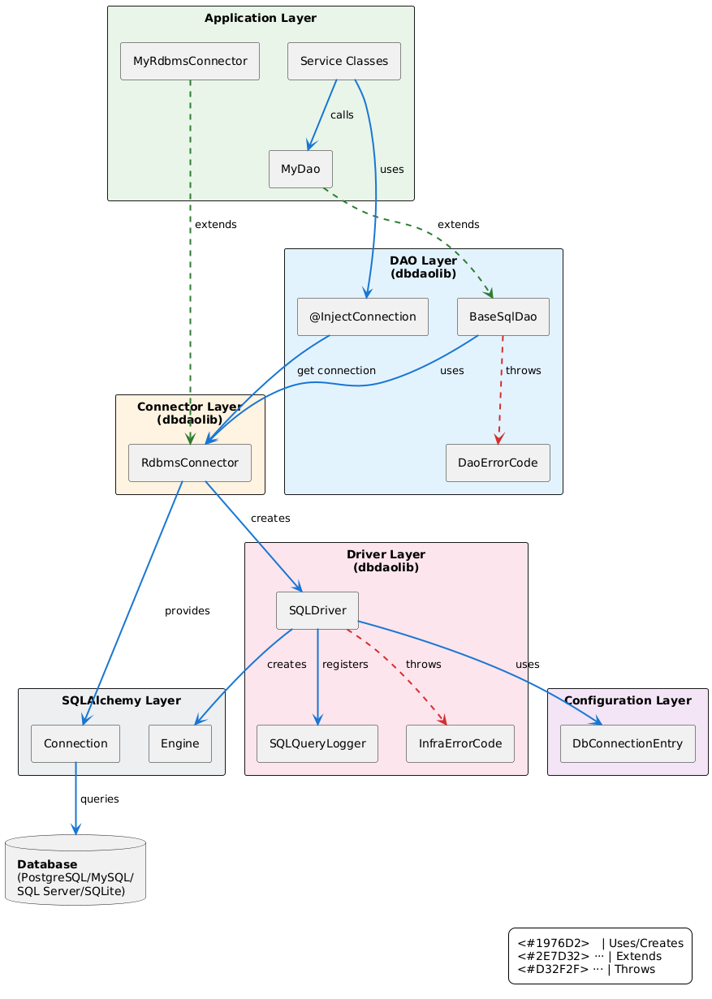
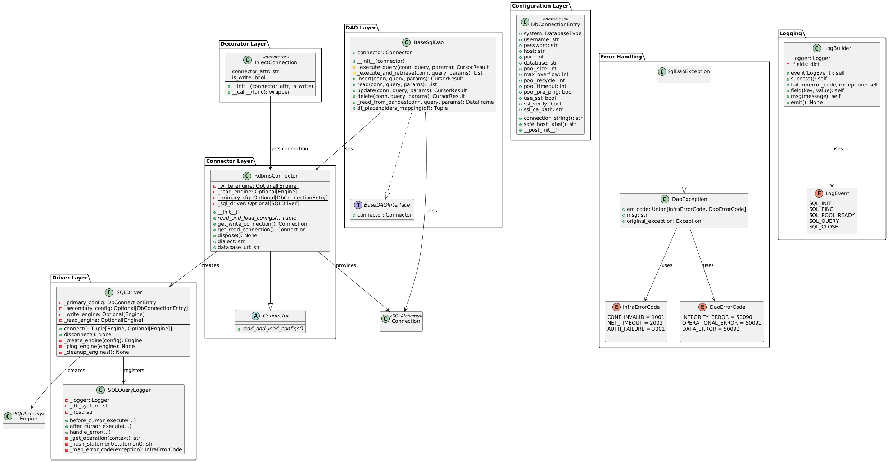
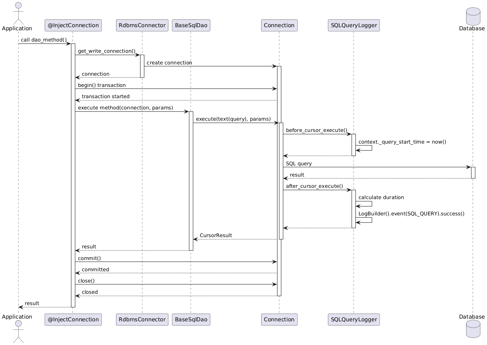
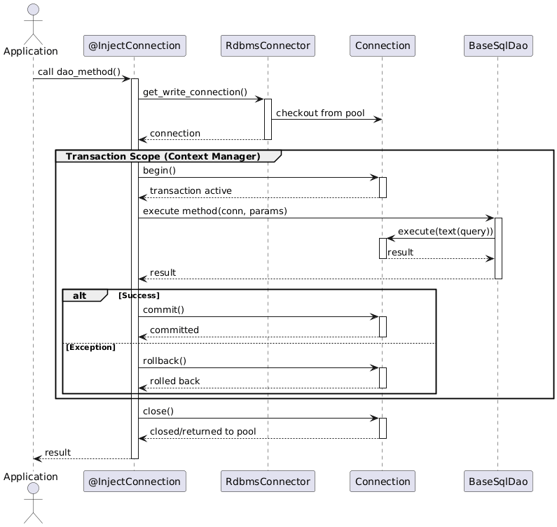

# SQL Database Architecture - dbdaolib

## Table of Contents

1. [Architecture Overview](#1-architecture-overview)
2. [Layer Design](#2-layer-design)
3. [Logging Architecture](#3-logging-architecture)
4. [Error Handling Architecture](#4-error-handling-architecture)
5. [Transaction Management Architecture](#5-transaction-management-architecture)
6. [Design Decisions](#6-design-decisions)

---

## 1. Architecture Overview

### 1.1 High-Level Architecture



### 1.2 UML Class Diagram



### 1.3 Sequence Diagram - Query Execution Flow



---

## 2. Layer Design

### 2.1 Configuration Layer

**Purpose**: Encapsulate database connection parameters and pooling configuration.

**Component**: `DbConnectionEntry` (dataclass)

**Responsibilities**:

- Store credentials, host, port, database name
- Pool configuration (size, overflow, recycle, timeout)
- SSL/TLS settings
- Validation via `__post_init__`
- Generate connection strings with URL encoding

**Interface**:

```python
@dataclass
class DbConnectionEntry:
    system: DatabaseType
    username: str
    password: str
    host: str
    port: int
    database: str
    pool_size: int = 10
    max_overflow: int = 10
    pool_recycle: int = 3600
    pool_timeout: int = 30
    pool_pre_ping: bool = True
    use_ssl: bool = False
    ssl_verify: bool = True
    ssl_ca_path: str = ""

    def connection_string() -> str
    def safe_host_label() -> str
    def __post_init__()
```

**Validation Rules**:

- System must be valid DatabaseType (postgresql, mysql, mssql, sqlite)
- Pool parameters must be positive integers
- SQLite: No auth credentials, requires `path` parameter
- SSL: CA path must exist if specified

---

### 2.2 Driver Layer

**Purpose**: Create SQLAlchemy engines and register query logging.

**Component**: `SQLDriver`

**Responsibilities**:

- Create Engine objects from DbConnectionEntry
- Register SQLQueryLogger event listeners
- Fail-fast connectivity validation (ping)
- Exception mapping to InfraErrorCode
- Engine cleanup on disconnect

**Interface**:

```python
class SQLDriver:
    def __init__(primary_config: DbConnectionEntry,
                 secondary_config: Optional[DbConnectionEntry])

    def connect() -> Tuple[Engine, Optional[Engine]]
        """Returns (write_engine, read_engine)"""

    def disconnect() -> None

    # Private methods
    def _create_engine(config: DbConnectionEntry) -> Engine
    def _ping_engine(engine: Engine) -> None
    def _cleanup_engines() -> None
    def _add_pool_fields(log_builder: LogBuilder, config: DbConnectionEntry) -> LogBuilder
    def _log_connection_error(error_code: InfraErrorCode, exc: Exception, config: DbConnectionEntry)
```

**SQLQueryLogger Architecture**:

**Component**: `SQLQueryLogger` (SQLAlchemy event listener)

**Responsibilities**:

- Thread-safe query timing using `context._query_start_time`
- Statement hashing (SHA-256) to avoid logging sensitive data
- Parameter count logging (not values for security)
- Operation type extraction (INSERT, UPDATE, DELETE, SELECT)
- Automatic error code mapping

**Interface**:

```python
class SQLQueryLogger:
    def __init__(logger: Logger, db_system: str, host: str)

    # SQLAlchemy event hooks
    def before_cursor_execute(conn, cursor, statement, params, context, executemany)
    def after_cursor_execute(conn, cursor, statement, params, context, executemany)
    def handle_error(exception_context)

    # Private methods
    def _get_operation(context) -> str
    def _hash_statement(statement: str) -> str
    def _map_error_code(exception: Exception) -> InfraErrorCode
```

---

### 2.3 Connector Layer

**Purpose**: Manage engine lifecycle as singleton and provide connection factory.

**Component**: `RdbmsConnector` (abstract base class)

**Responsibilities**:

- Singleton pattern: Engines created once per application
- Call `read_and_load_configs()` to get DbConnectionEntry
- Instantiate SQLDriver and call `connect()`
- Provide `get_read_connection()` and `get_write_connection()`
- Properties: dialect, database_url, pool configuration
- Cleanup: `dispose()` disposes engines

**Interface**:

```python
class RdbmsConnector(Connector):
    # Class-level singleton state
    _write_engine: Optional[Engine] = None
    _read_engine: Optional[Engine] = None
    _primary_cfg: Optional[DbConnectionEntry] = None

    def __init__()
        """Initialize on first instantiation only"""

    @abstractmethod
    def read_and_load_configs() -> Tuple[DbConnectionEntry, Optional[DbConnectionEntry]]
        """Application implements this"""

    def get_write_connection() -> Connection
    def get_read_connection() -> Connection
    def dispose() -> None

    # Properties
    @property
    def dialect() -> str
    @property
    def database_url() -> str
    @property
    def pool_size() -> int
    @property
    def max_overflow() -> int
```

**Design Pattern**: Singleton at class level prevents duplicate engine creation across instances.

---

### 2.4 DAO Layer

**Purpose**: Execute SQL queries and wrap SQLAlchemy exceptions.

**Component**: `BaseSqlDao`

**Responsibilities**:

- Execute queries using `connection.execute(text(query))`
- Wrap SQLAlchemy exceptions into `SqlDaoException` with `DaoErrorCode`
- **NO logging** (SQLQueryLogger handles it automatically)
- Helper methods for DataFrame integration

**Interface**:

```python
class BaseSqlDao:
    connector: Connector

    def __init__(connector: Connector)

    # Protected methods (exception wrapping)
    def _execute_query(connection: Connection, query: str, params: List) -> CursorResult
    def _execute_and_retrieve(connection: Connection, query: str, params: List) -> List

    # Public CRUD interface
    def insert(connection: Connection, query: str, params: List) -> CursorResult
    def read(connection: Connection, query: str, params: List) -> List
    def update(connection: Connection, query: str, params: List) -> CursorResult
    def delete(connection: Connection, query: str, params: List) -> CursorResult

    # DataFrame integration
    def _read_from_pandas(connection: Connection, query: str, params: List) -> DataFrame
    def df_placeholders_mapping(df: DataFrame) -> Tuple[str, List]
```

**Exception Mapping**:

| SQLAlchemy Exception | DaoErrorCode | Meaning |
|---------------------|--------------|---------|
| IntegrityError | INTEGRITY_ERROR (50090) | Foreign key, unique constraint violations |
| OperationalError | OPERATIONAL_ERROR (50091) | Connection lost, deadlock, timeout |
| DataError | DATA_ERROR (50092) | Type mismatch, value out of range |
| ProgrammingError | PROGRAMMING_ERROR (50093) | SQL syntax error, table not found |
| SQLAlchemyError | SQLALCHEMY_ERROR (50094) | Generic SQLAlchemy error |
| Exception | UNKNOWN_ERROR (50099) | Unexpected error |

---

### 2.5 Decorator Layer

**Purpose**: Inject connections and manage transaction lifecycle.

**Component**: `@InjectConnection` decorator

**Responsibilities**:

- Get connection from connector (read or write)
- Manage transaction begin/commit/rollback for writes
- Auto-close connection after method execution
- Handle manual connection injection for testing

**Interface**:

```python
class InjectConnection:
    def __init__(connector_attr: str = "connector", is_write: bool = False)
    def __call__(func: Callable) -> Callable
```

**Behavior**:

- If `is_write=True`: Wraps execution in `with conn.begin()` transaction
- If `is_write=False`: No transaction, just connection lifecycle
- Auto-detects manual connection injection (testing support)
- Auto-closes connection on method exit (success or failure)

---

## 3. Logging Architecture

### 3.1 LogEvent Taxonomy

All SQL operations emit structured logs using the LogEvent taxonomy:

| Event | When | Level | Fields |
|-------|------|-------|--------|
| `SQL_INIT` | Connector initialization | INFO | db.dialect, db.host, db.name, db.pool.* |
| `SQL_PING` | Connection validation | INFO/ERROR | db.host, duration_ms, error.code |
| `SQL_POOL_READY` | Pool created successfully | INFO | db.pool.size, db.pool.max_overflow |
| `SQL_QUERY` | Query execution | DEBUG/ERROR | db.operation, db.statement.hash, duration_ms, param_count |
| `SQL_CLOSE` | Engine disposal | INFO | - |

### 3.2 LogBuilder Architecture

**Purpose**: Fluent API for structured logging with LogEvent taxonomy.

**Interface**:

```python
class LogBuilder:
    def __init__(logger: Logger)

    def event(event: LogEvent) -> LogBuilder
    def success() -> LogBuilder
    def failure(error_code: Union[InfraErrorCode, DaoErrorCode], exc: Exception) -> LogBuilder
    def field(key: str, value: Any) -> LogBuilder
    def msg(message: str) -> LogBuilder
    def emit() -> None
```

### 3.3 Query Logging Security

**Statement Hashing**:

- SQL statements are hashed (SHA-256) before logging
- Prevents sensitive data in WHERE clauses from appearing in logs
- Only first 16 characters of hash logged for readability

**Parameter Safety**:

- Only parameter **count** is logged, never values
- Prevents PII, credentials, or sensitive data leakage
- Sufficient for query pattern analysis

**Thread Safety**:

- Uses `context._query_start_time` attribute (not class variable)
- Prevents race conditions in concurrent query execution
- Each query execution has isolated timing context

---

## 4. Error Handling Architecture

### 4.1 Two-Tier Error Code System

**Design Rationale**: Separate infrastructure failures from application-level query errors.

#### **Tier 1: InfraErrorCode (1000-9999)**

Infrastructure-level errors from Driver/Connector layer.

| Range | Category | Examples | Usage |
|-------|----------|----------|-------|
| 1000-1999 | Configuration | CONF_INVALID, CONF_SSL_ERROR | Driver initialization |
| 2000-2999 | Network | NET_TIMEOUT, NET_UNREACHABLE | Connection failures |
| 3000-3999 | Authentication | AUTH_FAILURE, AUTH_FORBIDDEN | Credential errors |
| 4000-4999 | Schema/ODM | QUERY_SYNTAX, DATA_VALIDATION | Schema issues |
| 9000+ | Unknown | UNKNOWN_FATAL | Unexpected errors |

**Used By**: SQLDriver.connect(), RdbmsConnector.**init**()
**Logged By**: SQLQueryLogger (in SQL_INIT, SQL_PING events)

#### **Tier 2: DaoErrorCode (50000-50999)**

Query execution errors from DAO layer.

| Range | Category | Examples | Usage |
|-------|----------|----------|-------|
| 50090-50099 | Integrity | INTEGRITY_ERROR, INTEGRITY_SELECT | Constraint violations |
| 50100-50199 | Operational | OPERATIONAL_ERROR, OPERATIONAL_SELECT | Connection/deadlock |
| 50200-50299 | Data | DATA_ERROR, DATA_SELECT | Type mismatches |
| 50300-50399 | Programming | PROGRAMMING_ERROR, PROGRAMMING_SELECT | SQL syntax errors |
| 50400-50499 | SQLAlchemy | SQLALCHEMY_ERROR | Generic SQLAlchemy |
| 50900-50999 | Unknown | UNKNOWN_ERROR | Unexpected errors |

**Used By**: BaseSqlDao._execute_query()  
**Wraps**: SQLAlchemy exceptions (IntegrityError, OperationalError, etc.)

### 4.2 Exception Wrapping Flow

```
SQLAlchemy Exception (e.g., IntegrityError)
    ↓
BaseSqlDao._execute_query() catches it
    ↓
Wraps in SqlDaoException(DaoErrorCode.INTEGRITY_ERROR, msg, original_exc)
    ↓
SQLQueryLogger already logged query failure with InfraErrorCode
    ↓
Application catches SqlDaoException
    ↓
Application handles based on err_code (no SQLAlchemy knowledge needed)
```

**Why Wrapping?**

- **Database Agnostic**: Application code never imports SQLAlchemy
- **Stable API**: Error codes don't change with SQLAlchemy upgrades
- **Programmatic Handling**: Applications can handle errors by code, not exception type
- **Observability**: Error codes enable dashboard metrics and alerting

### 4.3 Exception Hierarchy

```python
DaoException (base)
├── MongoConnectionException (InfraErrorCode: NET_*, AUTH_*)
├── MongoODMException (InfraErrorCode: ODM_*, DATA_*)
└── SqlDaoException (InfraErrorCode OR DaoErrorCode)
    ├── Driver layer: SqlDaoException(InfraErrorCode.NET_TIMEOUT, ...)
    └── DAO layer: SqlDaoException(DaoErrorCode.INTEGRITY_ERROR, ...)
```

---

## 5. Transaction Management Architecture

### 5.1 Transaction Lifecycle

**Decorator-Managed (Recommended)**:



**Manual (Advanced)**:


### 5.2 Read vs Write Connection Selection

**Design Decision**: Separate read and write connections for replica support.

**Write Connection (`is_write=True`)**:

- Always uses `_write_engine` (primary database)
- Transaction managed by decorator (`with conn.begin()`)
- Use for: INSERT, UPDATE, DELETE operations

**Read Connection (`is_write=False`)**:

- Uses `_read_engine` if configured, else falls back to `_write_engine`
- No transaction wrapping (SELECT doesn't need transactions)
- Use for: SELECT operations

**Fallback Behavior**: If no secondary config provided, read operations use write engine.

---

## 6. Design Decisions

### 6.1 Why Singleton Connector?

**Problem**: Multiple connector instances = duplicate engine creation = resource leaks

**Solution**: Class-level singleton state

- Engines stored as class variables (`_write_engine`, `_read_engine`)
- First instantiation creates engines
- Subsequent instantiations reuse existing engines

**Trade-off**: Cannot have multiple configurations in same process (by design).

### 6.2 Why Event-Based Logging?

**Problem**: Manual logging in DAO duplicates code and is error-prone

**Solution**: SQLAlchemy event system

- `before_cursor_execute`: Start timing
- `after_cursor_execute`: Log success with duration
- `handle_error`: Log failure with error code

**Benefits**:

- Zero application code changes
- Automatic for all queries
- Thread-safe timing
- Consistent log structure

### 6.3 Why Decorator for Transactions?

**Problem**: Boilerplate connection and transaction management in every DAO method

**Solution**: `@InjectConnection` decorator

- Auto-injects connection from connector
- Manages transaction lifecycle
- Auto-closes connection

**Benefits**:

- Clean DAO code (focus on business logic)
- Consistent transaction handling
- Impossible to forget connection cleanup

### 6.4 Why Two-Tier Error Codes?

**Problem**: Different layers have different error contexts

**Solution**:

- **InfraErrorCode**: Infrastructure failures (before query execution)
- **DaoErrorCode**: Query execution failures (during query execution)

**Benefits**:

- Clear separation of concerns
- Enables different alerting strategies (infra vs app errors)
- Dashboard metrics by error category

### 6.5 Why Wrap SQLAlchemy Exceptions?

**Problem**: Application depends on SQLAlchemy exception types

**Solution**: Wrap in `SqlDaoException` with stable error codes

**Benefits**:

- Database agnostic application code
- Stable API (error codes don't change with library upgrades)
- Programmatic error handling (by code, not exception type)

### 6.6 Why No Logging in DAO?

**Problem**: Logging in DAO duplicates SQLQueryLogger output

**Solution**: Remove all logging from DAO layer

**Rationale**:

- SQLQueryLogger already logs every query automatically
- DAO logging would create duplicate, inconsistent logs
- DAO should focus on query execution and exception wrapping

---

## Appendix: Error Code Reference

### InfraErrorCode (Infrastructure Errors)

| Code | Name | Layer | Meaning |
|------|------|-------|---------|
| 1001 | CONF_INVALID | Driver | Invalid configuration parameter |
| 1003 | CONF_SSL_ERROR | Driver | SSL/TLS certificate error |
| 2001 | NET_UNREACHABLE | Driver | Host unreachable |
| 2002 | NET_TIMEOUT | Driver | Connection timeout |
| 3001 | AUTH_FAILURE | Driver | Authentication failed |
| 4002 | QUERY_SYNTAX | Driver | SQL syntax error during ping |
| 9999 | UNKNOWN_FATAL | Driver | Unexpected fatal error |

### DaoErrorCode (Query Execution Errors)

| Code | Name | Layer | Meaning |
|------|------|-------|---------|
| 50090 | INTEGRITY_ERROR | DAO | Constraint violation (FK, unique, etc.) |
| 50091 | OPERATIONAL_ERROR | DAO | Database operational error |
| 50092 | DATA_ERROR | DAO | Type mismatch, value out of range |
| 50093 | PROGRAMMING_ERROR | DAO | SQL syntax error, table not found |
| 50094 | SQLALCHEMY_ERROR | DAO | Generic SQLAlchemy error |
| 50095 | INTEGRITY_SELECT | DAO | Integrity error during SELECT |
| 50096 | OPERATIONAL_SELECT | DAO | Operational error during SELECT |
| 50097 | DATA_SELECT | DAO | Data error during SELECT |
| 50098 | PROGRAMMING_SELECT | DAO | Programming error during SELECT |
| 50099 | UNKNOWN_ERROR | DAO | Unexpected error |

---

**Document Version**: 1.0.0  
**Last Updated**: January 2026  
**For Usage Examples**: See [SQL_USAGE_GUIDE.md](./SQL_USAGE_GUIDE.md)  
**For API Reference**: See [SQL_API_REFERENCE.md](./SQL_API_REFERENCE.md)
