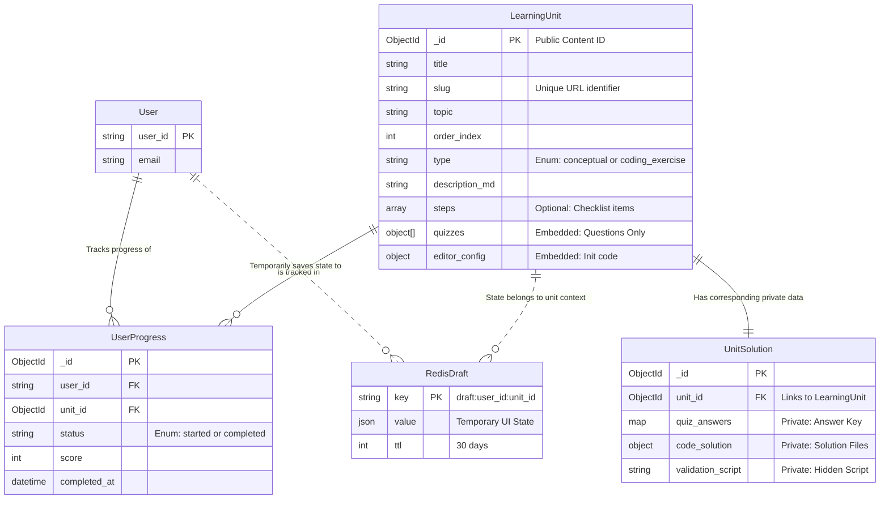

```mermaid
erDiagram
    %% --- Primary Entities ---
    User {
        string user_id PK
        string email
    }

    LearningUnit {
        ObjectId _id PK "Public Content ID"
        string title
        string slug "Unique URL identifier"
        string topic
        int order_index
        string type "Enum: conceptual or coding_exercise"
        string description_md
        array steps "Optional: Checklist items"
        object[] quizzes "Embedded: Questions Only"
        object editor_config "Embedded: Init code"
    }

    UnitSolution {
        ObjectId _id PK
        ObjectId unit_id FK "Links to LearningUnit"
        map quiz_answers "Private: Answer Key"
        object code_solution "Private: Solution Files"
        string validation_script "Private: Hidden Script"
    }

    UserProgress {
        ObjectId _id PK
        string user_id FK
        ObjectId unit_id FK
        string status "Enum: started or completed"
        int score
        datetime completed_at
    }

    %% --- Ephemeral Store (Redis) ---
    RedisDraft {
        string key PK "draft:user_id:unit_id"
        json value "Temporary UI State"
        int ttl "30 days"
    }

    %% --- Relationships ---
    LearningUnit ||--|| UnitSolution : "Has corresponding private data"
    User ||--o{ UserProgress : "Tracks progress of"
    LearningUnit ||--o{ UserProgress : "Is tracked in"
    
    %% Fixed dashed lines below: Added '||' and 'o{' markers
    User ||..o{ RedisDraft : "Temporarily saves state to"
    LearningUnit ||..o{ RedisDraft : "State belongs to unit context"
```