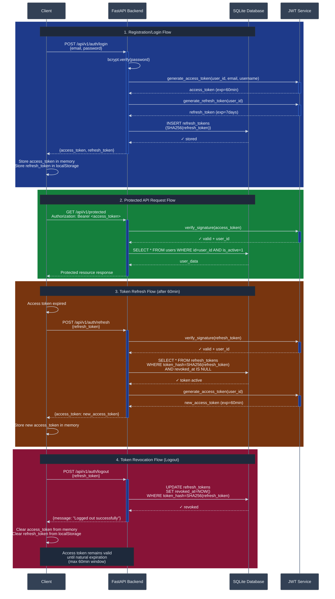
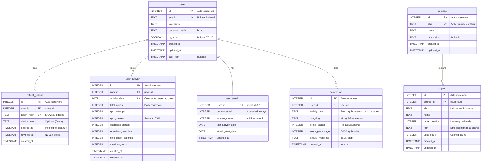

# Identity and Access Management

**Version:** 1.0
**Last Updated:** February 6, 2026  
**Document Type:** Technical Design Document (Architecture & Design Decisions)

---

## Table of Contents

1. [System Overview](#1-system-overview)
2. [JWT Authorization Flow](#2-jwt-authorization-flow)
3. [Security Implementation](#3-security-implementation)
4. [Database Architecture](#4-database-architecture)
5. [Activity Tracking & Gamification](#5-activity-tracking--gamification)
6. [API Documentation](#api-documentation)

---

## 1. System Overview

### 1.1 Architecture

The IAM module implements stateless JWT authentication with stateful refresh token management using SQLite. The
system separates user identity (authentication) from learning progress (content), employing a hybrid database
architecture:

- **SQLite**: User accounts, authentication tokens, activity tracking, course
  catalog
- **MongoDB**: Learning content, user progress, quiz submissions

**Design Rationale:**

- SQLite provides ACID transactions for critical authentication operations
- Refresh tokens stored in database enable revocation (logout, password change)
- Activity aggregation optimized for fast heatmap queries (20-25x faster than MongoDB)

### 1.2 Key Components

| Component | Location | Responsibility |
|-----------|----------|----------------|
| **AuthService** | `auth/router.py` | User registration, login, profile management |
| **TokenProvider** | `auth/security.py` | JWT generation, validation, refresh token management |
| **PasswordHasher** | `auth/security.py` | bcrypt password hashing and verification |
| **ActivityTracker** | `auth/router.py` | Daily activity aggregation, streak calculation |
| **SQLAlchemy Models** | `auth/models.py` | ORM definitions for all IAM tables |
| **Dependencies** | `auth/dependencies.py` | FastAPI dependency injection for authentication |

---

## 2. JWT Authorization Flow

### 2.1 Token Architecture

| Property | Access Token (Short-lived) | Refresh Token (Long-lived) |
|----------|---------------------------|---------------------------|
| **Lifetime** | 60 minutes (configurable via `JWT_EXPIRE_MINUTES`) | 7 days |
| **Claims** | `sub` (user_id), `email`, `username`, `iat`, `exp`, `token_type=access` | `sub` (user_id), `type=refresh`, `iat`, `exp` |
| **Purpose** | API authorization for protected endpoints | Obtain new access tokens without re-authentication |
| **Storage** | Client memory (React state) - never persisted | Database (SHA256 hash) + Client localStorage |
| **Revocation** | Not revocable (short expiration mitigates risk) | Database-backed (logout, password change) |

### 2.2 Token Lifecycle Sequence



### 2.3 Security Properties

**Stateless Access Tokens:**

- No database lookup required for authorization (performance)
- Cannot be revoked mid-session (60min maximum exposure window)
- Contain full user identity (no additional queries needed)

**Stateful Refresh Tokens:**

- Immediate revocation capability
- Device-specific management (future: per-device tracking)
- Password change invalidates all sessions
- Compromise detection via database audit trail

**Type Safety:**

- Access tokens cannot be used for refresh endpoint (type claim validation)
- Refresh tokens cannot authorize API requests (middleware checks token_type)

---

## 3. Security Implementation

### 3.1 Password Security

**Hashing Algorithm:** bcrypt via passlib CryptContext

**Implementation:** `auth/security.py`

**Properties:**

- **Algorithm:** bcrypt (adaptive key derivation function with salt)
- **Cost Factor:** 12 rounds (exponentially increases computation time)
- **Salt:** Automatically generated per password (64-bit embedded in hash)
- **Output:** 60-character bcrypt string format

**Security Features:**

- Constant-time comparison prevents timing attacks
- Failed logins return identical generic errors (prevents email enumeration)
- Adaptive cost factor (can increase as hardware improves)

### 3.2 Token Hashing Strategy

**Implementation:** `auth/security.py`

**Token Signing:**

- **Access Tokens:** HMAC-SHA256 (HS256) with secret key from environment
- **Refresh Tokens:** SHA256 hash for database storage (not bcrypt - performance optimization)

**Security Design:**

- Access tokens signed but not stored (stateless validation)
- Refresh tokens hashed before database persistence (plaintext never persisted)
- SHA256 appropriate for refresh tokens (system-generated high entropy, not user-typed)
- Rainbow table attacks infeasible (256-bit JWT tokens have ~10^77 possible values)

**Configuration:** Environment variables control secret and algorithm (see Section 3.4)

### 3.3 Rate Limiting

**Implementation:** SlowAPI (in-memory, IP-based)

| Endpoint | Limit | Rationale |
|----------|-------|-----------|
| `POST /auth/register` | 5/hour | Prevent spam account creation |
| `POST /auth/login` | 10/minute | Mitigate brute force attacks |
| `POST /auth/change-password` | 5/hour | Prevent password change abuse |

**Limitation for Production:**

- Current: In-memory storage (resets on restart, single-instance only)
- Recommended: Redis-backed storage for distributed deployments

### 3.4 Token Expiration Configuration

**Configuration:** `auth/security.py` environment variables

**Variables:**

- `JWT_SECRET` - HMAC signing key (REQUIRED in production, default for dev only)
- `JWT_ALGORITHM` - Signing algorithm (default: HS256, alternative: RS256 for multi-service)
- `JWT_EXPIRE_MINUTES` - Access token lifetime (default: 60 minutes)

**Production Hardening:**

1. **Mandatory Secret:** Fail startup if `JWT_SECRET` not set in non-dev environments
2. **Asymmetric Keys:** Consider RS256 (public/private key pair) for distributed microservices
3. **Shorter Lifetime:** Reduce to 15 minutes for high-security contexts (requires more frequent refresh)

---

## 4. Database Architecture

### 4.1 Entity Relationship Diagram



### 4.2 Table Specifications

#### 4.2.1 Users Table

**Purpose:** User account management and authentication

**Schema:** `auth/models.py - User`

**Key Design Decisions:**

- **Primary Key:** Integer auto-increment (not UUID) - simplifies MongoDB foreign key references
- **Email Uniqueness:** Database-level constraint with index for O(log n) login lookups
- **Soft Delete:** `is_active` flag preserves historical data and activity records
- **Last Login Tracking:** Updated on successful authentication for security monitoring

**Indexes:**

- `email` - Login queries
- `is_active` - Active user filtering (partial index)

#### 4.2.2 Refresh Tokens Table

**Purpose:** Revocable session management

**Schema:** `auth/models.py - RefreshToken`

**Storage Strategy:**

- Stores SHA256 hash (not plaintext) for security
- Unique constraint on hash prevents duplicate tokens
- Foreign key cascade delete removes tokens when user deleted

**Token Lifecycle:**

1. **Creation:** Generated on login/register, hash stored immediately
2. **Validation:** Lookup by hash with revocation and expiration checks
3. **Revocation:** Soft delete via `revoked_at` timestamp (enables audit trail)
4. **Cleanup:** Background job required (not yet implemented)

**Indexes:**

- `token_hash` - O(1) validation lookups (partial index: active tokens only)
- `user_id` - List user's active sessions
- `expires_at` - Efficient cleanup queries

#### 4.2.3 User Activity Table

**Purpose:** Daily activity aggregation for heatmap visualization

**Schema:** `auth/models.py - UserActivity`

**Design Pattern:** Event Sourcing Aggregation

- **Source:** `activity_log` table (detailed events)
- **Aggregate:** Daily roll-ups normalized to midnight UTC
- **Update Strategy:** Upsert on composite key `(user_id, activity_date)`

**Denormalization Trade-off:**

- **Pro:** Fast heatmap queries (no joins, single table scan)
- **Pro:** Pre-calculated counts avoid expensive aggregations
- **Con:** Requires atomic updates (activity_log + user_activity in transaction)
- **Con:** Data redundancy between tables

**Key Query Optimizations:**

- **Heatmap (365 days):** Composite index `(user_id, activity_date)` → 2ms query time
- **Leaderboard (daily rankings):** Index `(activity_date, total_points DESC)` → sub-10ms
- **Performance:** 20-25x faster than MongoDB aggregation pipeline (documented benchmark)

#### 4.2.4 User Streaks Table

**Purpose:** Consecutive activity tracking for gamification

**Schema:** `auth/models.py - UserStreak`

**Design Pattern:** Cached Calculation

- **1:1 relationship with users** (user_id as primary key)
- **Avoids expensive queries** on activity_log for every request
- **Trade-off:** Requires update on every activity submission

**Streak Algorithm:**

```
IF days_since_last_activity == 0:
    No change (same day)
ELSE IF days_since_last_activity == 1:
    Increment current_streak
    Update longest_streak if exceeded
ELSE:
    Reset current_streak = 1
    Mark streak_start_date = today
```

**Edge Cases Handled:**

- Multiple activities same day → only first updates streak
- Timezone normalization → all dates UTC midnight
- Stale data detection → API endpoint recalculates if `days_diff > 1`

**Implementation:** `auth/router.py - update_user_streak()`

#### 4.2.5 Activity Log Table

**Purpose:** Append-only event log for audit trail and analytics

**Schema:** `auth/models.py - ActivityLog`

**Design Pattern:** Event Sourcing

- **Immutable records** (no updates, only inserts)
- **Full granularity** with timestamps for time-series analysis
- **Source of truth** for `user_activity` aggregations

**Activity Type Taxonomy:**

- `quiz_submission` - Any quiz attempt (recorded regardless of pass/fail)
- `exercise_start` - User opened coding exercise
- `exercise_complete` - User completed exercise validation

**Metadata Strategy:**

- JSON blob stored as TEXT (SQLite has no native JSON type)
- Contains quiz answers, scores, execution results
- Enables detailed analytics without schema changes

**Cross-Database Integration:**

- `unit_slug` → MongoDB `learning_units.slug` (no FK constraint)
- Application-level validation before writes
- See: `database.py - validate_user_exists()`

**Indexes:** Optimized for time-series queries (user_id + created_at DESC)

#### 4.2.6 Course Catalog Tables

**Purpose:** SQLite-based course hierarchy for fast navigation

**Schemas:** `auth/models.py - Course, Topic`

**Design Pattern:** Hierarchical Catalog with Cached Counts

- **Course** → **Topic** (1:N relationship)
- **Topic** → MongoDB **LearningUnit** (cross-database 1:N)

**Why SQLite for Catalog:**

- **20-25x faster** than MongoDB for course browsing queries
- Supports ordered queries (learning path sequencing)
- Unique constraints on `(course_id, order_position)` prevent duplicates

**Cached Optimization:**

- `topics.units_count` - Denormalized unit count
- Updated during seed operations
- Avoids MongoDB aggregation on course page load

**Cross-Database Pattern:**

- MongoDB `learning_units.topic_id` references `topics.id`
- Application validates before MongoDB writes
- See: `TECHNICAL_DESIGN.md` Section 3.4-3.6 for course hierarchy and seeding workflow

### 4.3 Foreign Key Relationships

**Intra-Database (SQLite):**

- `refresh_tokens.user_id` → `users.id` (CASCADE DELETE)
- `user_activity.user_id` → `users.id` (CASCADE DELETE)
- `user_streaks.user_id` → `users.id` (CASCADE DELETE)
- `activity_log.user_id` → `users.id` (CASCADE DELETE)
- `topics.course_id` → `courses.id` (CASCADE DELETE)

**Cross-Database (SQLite ↔ MongoDB):**

- `activity_log.unit_slug` → MongoDB `learning_units.slug` (application-enforced)
- MongoDB `user_progress.user_id` → `users.id` (integer, application-enforced)
- MongoDB `user_solutions.user_id` → `users.id` (integer, application-enforced)
- MongoDB `learning_units.topic_id` → `topics.id` (integer, application-enforced)

**Validation Strategy:**

**Implementation:** `database.py - validate_user_exists()`

**Pattern:** Application-Level Referential Integrity

- Query SQLite users table before MongoDB writes
- Ensures user exists and is_active=TRUE
- Raises HTTPException 404 if validation fails
- Prevents orphaned records in MongoDB collections

---

## 5. Activity Tracking & Gamification

### 5.1 Points System

**Points Awarded:**

| Activity | Base Points | Bonus Calculation | First-Pass Only |
|----------|-------------|-------------------|-----------------|
| Quiz submission | 0 | `floor(score_percentage / 10)` | No (per attempt) |
| Quiz pass (score ≥ 70%) | 0 | `+15` on first pass only | **Yes** |
| Exercise start | 0 | None | N/A |
| Exercise complete | 0 | None | N/A |

**Implementation:** `routers/grading.py - submit_quiz()`

**First-Pass Detection Algorithm:**

```
Query activity_log for previous passing attempts
IF no previous pass AND current score >= 70%:
    Award points = floor(score / 10)
    Mark as first-pass in activity_log
ELSE:
    Award 0 points (retake attempt)
```

**Design Rationale:**

- **Prevents point farming** - Users can't retake easy quizzes for points
- **Audit trail** - All attempts logged for anomaly detection
- **Future extensibility** - Points formula can incorporate difficulty multipliers
- **Trade-off** - Additional query per submission (acceptable for learning platform workload)

### 5.2 Daily Aggregation

**Implementation:** `routers/grading.py - submit_quiz()`

**Upsert Pattern:**

```
Normalize current time to UTC midnight (date only)
Query user_activity for (user_id, today)
IF record exists:
    Increment counters (quiz_attempts, quiz_passes, total_points)
ELSE:
    Insert new daily record with initial values
Commit transaction
```

**Consistency Guarantees:**

- **Atomicity:** SQLite transaction wraps both activity_log INSERT and user_activity UPSERT
- **Isolation:** Composite UNIQUE constraint prevents race conditions on concurrent updates
- **Durability:** Commit ensures data persisted before response sent
- **Trade-off:** Write amplification (2 table updates per activity) - acceptable for single-user local deployment

### 5.3 Streak Calculation

**Update Trigger:** Every activity submission (quiz, exercise)

**Implementation:** See Section 4.2.4 for algorithm description

**Edge Cases:**

- Multiple activities same day: Only first activity increments streak
- Timezone handling: All dates normalized to UTC midnight
- Streak validation: `/me/streak` endpoint recalculates if stale (days_diff > 1)

### 5.4 Heatmap Data Generation

**Endpoint:** `GET /api/v1/auth/me/activity/heatmap?days=365`

**Implementation:** `auth/router.py - get_activity_heatmap()`

**Data Generation Algorithm:**

```
1. Query user_activity for date range (single indexed query)
2. Build in-memory lookup map: date → points
3. Calculate intensity thresholds using percentiles:
   - Level 1: 25th percentile (light activity)
   - Level 2: 50th percentile (median)
   - Level 3: 75th percentile (high activity)
   - Level 4: 90th percentile (exceptional)
4. Generate complete date range (fill missing days with 0 points)
5. Map each day to intensity level based on thresholds
```

**Performance Characteristics:**

- **Query time:** ~2ms (composite index on user_id + activity_date)
- **Response size:** 365 days × 50 bytes ≈ 18 KB (acceptable for web)
- **Rendering:** Client-side (GitHub-style heatmap component)
- **Color mapping:** 5 intensity levels (0=empty, 1-4=progressive intensity)

**GitHub-Style Percentile Approach:**

- Dynamic thresholds adapt to user's activity distribution
- Inactive users see progression even with low absolute points
- Active users maintain color diversity across full spectrum

---

## API Documentation

For complete API endpoint specifications, schemas, and examples, refer to the interactive HTML documentation:

**File:** [`iam-api-documentation.html`](./iam-api-documentation.html)

This standalone HTML documentation includes:

- All IAM authentication endpoints (`/auth/*`)
- Request/response schemas with validation rules
- Authentication requirements and security schemes
- Error response formats and status codes
- Rate limiting specifications
- Interactive examples and code samples

**Viewing:**

- Open [`iam-api-documentation.html`](./iam-api-documentation.html) directly in any web browser
- No server required - fully self-contained HTML file
- Original OpenAPI spec: [`iam-openapi.json`](./iam-openapi.json)

---

**Document Version Control:**
- v1.0 (Feb 6, 2026): Initial technical documentation
