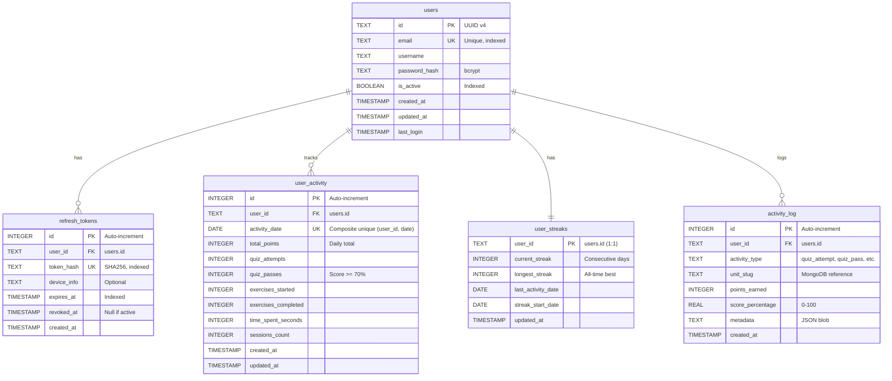

# IAM Database Schema (SQLite)

## Entity Relationship Diagram

## Key Indexes

### Authentication

- `idx_users_email` - Fast login lookups
- `idx_users_active` - Filter active users
- `idx_refresh_tokens_hash` - Token validation (WHERE revoked_at IS NULL)
- `idx_refresh_tokens_user` - User's active tokens
- `idx_refresh_tokens_expires` - Cleanup expired tokens

### Activity & Gamification

- `idx_user_activity_date_range` - Heatmap date range queries (user_id, activity_date)
- `idx_user_activity_leaderboard` - Daily rankings (activity_date, total_points DESC)
- `idx_activity_log_user_recent` - User history (user_id, created_at DESC)
- `idx_activity_log_unit` - Unit analytics (unit_slug, created_at DESC)
- `idx_activity_log_type` - Activity type filtering (activity_type, created_at DESC)
- `idx_activity_log_points` - Points queries (WHERE points_earned > 0)

## Points System

| Activity Type | Base Points | Bonus |
|---------------|-------------|-------|
| quiz_attempt | 10 | + floor(score_percentage / 10) |
| quiz_pass | 10 | + 15 (when score >= 70) |
| exercise_start | 5 | - |
| exercise_complete | 20 | + 10 (first completion) |
| login | 5 | Daily bonus (once/day) |
| unit_view | 1 | First view only |

## Relationships

### One-to-Many

- `users` → `refresh_tokens` (User can have multiple refresh tokens)
- `users` → `user_activity` (Daily activity records)
- `users` → `activity_log` (Detailed event log)

### One-to-One

- `users` → `user_streaks` (Single streak record per user)

### Cross-Database Reference

- `activity_log.unit_slug` → MongoDB `learning_units.slug` (No FK constraint)

## Data Normalization

### user_activity (Aggregated)

- Normalized to date (not datetime)
- One row per user per day
- Optimized for heatmap queries

### activity_log (Detailed)

- Append-only event log
- Full granularity with timestamps
- Used for analytics and audit trail

### user_streaks (Denormalized)

- Cached streak calculations
- Updated on each activity
- Avoids expensive queries on activity_log
