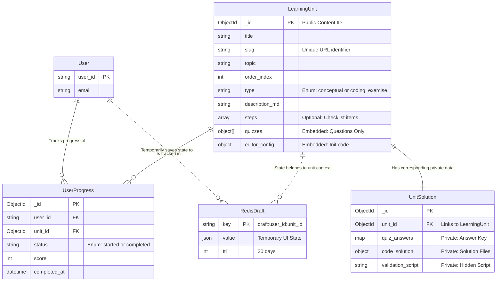
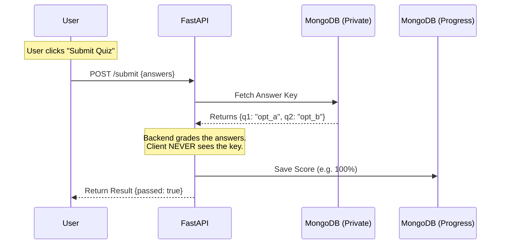

# Backend TD

## 1. Project Overview

**Objective:** Develop a robust, secure, and scalable backend for an interactive learning platform that supports dual-mode learning: **Conceptual Modules** (Markdown + Quizzes) and **Coding Exercises** (Kubernetes/YAML editor).

**Core Philosophy:** * **Security First:** "Split-Brain" architecture separates public content from private solutions.

* **Resilience:** Ephemeral state (Drafts) is isolated from permanent state (Progress).
* **Performance:** Optimized queries for syllabus loading and caching for active user sessions.

### 1.1 Technology Stack

* **Framework:** FastAPI (Python 3.10+)
* **Database (Primary):** MongoDB 6.0+ (Motor + Beanie ODM)
* **Cache / Draft Store:** Redis
* **Code Execution:** Independent Sandboxed Microservice (Runner)

---

## 2. System Architecture

### 2.1 High-Level Design

The system operates as a secure gateway between the Client and the Data/Execution layers.

1. **FastAPI Backend:** Orchestrates all logic, authentication, and grading. It is the only entity with access to the "Private" solution database.
2. **MongoDB (Split-Brain):** * *Public Collection:* Stores questions and instructions.
* *Private Collection:* Stores answer keys and validation scripts.


3. **Redis:** Handles high-frequency write operations for autosaving user inputs (Drafts).
4. **Code Runner:** An isolated service that receives user code + hidden validation scripts from the Backend to execute tests.

---

## 3. Database Schema Design (MongoDB)

### 3.1 Collection: `learning_units` (Public Content)

*Stores data safe for the frontend to render.*

| Field | Type | Description |
| --- | --- | --- |
| `_id` | ObjectId | Unique Document ID. |
| `slug` | String | URL-friendly identifier (e.g., `pod-lifecycle-101`). |
| `title` | String | Display title. |
| `topic` | String | Broad category (e.g., "Deployment"). |
| `order_index` | Integer | Sorting order for the syllabus. |
| `type` | String | Enum: `conceptual` or `coding_exercise`. |
| `description_md` | String | Common markdown content (Left Pane). |
| `steps` | List[Str] | **(Exercise Only)** Checklist items for user tracking. |
| `quizzes` | List[Obj] | **(Conceptual Only)** Embedded objects containing `question`, `options[]`. **NO answers.** |
| `editor_config` | Object | **(Exercise Only)** `{ "initial_code": "...", "language": "yaml" }`. |

### 3.2 Collection: `unit_solutions` (Private Logic)

*Stores secrets. NEVER exposed to the API.*

| Field | Type | Description |
| --- | --- | --- |
| `unit_id` | ObjectId | Foreign Key linking to `learning_units`. |
| `quiz_answers` | Map | Key-Value pairs: `{ "question_id": "correct_option_id" }`. |
| `code_solution` | Object | Full solution files: `{ "main.yaml": "..." }`. |
| `validation_script` | String | Hidden Python/Bash script used by the runner to verify user code. |

### 3.3 Collection: `user_progress` (Permanent State)

*Stores the official record of completion.*

| Field | Type | Description |
| --- | --- | --- |
| `user_id` | String | User Identifier. |
| `unit_id` | ObjectId | Link to `learning_units`. |
| `status` | String | Enum: `started`, `completed`. |
| `score` | Integer | Percentage score (for quizzes). |
| `completed_at` | DateTime | Timestamp of successful submission. |

---

## 4. Redis Caching Strategy (Drafts)

**Purpose:** Prevent data loss on page refresh/crash without overloading the primary DB.

* **Key Pattern:** `draft:{user_id}:{unit_id}`
* **TTL (Time-To-Live):** 30 Days (Refreshes on every write).
* **Data Structure (JSON):**
```json
{
  "checklist_state": [0, 2],       // Indices of checked steps
  "quiz_selections": {"q1": "a"},  // Current radio button selection
  "editor_code": "..."             // Current editor content
}

```


---

## 5. Functional Requirements (API Flows)

### 5.1 Content Delivery

* **Syllabus Generation:** * Endpoint: `GET /api/units/syllabus`
* Logic: Fetch all `learning_units` using a **Projection** (fetching only `_id`, `slug`, `title`, `topic`, `order_index`) to minimize payload size.


* **Lesson Loading:**
* Endpoint: `GET /api/units/{slug}`
* Logic: Return the full public document. **Security Check:** Ensure no fields from `unit_solutions` are joined or returned.


### 5.2 Interactive Grading (The "Split-Brain" Logic)

* **Quiz Submission:**
* Endpoint: `POST /api/units/{id}/submit`
* Input: `{ "answers": { "q_id": "selected_opt_id" } }`
* Process:
1. Fetch answer key from `unit_solutions` (Private DB).
2. Compare inputs.
3. Upsert `user_progress` (Permanent DB).
4. Return Score + Corrections.


* **Code Verification:**
* Endpoint: `POST /api/units/{id}/verify`
* Input: `{ "user_code": "..." }`
* Process:
1. Fetch `validation_script` from `unit_solutions` (Private DB).
2. Bundle `{ user_code, validation_script }`.
3. Send to **External Code Runner**.
4. Return Pass/Fail status + Console Logs.


### 5.3 State Management

* **Autosave:**
* Endpoint: `PUT /api/drafts/{unit_id}`
* Logic: Asynchronously update Redis. If Redis fails, log error but do not fail the request (Graceful Degradation).


* **Fetch Draft:**
* Endpoint: `GET /api/drafts/{unit_id}`
* Logic: Return Redis value. If null, return default/empty state.


---

## 6. Diagrams

### 6.1 Entity Relationship Diagram (Schema)



### 6.2 Simplified Data Flow (Submission)



---

## 7. Operational & Non-Functional Requirements

1. **Content Management (CMS):**
* A `seed.py` script must exist to sync content from a local **Master YAML/JSON** repository to MongoDB.
* This script handles splitting the data into the Public `learning_units` and Private `unit_solutions` collections.


2. **Rate Limiting:**
* All `POST` endpoints (Submit/Verify) must be rate-limited (e.g., 5 requests/minute) to prevent brute-force attacks on quizzes and overload on the Code Runner.


3. **Security:**
* The Code Runner must be isolated (e.g., ephemeral containers) to prevent malicious code execution from compromising the backend.
* Validation scripts are never sent to the client.