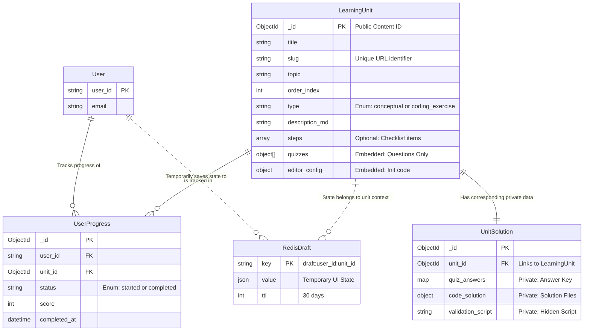
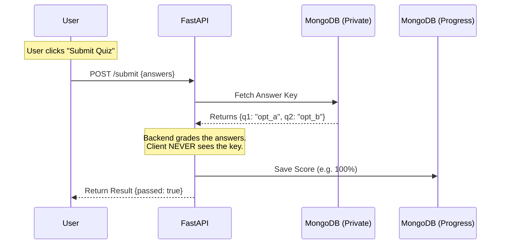

# Backend TD

## 1. Project Overview

**Objective:** Develop a robust, secure, and scalable backend for an interactive learning platform that
supports dual-mode learning: **Conceptual Modules** (Markdown + Quizzes) and **Coding Exercises**
(Kubernetes/YAML editor).

**Core Philosophy:** * **Security First:** "Split-Brain" architecture separates public content from private solutions.

* **Resilience:** Ephemeral state (Drafts) is isolated from permanent state (Progress).
* **Performance:** Optimized queries for syllabus loading and caching for active user sessions.

### 1.1 Technology Stack

* **Framework:** FastAPI (Python 3.10+)
* **Database (Primary):** MongoDB 6.0+ (Motor + Beanie ODM)
* **Cache / Draft Store:** Redis
* **Code Execution:** Independent Sandboxed Microservice (Runner)

---

## 2. System Architecture

### 2.1 High-Level Design

The system operates as a secure gateway between the Client and the Data/Execution layers.

1. **FastAPI Backend:** Orchestrates all logic, authentication, and grading. It is the only entity with access
   to the "Private" solution database.
2. **MongoDB (Split-Brain):**
   * *Public Collection:* Stores questions and instructions.
   * *Private Collection:* Stores answer keys and validation scripts.
3. **Redis:** Handles high-frequency write operations for autosaving user inputs (Drafts).
4. **Code Runner:** An isolated service that receives user code + hidden validation scripts from the Backend to
   execute tests.

---

## 3. Database Schema Design (MongoDB)

### 3.1 Collection: `learning_units` (Public Content)

*Stores data safe for the frontend to render.*

| Field | Type | Description |
| --- | --- | --- |
| `_id` | ObjectId | Unique Document ID. |
| `slug` | String | URL-friendly identifier (e.g., `pod-lifecycle-101`). |
| `title` | String | Display title. |
| `topic` | String | Broad category (e.g., "Deployment"). |
| `order_index` | Integer | Sorting order for the syllabus. |
| `type` | String | Enum: `conceptual` or `coding_exercise`. |
| `description_md` | String | Common markdown content (Left Pane). |
| `steps` | List[Str] | **(Exercise Only)** Checklist items for user tracking. |
| `quizzes` | List[Obj] | **(Conceptual Only)** Embedded objects containing `question`, `options[]`. **NO answers.** |
| `editor_config` | Object | **(Exercise Only)** `{ "initial_code": "...", "language": "yaml" }`. |

### 3.2 Collection: `unit_solutions` (Private Logic)

*Stores secrets. NEVER exposed to the API.*

| Field | Type | Description |
| --- | --- | --- |
| `unit_id` | ObjectId | Foreign Key linking to `learning_units`. |
| `quiz_answers` | Map | Key-Value pairs: `{ "question_id": "correct_option_id" }`. |
| `code_solution` | Object | Full solution files: `{ "main.yaml": "..." }`. |
| `validation_script` | String | Hidden Python/Bash script used by the runner to verify user code. |

### 3.3 Collection: `user_progress` (Permanent State)

*Stores the official record of completion.*

| Field | Type | Description |
| --- | --- | --- |
| `user_id` | String | User Identifier. |
| `unit_id` | ObjectId | Link to `learning_units`. |
| `status` | String | Enum: `started`, `completed`. |
| `score` | Integer | Percentage score (for quizzes). |
| `completed_at` | DateTime | Timestamp of successful submission. |

---

## 4. Redis Caching Strategy (Drafts)

**Purpose:** Prevent data loss on page refresh/crash without overloading the primary DB.

* **Key Pattern:** `draft:{user_id}:{unit_id}`
* **TTL (Time-To-Live):** 30 Days (Refreshes on every write).
* **Data Structure (JSON):**

```json
{
  "checklist_state": [0, 2],       // Indices of checked steps
  "quiz_selections": {"q1": "a"},  // Current radio button selection
  "editor_code": "..."             // Current editor content
}

```

---

## 5. Functional Requirements (API Flows)

### 5.1 Content Delivery

* **Syllabus Generation:** * Endpoint: `GET /api/units/syllabus`
* Logic: Fetch all `learning_units` using a **Projection** (fetching only `_id`, `slug`, `title`, `topic`,
  `order_index`) to minimize payload size.

* **Lesson Loading:**
* Endpoint: `GET /api/units/{slug}`
* Logic: Return the full public document. **Security Check:** Ensure no fields from `unit_solutions` are
  joined or returned.

### 5.2 Interactive Grading (The "Split-Brain" Logic)

* **Quiz Submission:**
* Endpoint: `POST /api/units/{id}/submit`
* Input: `{ "answers": { "q_id": "selected_opt_id" } }`
* Process:

1. Fetch answer key from `unit_solutions` (Private DB).
2. Compare inputs.
3. Upsert `user_progress` (Permanent DB).
4. Return Score + Corrections.

* **Code Verification:**
* Endpoint: `POST /api/units/{id}/verify`
* Input: `{ "user_code": "..." }`
* Process:

1. Fetch `validation_script` from `unit_solutions` (Private DB).
2. Bundle `{ user_code, validation_script }`.
3. Send to **External Code Runner**.
4. Return Pass/Fail status + Console Logs.

### 5.3 State Management

* **Autosave:**
* Endpoint: `PUT /api/drafts/{unit_id}`
* Logic: Asynchronously update Redis. If Redis fails, log error but do not fail the request (Graceful Degradation).

* **Fetch Draft:**
* Endpoint: `GET /api/drafts/{unit_id}`
* Logic: Return Redis value. If null, return default/empty state.

---

## 6. Diagrams

### 6.1 Entity Relationship Diagram (Schema)



### 6.2 Simplified Data Flow (Submission)



---

## 7. Current Design Assessment (Hybrid Architecture)

### 7.1 Architecture Overview

The current implementation uses a **hybrid database architecture**:

* **MongoDB:** Stores learning content, user progress, and user solutions
* **SQLite (RDBMS):** Stores IAM (authentication) and activity tracking/analytics

This separation creates a dual-database system where:

* User completes quiz → MongoDB (`user_progress`) updated with status/score
* Activity logged → SQLite (`activity_log`, `user_activity`, `user_streaks`) updated with analytics

### 7.2 Strengths of Current Design

#### ✅ Separation of Concerns

* **MongoDB:** Optimized for flexible schemas, document-based learning content and progress tracking
* **RDBMS:** Optimized for normalized data, complex aggregations, and analytics queries
* Clear domain boundaries between OLTP (transactional) and OLAP (analytical) workloads

#### ✅ Query Optimization

* **Progress Queries:** Fast document lookups in MongoDB using `user_id` + `unit_id`
* **Analytics Queries:** Efficient SQL aggregations (SUM, AVG, COUNT) with proper indexes
* Each database handles workload it's designed for

#### ✅ Perfect for Local Deployment

* **Single User Per Instance:** No multi-tenancy complexity or contention
* **SQLite Adequate:** File-based database perfect for local deployment volume
* **Simple Operations:** No distributed systems complexity
* **Dual-Write Manageable:** Sequential writes acceptable for single-user load

#### ✅ Development Velocity

* Familiar SQL for analytics (heatmaps, streaks, leaderboards)
* MongoDB flexibility for evolving learning content schemas
* Industry-standard patterns (JWT, bcrypt, refresh tokens)

### 7.3 Scalability Concerns (Cloud/Multi-Tenant Scenarios)

#### ❌ Dual-Write Problem (Consistency)

**Issue:** No distributed transaction support across MongoDB and RDBMS.

```
User Action Flow:
1. POST /api/grading/quiz/submit
   ├─ Write 1: MongoDB.user_progress (status=completed) ✓
   └─ Write 2: POST /api/auth/activity
        ├─ RDBMS.activity_log ✗ (Network failure)
        ├─ RDBMS.user_activity (not reached)
        └─ RDBMS.user_streaks (not reached)

Result: Inconsistent state (quiz marked complete but no analytics logged)
```

**Impact:**

* No ACID guarantees across databases
* Partial failures create data inconsistencies
* Manual reconciliation required

#### ❌ Write Amplification

**Issue:** Single user action triggers multiple database writes.

```
Quiz Completion = 4 Database Operations:
├─ 1 MongoDB write (user_progress)
├─ 1 RDBMS insert (activity_log)
├─ 1 RDBMS upsert (user_activity)
└─ 1 RDBMS upsert (user_streaks)

At Scale:
1M users × 5 activities/day = 20M DB operations/day
= 231 writes/second (average)
= Peak traffic spikes much higher
```

**Impact:**

* Increased latency (sequential writes)
* Higher infrastructure costs
* Database contention under load

#### ❌ Cross-Database Query Limitations

**Issue:** Cannot perform joins across MongoDB and RDBMS.

```sql
-- Impossible Query:
"Show all users who completed pod-101 today
 AND have >20 points"

Requires:
├─ MongoDB: user_progress (completion status)
└─ RDBMS: user_activity (points)

Solution: Application-level joins (N+1 queries)
→ Terrible performance at scale
```

**Impact:**

* Complex queries require multiple round trips
* Application-level join logic
* Increased response times

#### ❌ Analytics Bottleneck

**Issue:** RDBMS struggles with high-volume analytics queries.

```
Heatmap Query (365 days per user):
At 1M users:
├─ user_activity table: 365M rows/year
├─ Indexes help but still scanning millions
└─ Concurrent queries = lock contention

Aggregation Queries:
├─ SUM(), AVG(), COUNT() across millions of rows
├─ Even with indexes, requires table scans
└─ Slow for real-time dashboards
```

**Impact:**

* Slow query response times
* Database locks under concurrent load
* Complex partitioning/sharding required

#### ❌ Operational Complexity

**Issue:** Managing two database systems in production.

```
Operational Burden:
├─ Separate backup strategies
├─ Different monitoring tools
├─ Dual connection pools
├─ Two failure modes to handle
└─ Complex disaster recovery
```

**Impact:**

* Higher operational overhead
* More failure points
* Increased infrastructure complexity

---

## 8. Scalability Considerations

### 8.1 When Current Design Scales

The hybrid architecture is appropriate for:

* **Local Deployment:** ✅ Single user per instance (current use case)
* **Small Teams:** ✅ Up to 100 concurrent users
* **Development/Testing:** ✅ Simple to set up and maintain

**Recommendation:** Keep current design for locally-distributed application model.

### 8.2 Migration Path for Cloud Scale

If pivoting to cloud/multi-tenant hosting with millions of users, consider these architectures:

#### Option 1: All MongoDB (Simplest Migration)

**Architecture:**

```
Collections:
├─ learning_units (content)
├─ user_progress (status, score)
└─ user_activities (time-series collection)
     ├─ Sharded by user_id
     ├─ TTL index for data retention
     └─ Aggregation pipeline for analytics
```

**Pros:**

* Single transaction boundary (ACID within MongoDB)
* Horizontal scaling via sharding
* Aggregation framework powerful enough for analytics
* No dual-write complexity

**Cons:**

* Aggregations slower than optimized SQL
* More complex indexes for analytics queries
* Learning curve for aggregation pipeline

**Best For:** 10K-100K users, moderate analytics needs

---

#### Option 2: Event Streaming (Best for Scale)

**Architecture:**

```
User Action → Kafka Topic (Event Bus)
     ├─ Consumer 1 → MongoDB (user_progress)
     ├─ Consumer 2 → TimescaleDB (time-series analytics)
     ├─ Consumer 3 → Redis (real-time leaderboard)
     └─ Consumer 4 → S3 (data lake for ML)
```

**Benefits:**

* **Decoupled Writes:** Eventual consistency acceptable for analytics
* **Event Sourcing:** Complete audit trail built-in
* **Replay Capability:** Recover from consumer failures
* **Independent Scaling:** Scale each consumer based on workload
* **Extensibility:** Add new consumers without code changes

**Components:**

* **Kafka/Pulsar:** Event bus for publish-subscribe
* **TimescaleDB:** PostgreSQL + time-series optimizations
* **Redis:** Real-time counters (streaks, leaderboard)
* **MongoDB:** Flexible document storage for content

**Best For:** 100K+ users, real-time analytics, future ML pipelines

---

#### Option 3: CQRS Pattern (Read/Write Separation)

**Architecture:**

```
Write Side (Command):
├─ MongoDB: Source of truth for all data
└─ Write once, emit change events

Read Side (Query):
├─ PostgreSQL: Materialized views for analytics
├─ Redis: Cached aggregates (hot data)
└─ ElasticSearch: Full-text search

Sync:
MongoDB Change Streams → Kafka → Update Read Models
```

**Benefits:**

* Optimized for read workload (99% of traffic)
* Write complexity hidden from read logic
* Multiple specialized read models
* Eventual consistency acceptable

**Complexity:**

* More moving parts to manage
* Eventual consistency requires careful handling
* Sync lag monitoring required

**Best For:** Read-heavy workloads, complex analytics requirements

---

#### Option 4: Specialized Time-Series Database

**Architecture:**

```
├─ MongoDB: user_progress (transactional)
└─ ClickHouse/TimescaleDB: activity_log (analytics)
     ├─ Insert-only (no updates)
     ├─ Columnar storage (compression)
     ├─ Distributed aggregations
     └─ Handles billions of rows easily
```

**Time-Series DB Options:**

| Database | Strengths | Use Case |
|----------|-----------|----------|
| **ClickHouse** | Blazing fast aggregations, columnar storage | Massive analytics workloads |
| **TimescaleDB** | PostgreSQL compatibility, SQL queries | Familiar SQL with time-series optimizations |
| **InfluxDB** | Purpose-built for metrics | IoT-style time-series data |

**Best For:** 1M+ users, heavy analytics, high write throughput

---

### 8.3 Recommended Migration Phases

```
Phase 1: Current Design (1-10K users)
├─ Hybrid MongoDB + SQLite
├─ Perfect for local deployment
└─ No changes needed

Phase 2: All MongoDB (10K-100K users)
├─ Consolidate to single database
├─ Use aggregation pipeline for analytics
└─ Simpler operations

Phase 3: Event Streaming (100K-1M users)
├─ Introduce Kafka for event bus
├─ Separate read/write concerns
└─ Scale consumers independently

Phase 4: Specialized DBs (1M+ users)
├─ TimescaleDB/ClickHouse for analytics
├─ Redis for real-time features
└─ Full CQRS implementation
```

### 8.4 Key Design Principles for Scale

1. **Embrace Eventual Consistency**
   * Analytics don't need real-time accuracy
   * Accept seconds/minutes of lag for better performance

2. **Event-Driven Architecture**
   * Decouple systems via events
   * Enable independent scaling
   * Simplify failure handling

3. **Specialize Databases**
   * Use right tool for each job
   * Don't force RDBMS to do time-series
   * Don't force MongoDB to do complex joins

4. **Cache Aggressively**
   * Redis for hot data (leaderboards, streaks)
   * CDN for static content
   * Materialized views for common queries

### 8.5 Verdict

**Current Design:**

* ✅ **Excellent** for locally-distributed application
* ✅ **Appropriate** for single-user-per-instance model
* ✅ **Simple** to implement and maintain
* ⚠️ **Does not scale** for cloud multi-tenant

**Key Insight:** Don't over-engineer for scale you don't need. Current architecture fits the problem
perfectly. IF pivoting to cloud hosting, rearchitect around event streaming (Option 2) for best
long-term scalability.

---

## 9. Operational & Non-Functional Requirements

1. **Content Management (CMS):**
   * A `seed.py` script must exist to sync content from a local **Master YAML/JSON** repository to MongoDB.
   * This script handles splitting the data into the Public `learning_units` and Private `unit_solutions`
     collections.
2. **Rate Limiting:**
   * All `POST` endpoints (Submit/Verify) must be rate-limited (e.g., 5 requests/minute) to prevent
     brute-force attacks on quizzes and overload on the Code Runner.
3. **Security:**
   * The Code Runner must be isolated (e.g., ephemeral containers) to prevent malicious code execution from
     compromising the backend.
   * Validation scripts are never sent to the client.
