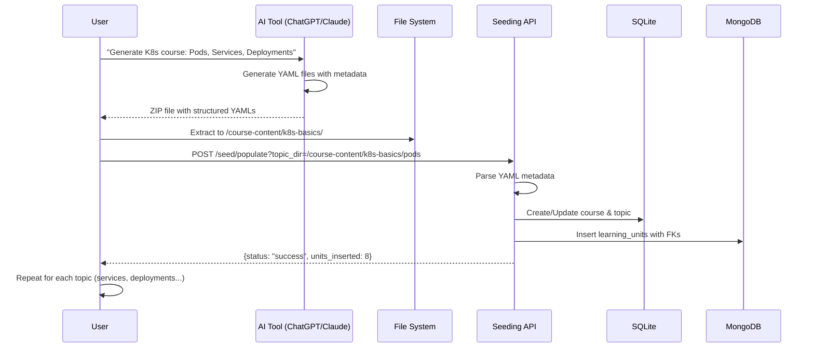
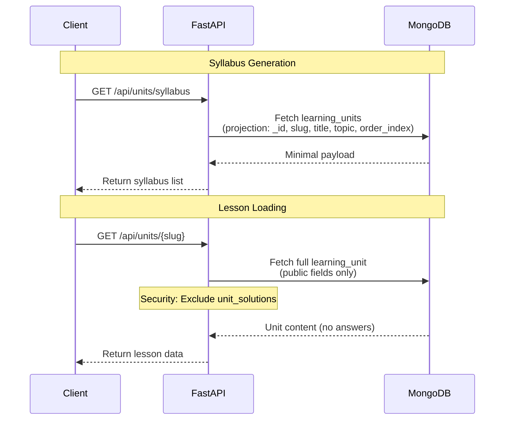
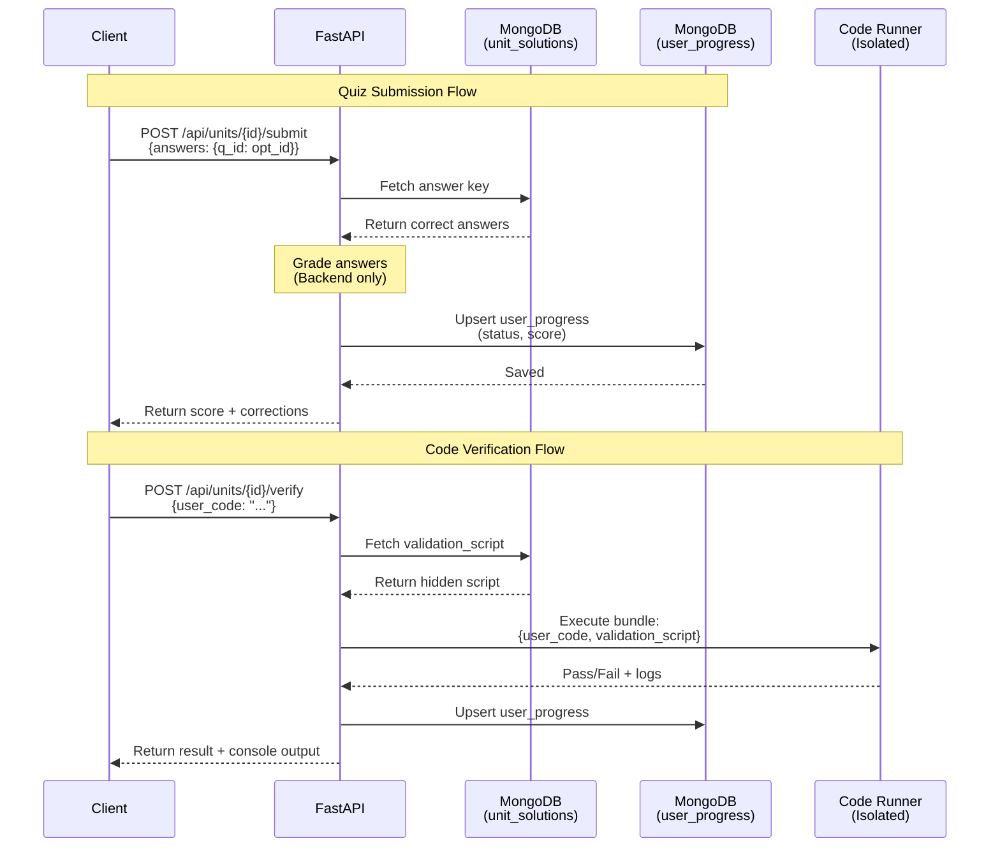
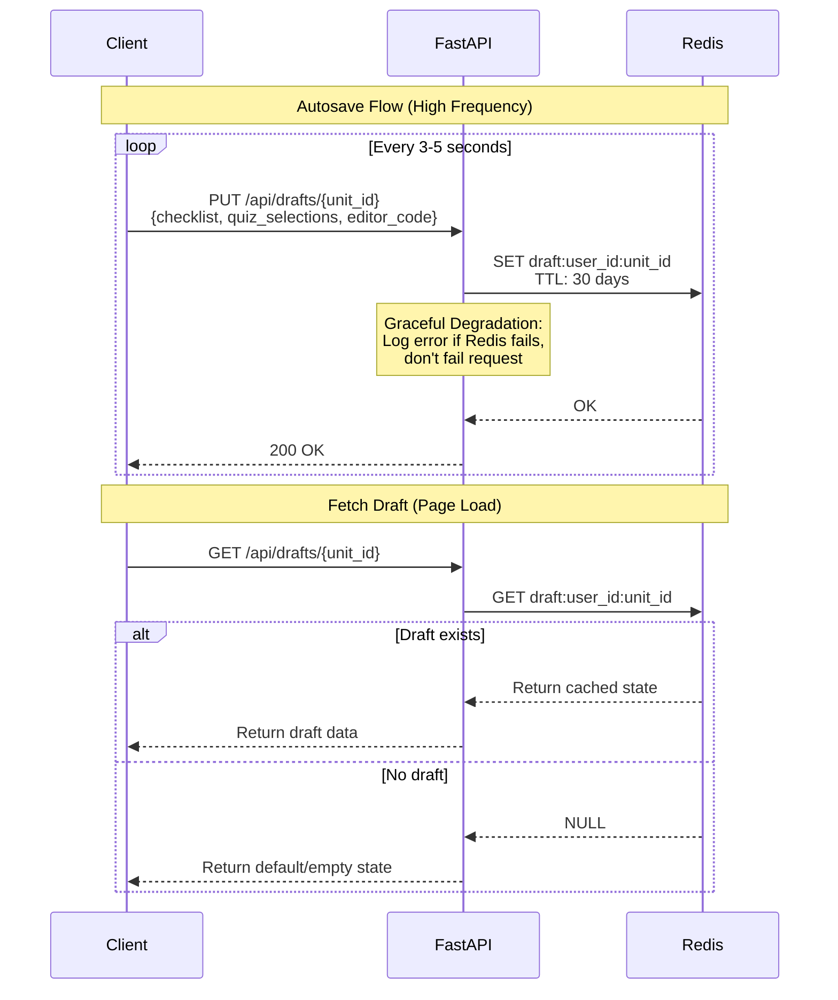
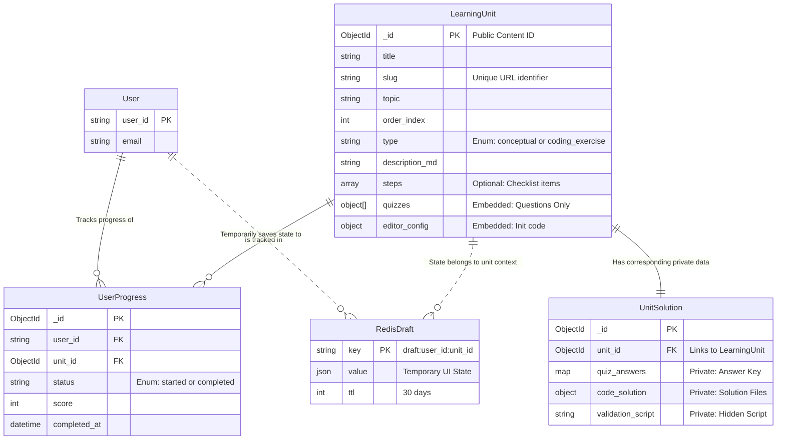
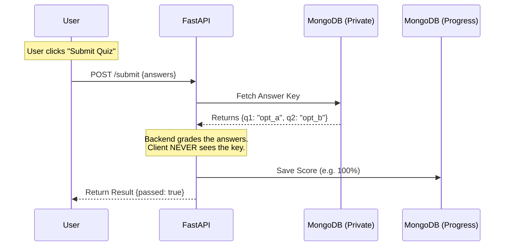

# Backend Technical Design Document

**Version:** 1.0  
**Document Type:** Technical Design Document (Architecture & Design Decisions)

---

## 1. Project Overview

**Objective:** Develop a robust, secure, and scalable backend for an interactive learning platform that
supports dual-mode learning: **Conceptual Modules** (Markdown + Quizzes) and **Coding Exercises**
(Kubernetes/YAML editor).

**Deployment Model:**

* **Local Hosting Only:** Designed for single-user desktop environments (Docker Compose)
* **AI-Powered Content Generation:** Users can generate custom courses using AI tools and load them via seeding API
* **Personal Learning:** Each user runs their own instance with their own content and progress
* **No Multi-Tenancy:** Architecture optimized for local performance, not cloud scalability

**Core Philosophy:**

* **Security First:** "Split-Brain" architecture separates public content from private solutions
* **Resilience:** Ephemeral state (Drafts) is isolated from permanent state (Progress)
* **Performance:** Hybrid database architecture optimized for local workloads
* **Flexibility:** User-generated content through AI with simple YAML seeding

### 1.1 Technology Stack

* **Framework:** FastAPI (Python 3.10+)
* **Database (Content):** MongoDB 6.0+ (Motor + Beanie ODM) - Learning units, user progress
* **Database (Catalog/IAM):** SQLite - Course hierarchy, authentication, activity tracking
* **Cache / Draft Store:** Redis - Autosave drafts, session state
* **Code Execution:** Independent Sandboxed Microservice (Runner)

### 1.2 Hybrid Database Architecture Rationale

**Why SQLite + MongoDB Instead of MongoDB Only?**

| Use Case | Database | Reasoning |
|----------|----------|----------|
| **Course Catalog Browsing** | SQLite | 20-25x faster for simple hierarchical queries (courses → topics → units list) |
| **Authentication & Sessions** | SQLite | Strong consistency requirements, ACID transactions for JWT tokens |
| **Activity Tracking** | SQLite | Time-series data benefits from SQL window functions and aggregations |
| **Learning Unit Content** | MongoDB | Flexible schema for quizzes, YAML configurations, nested quiz structures |
| **User Progress** | MongoDB | Document-based progress tracking with flexible metadata |
| **Draft Autosave** | Redis | High-frequency writes, ephemeral data, TTL-based expiration |

**Performance Comparison (Local SQLite vs MongoDB):**

* Course list query: 5ms (SQLite) vs 50-80ms (MongoDB)
* Chapter grid with progress: 35ms (hybrid) vs 150-200ms (MongoDB only)
* Unit content fetch: 15ms (MongoDB with SQLite FK) vs 50ms (MongoDB text search)

**Key Design Decision:** Use the right tool for each job rather than forcing one database to handle all use cases.

---

## 2. System Architecture

### 2.1 High-Level Design

The system operates as a secure gateway between the Client and the Data/Execution layers.

1. **FastAPI Backend:** Orchestrates all logic, authentication, and grading. It is the only entity with access
   to the "Private" solution database.
2. **MongoDB (Split-Brain):**
   * *Public Collection:* Stores questions and instructions.
   * *Private Collection:* Stores answer keys and validation scripts.
3. **Redis:** Handles high-frequency write operations for autosaving user inputs (Drafts).
4. **Code Runner:** An isolated service that receives user code + hidden validation scripts from the Backend to
   execute tests.

---

## 3. Database Schema Design (MongoDB)

### 3.1 Collection: `learning_units` (Public Content)

*Stores data safe for the frontend to render.*

**Schema:** `core/content/models.py - LearningUnit`

**Key Design Elements:**

* URL-friendly slug for unique identification
* Hybrid references: `course_id` and `topic_id` (FK to SQLite catalog)
* Type discrimination: conceptual (quizzes) vs coding (editor config)
* Flexible quiz structure with embedded questions/options (no answers)
* Markdown content for left pane instructions

**Security:** This collection contains NO answers or validation scripts - client-safe data only.

**ER Diagram:** See Section 6.1 for complete entity relationships.

### 3.2 Collection: `unit_solutions` (Private Logic)

*Stores secrets. NEVER exposed to the API.*

**Schema:** `core/content/models.py - UnitSolution`

**Key Design Elements:**

* One-to-one relationship with `learning_units` via foreign key
* Quiz answers stored as question-to-answer mappings
* Complete solution files for coding exercises
* Validation scripts executed by isolated Runner service

**Security:** Backend-only access. Never transmitted to client. Used exclusively for server-side grading.

**ER Diagram:** See Section 6.1 for complete entity relationships.

### 3.3 Collection: `user_progress` (Permanent State)

*Stores the official record of completion.*

**Schema:** `core/content/models.py - UserProgress`

**Key Design Elements:**

* Composite key: user + learning unit
* Status tracking: started vs completed
* Score persistence for quiz results
* Timestamp for completion analytics

**Purpose:** Permanent record separate from ephemeral drafts (Redis). Used for progress dashboards and streak calculations.

**ER Diagram:** See Section 6.1 for complete entity relationships.

---

## 3.4 Course Hierarchy Architecture (Hybrid Database)

**Design Decision:** Course catalog structure lives in SQLite while content lives in MongoDB.

### Why Separate Catalog from Content?

**Problem:** MongoDB queries for course browsing (list courses → list topics →
count units) required multiple aggregations and text searches, taking 150-200ms
for the chapter grid view.

**Solution:** Extract catalog structure to SQLite, keep rich content in MongoDB.

### SQLite Tables (Catalog)

**Schema Reference:** `core/auth/models.py` - Course, Topic

**ER Diagram:** See Section 6.1 for complete entity relationships

**Design Elements:**

* **courses:** Course metadata with unique slug identifier
* **topics:** Chapter/topic structure with foreign key to course, order_position for learning path sequencing

**Benefits:**

* **Fast browsing:** 5ms course list, 35ms chapter grid (vs 150-200ms MongoDB)
* **Stable ordering:** `order_position` ensures consistent learning path
* **Cached counts:** `units_count` field avoids expensive MongoDB aggregations
* **Referential integrity:** SQLite foreign keys enforce course → topic relationships

### MongoDB Integration

**Learning units reference SQLite catalog:**

**Implementation:** `core/content/models.py - LearningUnit`

**Design Pattern:** Cross-database foreign keys

* MongoDB documents store integer references to SQLite catalog entities
* `course_id` and `topic_id` fields link to SQLite courses/topics tables
* Enables fast catalog queries (SQLite) with flexible content storage (MongoDB)

**Query Pattern:**

1. SQLite: Fetch topic structure (fast, 5ms)
2. MongoDB: Fetch units by `topic_id` (indexed lookup, 15ms)
3. Application: Combine results for chapter grid display

**Trade-off:** No native database joins, but performance gain outweighs application-level join cost for local hosting.

### YAML Metadata Structure

**Complete Metadata Example:**

```yaml
metadata:
  # Unit identification
  slug: "kubernetes-pod-lifecycle"
  title: "Understanding Pod Lifecycle"
  order_index: 1
  type: "conceptual"  # or "coding"
  difficulty: "beginner"  # optional
  description: "Learn how Kubernetes manages pod lifecycles"

  # Course hierarchy (auto-creates in SQLite)
  course:
    slug: "k8s-fundamentals"
    name: "Kubernetes Fundamentals"
    description: "Master Kubernetes core concepts"  # optional

  topic:
    slug: "pods"
    name: "Pods 101"
    order: 1       # Learning path position
    icon: "🎯"     # optional emoji
```

**Backward Compatibility:** YAMLs without `course`/`topic` nested structures still work with legacy `topic` string
field (course_id/topic_id will be NULL).

### Auto-Creation from YAML Metadata

When users seed AI-generated content, the system auto-creates course/topic
hierarchy:

**Seeding Algorithm:**

1. **Course Check:** If `course.slug` doesn't exist → create course with metadata
2. **Topic Check:** If `topic.slug` doesn't exist → create topic with `order_position`
3. **Topic Update:** If topic exists but order changed → update `order_position`
   field
4. **Unit Insert:** Insert learning unit in MongoDB with `course_id`, `topic_id` foreign keys
5. **Count Update:** Increment `topics.units_count` cached counter for fast UI rendering

**Incremental Seeding:** Users can seed topics **gradually** via API endpoint
(`POST /api/v1/seed/populate?topic_dir=/path`). AI-generated content can be
added incrementally without requiring complete course structure upfront.

**Example Incremental Workflow:**

```bash
# Day 1: Seed first topic
POST /api/v1/seed/populate?topic_dir=/user-courses/k8s-101/pods
# Result: Course + Pods topic created

# Day 7: Add second topic later
POST /api/v1/seed/populate?topic_dir=/user-courses/k8s-101/deployments
# Result: Course now has 2 topics, displayed in order
```

Result: Course automatically expands with new topics in correct learning path order.

### Topic Ordering Best Practices

**Use Gaps for Future Insertions:**

```yaml
# pods/metadata.yaml
topic:
  order: 10

# services/metadata.yaml  
topic:
  order: 20

# deployments/metadata.yaml
topic:
  order: 30
```

**Benefit:** Can insert "ReplicaSets" at order 15 later without reordering all existing topics.

**Reordering Topics:**

To change learning path order, update `order` in YAML and reseed:

```yaml
# Before: Services at order 20
# After: Move Services to order 35 (after Deployments)
topic:
  order: 35
```

Re-run seeding API → SQLite `order_position` updated instantly.

### Performance Metrics

| Operation | MongoDB Only | Hybrid (SQLite + MongoDB) | Speedup |
|-----------|--------------|---------------------------|---------|
| Course list | 50-80ms | 5ms | 10-16x |
| Chapter grid with progress | 150-200ms | 35ms | 4-6x |
| Unit list by topic | 50ms (text search) | 15ms (indexed FK) | 3x |

**Hardware:** Local development (Docker on SSD, single user load)

### Troubleshooting

#### Issue: Topic order wrong in UI

* **Check:** SQLite `order_position` field in topics table
* **Solution:** Update YAML `topic.order` value and reseed

#### Issue: Units not appearing in topic

* **Check MongoDB:** Query `learning_units` for matching `topic_id`
* **Solution:** If `topic_id` is NULL, reseed YAML with proper course/topic metadata

#### Issue: Duplicate course/topic slugs

* **Constraint:** Slugs must be globally unique
* **Solution:** Update slug in YAML and reseed with new identifier

---

## 3.5 AI-Generated Content Workflow

**Use Case:** Users generate custom courses with AI (ChatGPT, Claude, etc.) and load them locally.

### Content Generation Flow



### AI Generation Prompt Example

**Recommended Prompt Structure:**

```
Generate a Kubernetes learning course with:
1. Course: "Kubernetes Fundamentals"
2. Topics:
   - Pods (order: 1) - 5-8 conceptual units
   - Services (order: 2) - 5-8 conceptual units
   - Deployments (order: 3) - 5-8 conceptual units
3. Each unit includes:
   - Title, description, difficulty level
   - 3-5 multiple choice quiz questions with 1 correct answer
4. Format: YAML with embedded metadata

Metadata structure required:
- course.slug, course.name, course.description
- topic.slug, topic.name, topic.order, topic.icon (emoji)
- Unit: slug, title, order_index, type, difficulty
- Quiz: questions with options and correct_answer marked
```

### Directory Structure

**Generated Content Organization:**

```bash
/user-courses/k8s-fundamentals/
  ├── pods/
  │   ├── 01-basics.yaml
  │   ├── 02-lifecycle.yaml
  │   ├── 03-multi-container.yaml
  │   └── ...
  ├── services/
  │   ├── 01-introduction.yaml
  │   ├── 02-service-types.yaml
  │   └── ...
  └── deployments/
      ├── 01-deployment-basics.yaml
      ├── 02-rolling-updates.yaml
      └── ...
```

### Seeding Commands

**Topic-by-Topic Seeding:**

```bash
# Seed first topic
POST /api/v1/seed/populate?topic_dir=/user-courses/k8s-fundamentals/pods
# Response: {status: "success", course_created: true, topic_created: true, units: 8}

# Add second topic
POST /api/v1/seed/populate?topic_dir=/user-courses/k8s-fundamentals/services
# Response: {status: "success", course_created: false, topic_created: true, units: 6}

# Add third topic
POST /api/v1/seed/populate?topic_dir=/user-courses/k8s-fundamentals/deployments
# Response: {status: "success", course_created: false, topic_created: true, units: 9}
```

**Result:**

* SQLite: 1 course + 3 topics with correct order (1, 2, 3)
* MongoDB: 23 learning units with course_id/topic_id references
* UI: Chapter grid displays topics in learning path order

### Content Validation & Error Handling

API validates during seeding:

* Required metadata fields present
* Course/topic slugs are URL-safe
* Quiz questions have correct answer marked
* File structure matches expected format

**Error Handling:**

* Invalid YAML → Skip file, log error, continue
* Duplicate slug → Update existing unit
* Missing metadata → Use defaults (course: "General", topic: NULL)

### Local Storage

**Volume Mount Strategy:**

* Pre-built courses: Read-only sample resources directory
* AI-generated courses: User content directory mounted read-only
* SQLite database: Volume-mounted for persistence
* MongoDB: Docker named volume for data persistence

**Data Ownership:** All content and progress data stored locally on user's machine. No cloud dependencies.

**Implementation:** See `docker-compose.yml` for volume configuration.

---

## 3.6 Course Navigation UI & API Flow

### Navigation Structure

The UI implements a three-level navigation hierarchy with progressive disclosure:

```mermaid
graph LR
    subgraph NAV["HEADER NAVIGATION"]
        H1["🏠 KubePlayground | Dashboard | Courses"]
        H2["Chapters ▼"]
        H3["@username ▼"]
    end

    subgraph DROP["CHAPTERS DROPDOWN"]
        D1["▼ Kubernetes Fundamentals"]
        D2["  🎯 Pods 101"]
        D3["  🌐 Services"]
        D4["  📦 Deployments"]
        D1 --> D2 & D3 & D4
    end

    subgraph UNIT["UNIT PAGE NAVIGATION"]
        U1["CH1: Pods ▼"]
        U2["L2: Lifecycle ▼"]
    end

    H2 -.-> DROP
    D2 -.-> UNIT

    style NAV fill:#1a1d23,stroke:#4a5568
    style DROP fill:#2d1b4e,stroke:#6d28d9
    style UNIT fill:#3e2723,stroke:#d97706
```



### API Endpoints

```mermaid
flowchart TB
    subgraph Client["Client Requests"]
        R1["Dashboard Load"]
        R2["Topic Click"]
        R3["Course Page Load"]
    end

    subgraph API["FastAPI Endpoints"]
        E1["GET /api/v1/dashboard<br/>35ms | SQLite + MongoDB"]
        E2["GET /api/v1/courses/topics/{id}/units<br/>15ms | MongoDB"]
        E3["GET /api/v1/courses/{slug}/chapters<br/>35ms | SQLite + MongoDB"]
    end

    subgraph Response["Response Data"]
        D1["All courses + topics<br/>+ progress summary"]
        D2["Topic metadata<br/>+ ordered units list"]
        D3["Course details<br/>+ topic cards + progress"]
    end

    R1 --> E1 --> D1
    R2 --> E2 --> D2
    R3 --> E3 --> D3

    D1 -.->|"Powers"| UI1["CourseNavigation.tsx<br/>Header dropdown"]
    D2 -.->|"Powers"| UI2["UnitNavigation.tsx<br/>Context dropdowns"]
    D3 -.->|"Powers"| UI3["CourseChaptersPage.tsx<br/>Chapter grid"]

    style Client fill:#1e293b,stroke:#475569
    style API fill:#1e40af,stroke:#3b82f6
    style Response fill:#065f46,stroke:#10b981
```



**Query Pattern:**

* Dashboard/Chapters: SQLite (topics) + MongoDB (progress) = 35ms
* Unit navigation: MongoDB indexed lookup = 15ms
* Client-side caching for instant re-access

---

### Progressive Disclosure Pattern

**Lazy Loading Strategy:**

```
Initial Load (Dashboard)
├─ Load: All courses + topics (fast, 35ms)
└─ Defer: Unit details until topic clicked

User Clicks Topic
├─ Load: Units for that topic only (15ms)
└─ Cache: Client-side for instant re-access

User Navigates to Unit
└─ Context dropdowns: Pre-loaded from dashboard data
```

**Why This Pattern:**

* **Fast Initial Render:** Topics load immediately, units deferred
* **Reduced Bandwidth:** Don't fetch hundreds of units upfront
* **Instant Navigation:** Once loaded, dropdown navigation is instant
* **Optimal for Local:** Takes advantage of fast local database queries

---

### UI Navigation Flows

#### Flow 1: Topic Selection from Header

```
User clicks "Chapters" → Dropdown shows all courses/topics
User clicks topic → Navigate to first unit in that topic
```

#### Flow 2: Unit-to-Unit Navigation

```
User on unit page → Dropdowns show: [CH1: Pods ▼] [L2: Lifecycle ▼]
User clicks dropdown → See all units in current topic
User selects unit → Navigate to that unit
```

#### Flow 3: Topic Switching from Unit Page

```
User clicks topic dropdown → See all topics in course with progress
User selects different topic → Jump to first unit of new topic
```

**Technical Notes:**

* All navigation state cached client-side after first load
* Progress updates refresh via dashboard API call
* Topic/unit slugs used for routing (`/unit/{slug}`)

---

## 4. Redis Caching Strategy (Drafts)

**Purpose:** Prevent data loss on page refresh/crash without overloading the primary DB.

**Design Pattern:**

* **Key Pattern:** `draft:{user_id}:{unit_id}` for isolated user/unit state
* **TTL:** 30 days with refresh-on-write to balance persistence and cleanup
* **Data Structure:** JSON document containing:
  * Checklist state (completed step indices)
  * Quiz selections (current radio button choices)
  * Editor code (current YAML/code content)

**Architecture Decision:** Ephemeral draft state in Redis (high-frequency
writes) separate from permanent progress in MongoDB (write-once on completion).

---

## 5. Functional Requirements (API Flows)

### 5.1 Content Delivery



**Key Points:**

* Syllabus uses projection to minimize bandwidth
* Lesson loading returns full public document
* Security: `unit_solutions` never joined or returned

---

### 5.2 Interactive Grading (Split-Brain Logic)



**Security Guarantees:**

* Answer keys never leave backend
* Validation scripts never sent to client
* Code Runner isolated (ephemeral containers)

---

### 5.3 State Management (Ephemeral Drafts)



**Design Decisions:**

* Redis handles high-frequency writes (every 3-5s)
* TTL-based expiration (30 days) for automatic cleanup
* Graceful degradation: Redis failures don't break UX
* Permanent progress saved to MongoDB only on submission

---

## 6. Diagrams

### 6.1 Entity Relationship Diagram (Schema)



### 6.2 Simplified Data Flow (Submission)



---

## 7. Current Design Assessment (Hybrid Architecture)

### 7.1 Architecture Overview

The current implementation uses a **hybrid database architecture**:

* **MongoDB:** Stores learning content, user progress, and user solutions
* **SQLite (RDBMS):** Stores IAM (authentication) and activity tracking/analytics

This separation creates a dual-database system where:

* User completes quiz → MongoDB (`user_progress`) updated with status/score
* Activity logged → SQLite (`activity_log`, `user_activity`, `user_streaks`) updated with analytics

### 7.2 Strengths of Current Design

#### ✅ Separation of Concerns

* **MongoDB:** Optimized for flexible schemas, document-based learning content and progress tracking
* **RDBMS:** Optimized for normalized data, complex aggregations, and analytics queries
* Clear domain boundaries between OLTP (transactional) and OLAP (analytical) workloads

#### ✅ Query Optimization

* **Progress Queries:** Fast document lookups in MongoDB using `user_id` + `unit_id`
* **Analytics Queries:** Efficient SQL aggregations (SUM, AVG, COUNT) with proper indexes
* Each database handles workload it's designed for

#### ✅ Perfect for Local Deployment

* **Single User Per Instance:** No multi-tenancy complexity or contention
* **SQLite Adequate:** File-based database perfect for local deployment volume
* **Simple Operations:** No distributed systems complexity
* **Dual-Write Manageable:** Sequential writes acceptable for single-user load

#### ✅ Development Velocity

* Familiar SQL for analytics (heatmaps, streaks, leaderboards)
* MongoDB flexibility for evolving learning content schemas
* Industry-standard patterns (JWT, bcrypt, refresh tokens)

### 7.3 Scalability Concerns (Cloud/Multi-Tenant Scenarios)

#### ❌ Dual-Write Problem (Consistency)

**Issue:** No distributed transaction support across MongoDB and RDBMS.

```
User Action Flow:
1. POST /api/grading/quiz/submit
   ├─ Write 1: MongoDB.user_progress (status=completed) ✓
   └─ Write 2: POST /api/auth/activity
        ├─ RDBMS.activity_log ✗ (Network failure)
        ├─ RDBMS.user_activity (not reached)
        └─ RDBMS.user_streaks (not reached)

Result: Inconsistent state (quiz marked complete but no analytics logged)
```

**Impact:**

* No ACID guarantees across databases
* Partial failures create data inconsistencies
* Manual reconciliation required

#### ❌ Write Amplification

**Issue:** Single user action triggers multiple database writes.

```
Quiz Completion = 4 Database Operations:
├─ 1 MongoDB write (user_progress)
├─ 1 RDBMS insert (activity_log)
├─ 1 RDBMS upsert (user_activity)
└─ 1 RDBMS upsert (user_streaks)

At Scale:
1M users × 5 activities/day = 20M DB operations/day
= 231 writes/second (average)
= Peak traffic spikes much higher
```

**Impact:**

* Increased latency (sequential writes)
* Higher infrastructure costs
* Database contention under load

#### ❌ Cross-Database Query Limitations

**Issue:** Cannot perform joins across MongoDB and RDBMS.

**Example Constraint:**
Queries requiring data from both databases (e.g., "users who completed unit X
today AND have >20 points") cannot use native database joins.

**Current Solution:**

* Application-level joins (sequential queries)
* N+1 query pattern when iterating results

**Impact:**

* Multiple database round trips for complex queries
* Application logic for data merging
* Acceptable for local hosting, problematic for cloud scale

**Trade-off:** Performance hit on complex queries acceptable given local
deployment model and benefit of specialized database strengths.

#### ❌ Analytics Bottleneck

**Issue:** RDBMS struggles with high-volume analytics queries.

```
Heatmap Query (365 days per user):
At 1M users:
├─ user_activity table: 365M rows/year
├─ Indexes help but still scanning millions
└─ Concurrent queries = lock contention

Aggregation Queries:
├─ SUM(), AVG(), COUNT() across millions of rows
├─ Even with indexes, requires table scans
└─ Slow for real-time dashboards
```

**Impact:**

* Slow query response times
* Database locks under concurrent load
* Complex partitioning/sharding required

#### ❌ Operational Complexity

**Issue:** Managing two database systems in production.

```
Operational Burden:
├─ Separate backup strategies
├─ Different monitoring tools
├─ Dual connection pools
├─ Two failure modes to handle
└─ Complex disaster recovery
```

**Impact:**

* Higher operational overhead
* More failure points
* Increased infrastructure complexity

---

## 8. Deployment Model & Architecture Boundaries

### 8.1 Design Scope

This application is **explicitly scoped for local deployment only**. It is NOT
designed for cloud hosting, multi-tenancy, or horizontal scaling.

**Intended Use Case:**

* **Single-user desktop application** (Docker Compose)
* **Personal learning environment** with user-owned data
* **AI-generated custom courses** seeded locally
* **No network requirements** beyond initial setup

**Out of Scope:**

* ❌ Cloud hosting (AWS, GCP, Azure)
* ❌ Multi-tenant SaaS architecture
* ❌ Horizontal scaling (millions of users)
* ❌ Distributed systems complexity
* ❌ Event streaming, message queues, CQRS patterns

---

### 8.2 Architecture Optimizations for Local Hosting

The hybrid architecture leverages local deployment advantages:

#### Database Strategy

**SQLite for Catalog & IAM:**

* ✅ **Fast file-based access** (no network overhead)
* ✅ **ACID transactions** for authentication and course structure
* ✅ **Perfect for single-writer** workloads
* ✅ **Zero configuration** (no database server required)
* ✅ **Embeddable** (ships with Python standard library)

**MongoDB for Content:**

* ✅ **Flexible schema** for AI-generated course variations
* ✅ **Document model** natural fit for nested quiz structures
* ✅ **Embedded MongoDB** via Docker (no cloud dependencies)

**Redis for Ephemeral State:**

* ✅ **In-memory performance** for high-frequency autosave (every 3-5s)
* ✅ **TTL-based expiration** (automatic cleanup)
* ✅ **Simple key-value** model for draft storage

**Why Not PostgreSQL?**

* Overkill for single-user workloads
* Requires separate database server process
* SQLite sufficient for local catalog queries (<10ms)
* No multi-writer concurrency needed

**Why Not MongoDB Only?**

* Course browsing 20-25x slower without SQLite catalog optimization
* SQLite provides better performance for hierarchical queries
* Hybrid approach uses each database's strengths

---

### 8.3 Performance Characteristics

**Local Deployment Performance (Docker on SSD):**

| Operation | Response Time | Database |
|-----------|---------------|----------|
| Course list | 5ms | SQLite |
| Chapter grid with progress | 35ms | SQLite + MongoDB |
| Unit content fetch | 15ms | MongoDB |
| Quiz submission | 50ms | MongoDB |
| Draft autosave | <10ms | Redis |

**Hardware Requirements:**

* **RAM:** 2GB minimum (Docker containers + databases)
* **Storage:** 500MB for application + user-generated content
* **CPU:** Any modern processor (single-core sufficient)

**Scaling Limits (Local Hosting):**

* **Courses:** Unlimited (limited by disk space)
* **Units per course:** Thousands (MongoDB indexes prevent performance degradation)
* **Draft storage:** 30-day TTL prevents Redis bloat
* **Activity logs:** SQLite handles years of single-user activity

---

### 8.4 Data Ownership & Privacy

**User-Controlled Environment:**

* All data stored locally on user's machine
* No telemetry, analytics, or cloud sync
* User owns all AI-generated course content
* Complete offline capability after initial setup

**Volume Mounting Strategy:**

```
docker-compose.yml:
├─ ./data/sqlite:/app/data        # User database (IAM, catalog)
├─ ./data/mongodb:/data/db        # Learning content (persistent)
├─ ./user-courses:/courses        # AI-generated YAMLs (read-only)
└─ redis (no volume)              # Ephemeral drafts only
```

**Backup Strategy:**

* User-initiated: Copy `./data` directory
* Export courses: Standard YAML format (portable)
* No vendor lock-in: Open-source stack

---

### 8.5 Why This Design is Correct for the Scope

**Architectural Decisions Justified:**

1. **Hybrid Database (SQLite + MongoDB + Redis)**
   * ✅ Optimizes each workload with specialized tools
   * ✅ Total resource footprint <500MB RAM
   * ✅ Zero operational complexity for end users

2. **Dual-Write Pattern (MongoDB + SQLite)**
   * ✅ Acceptable for single-user (no concurrency issues)
   * ✅ Sequential writes fast enough (<50ms)
   * ✅ No distributed transaction overhead needed

3. **No Event Streaming**
   * ✅ Direct database writes simpler and faster
   * ✅ No Kafka/RabbitMQ operational burden
   * ✅ Eventual consistency unnecessary for single user

4. **Split-Brain Security Architecture**
   * ✅ Answer keys never leave backend (client-safe)
   * ✅ Code Runner isolated (prevents malicious execution)
   * ✅ Trust boundary matches threat model

**Trade-offs Made:**

* ❌ Cannot horizontally scale (not a requirement)
* ❌ SQLite limits multi-writer scenarios (not a use case)
* ❌ No cloud-native features (out of scope)
* ✅ Simple deployment model (Docker Compose)
* ✅ Blazing fast performance (local queries)
* ✅ Zero operational overhead (no servers to manage)

---

### 8.6 Migration Path (If Scope Changes)

**⚠️ Important:** This section is purely hypothetical. Current design is intentionally NOT cloud-ready.

**If pivoting to cloud/multi-tenant SaaS (complete rearchitecture required):**

1. **Database Replacement:**
   * PostgreSQL replaces SQLite (multi-writer support)
   * MongoDB Atlas or self-hosted cluster (horizontal scaling)
   * Redis Cluster (distributed caching)

2. **Application Changes:**
   * Multi-tenant data isolation (tenant_id in all queries)
   * Distributed transactions or saga pattern (dual-write problem)
   * Event streaming for activity tracking (Kafka/RabbitMQ)
   * API authentication changes (OAuth2, API keys)

3. **Infrastructure:**
   * Container orchestration (Kubernetes)
   * Load balancers (HAProxy, NGINX)
   * CDN for static assets (CloudFront, Cloudflare)
   * Monitoring stack (Prometheus, Grafana)

**Estimated Effort:** 6-12 months complete rewrite.

**Recommendation:** Do NOT attempt cloud migration. Design philosophy
fundamentally incompatible with cloud requirements. Better to build
cloud-native application from scratch if needed.

---

### 8.7 Verdict

**Current Design Assessment:**

* ✅ **Perfect** for single-user desktop learning environments
* ✅ **Optimized** for local performance (5-50ms queries)
* ✅ **Simple** Docker Compose deployment (zero configuration)
* ✅ **Secure** split-brain architecture prevents cheating
* ✅ **Flexible** AI-generated content support
* ✅ **Private** user-owned data (no cloud dependencies)

**Architecture is intentionally LOCAL-FIRST:**

* Embraces local file system speed (SQLite)
* Eliminates network latency (embedded databases)
* Removes operational complexity (no servers to manage)
* Maximizes user privacy (no data leaves machine)

**This is a feature, not a limitation.** The architecture achieves its design goals perfectly within the defined scope.

---

## 9. Security & Operations

### 9.1 Authentication & Authorization

* **Access Tokens:** JWT (60min expiry)
* **Refresh Tokens:** 7-day sliding window
* **Password Hashing:** bcrypt (cost factor 12)
* **Authentication Details:** See [IAM.md](./IAM.md)

### 9.2 Rate Limiting

| Endpoint | Limit | Rationale |
|----------|-------|-----------|
| `POST /submit` | 5 req/min | Prevent brute-force quiz attacks |
| `POST /seed/populate` | Unlimited | Local hosting, single user |
| Code execution | Queue-based | Prevent Runner service overload |

### 9.3 Health Monitoring

**Endpoint:** `GET /health`

**Checks:**

* SQLite connectivity
* MongoDB connectivity  
* Redis connectivity

**Returns:** 503 if any database unavailable (used by Docker Compose health checks)

---

**Document Version Control:**
* v1.x: Original implementation guide (before refactoring to TDD standards)

**Related Documentation:**

* [IAM.md](./IAM.md) - Authentication and activity tracking design
* [Logging.md](./Logging.md) - Structured logging standard (ECS-compliant)
